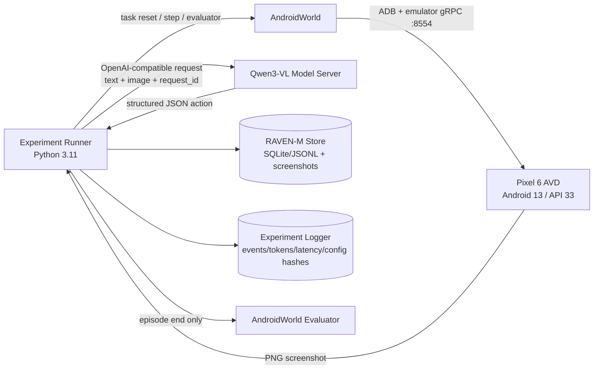
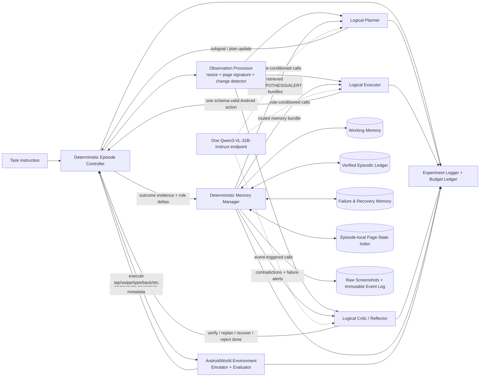
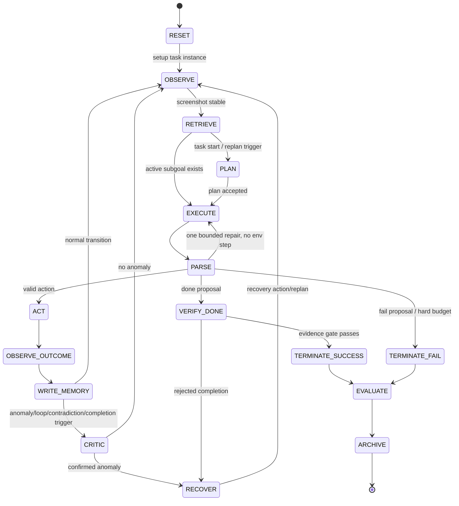
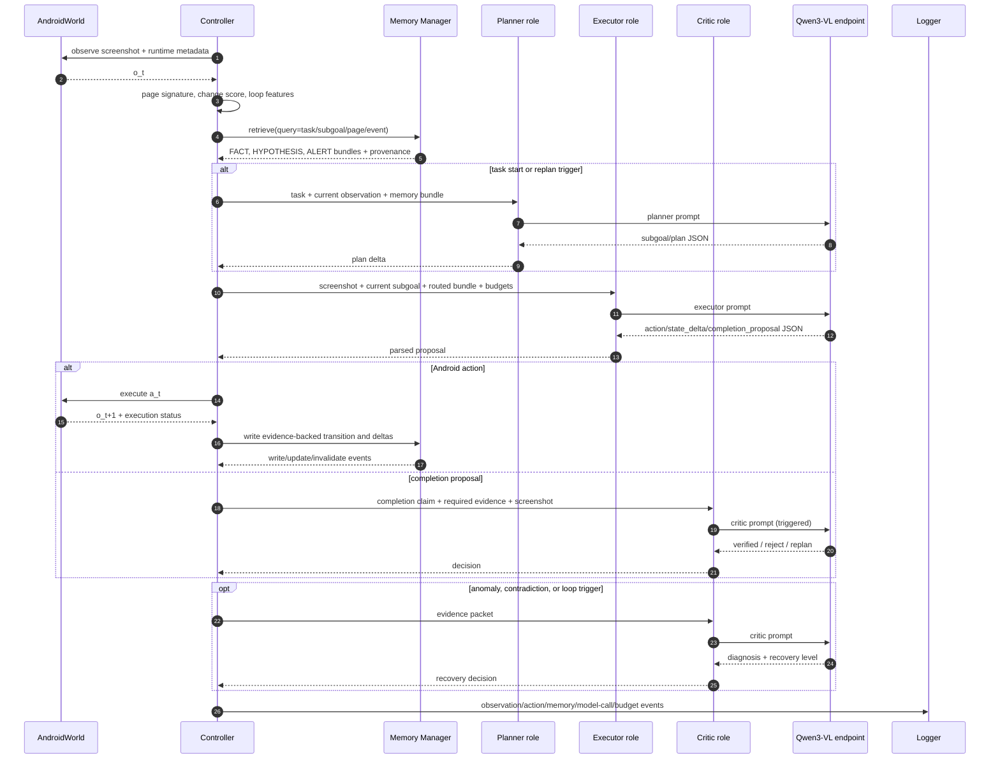
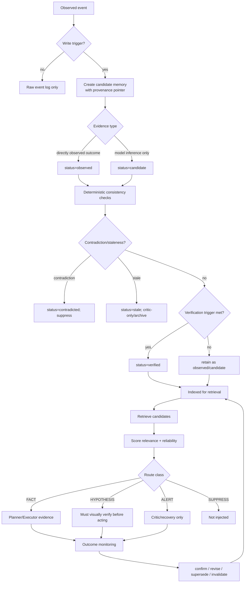
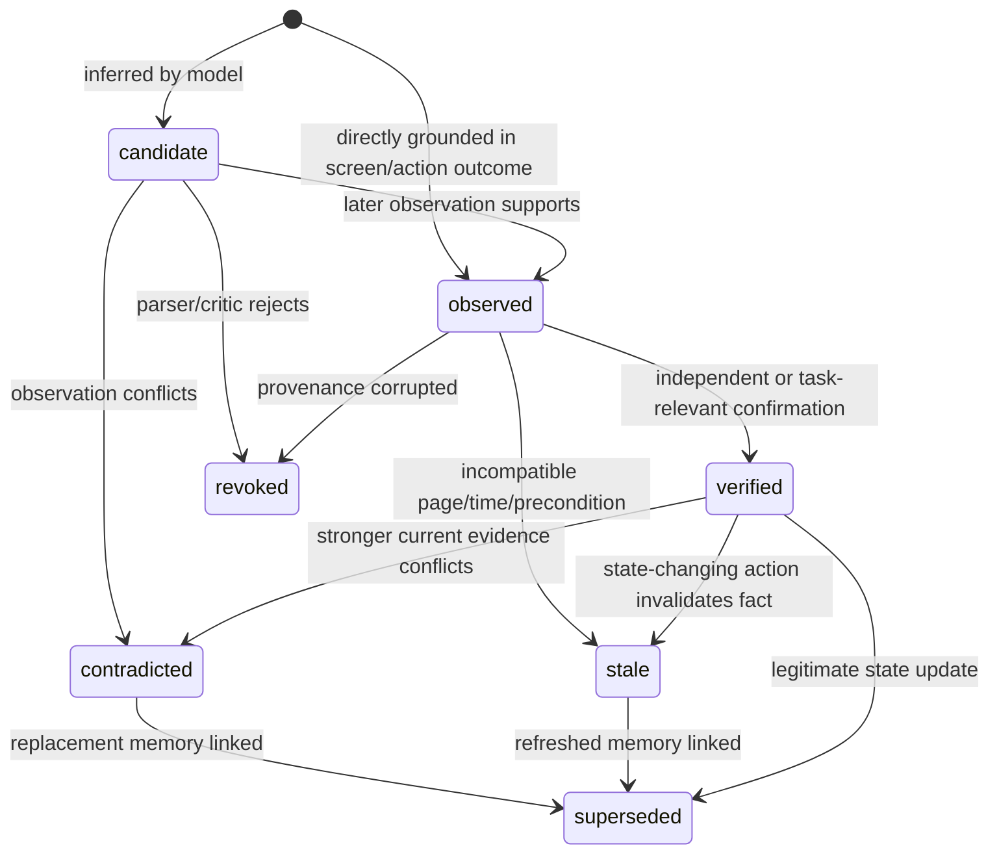
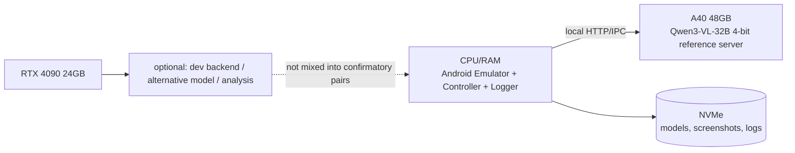
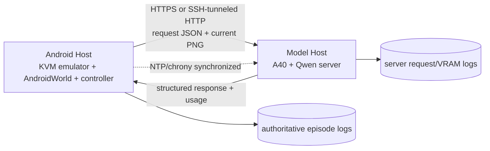

# RAVEN-M：面向长程移动 GUI Agent 的可靠性感知、可验证情景导航记忆

> **项目性质**：浙江大学直博夏令营考核研究计划；paper-grade reasoning，research-prototype-scale implementation  
> **执行日期**：2026-07-20（Asia/Tokyo）  
> **文档版本**：v1.0 / protocol-design draft  
> **核心原则**：先满足全部官方要求，再追求研究增量；先冻结证据与协议，再运行 Hard 测试；不以增加上下文、模型调用或推理预算冒充“记忆收益”。

---

## 0. 文档元数据

| 字段 | 内容 |
|---|---|
| 项目中文名 | **RAVEN-M：面向长程移动 GUI Agent 的可靠性感知、可验证情景导航记忆** |
| 英文工作名 | **RAVEN-M: Reliability-Aware Verified Episodic Navigation Memory for Long-Horizon Mobile GUI Agents** |
| 候选人水平 | 有 IJCAI-ECAI 2026 与 ACM MM 2026 一作/共同一作研究经历的直博候选人；按能够独立完成 controlled experiment、ablation、robustness、qualitative analysis 与论文式写作的水平设计 |
| 目标标准 | **论文级问题定义与实验严谨度，研究原型级范围**；不要求 SOTA、完整新 benchmark 或大规模训练 |
| 推荐周期 | 28 天；另给 14 天压缩预案 |
| 硬件 | 1× NVIDIA A40 48 GB；1× NVIDIA GeForce RTX 4090 24 GB；不假设 NVLink，也不假设同机 |
| 核心环境 | [AndroidWorld 官方仓库](https://github.com/google-research/android_world)（访问：2026-07-20） |
| 核心模型 | [Qwen/Qwen3-VL-32B-Instruct](https://huggingface.co/Qwen/Qwen3-VL-32B-Instruct)（访问：2026-07-20） |
| 主评测 | AndroidWorld 官方 task list 中标注为 `hard` 的 19 个任务类；固定仓库 commit、任务清单与参数 seed |
| 主方法 | training-free/test-time、外部显式记忆；一个 Qwen3-VL endpoint 承担多个 logical roles；Memory Manager 以确定性代码为主 |
| 主要指标 | Task Success Rate；相对 B0/B3 的 paired absolute improvement；95% CI；模型调用、token、loop、recovery 与 memory-induced error 指标 |
| 预注册点 | `protocol_lock.yaml` + `task_manifest` + prompt/config hash + Git tag；Hard 结果出现前冻结 |

### 0.1 证据与命令标签

- **[已核验]**：来自官方仓库、官方 model card、正式 proceedings/OpenReview/ACL Anthology/CVF 页面或作者官方页面。
- **[方案建议]**：本计划基于已核验事实作出的工程或实验设计选择。
- **[待冻结]**：必须在项目 Day 1–9 通过 commit、配置、smoke test 或导师确认固化的内容。
- **[示意命令]**：接口与意图可执行，但版本号、路径或参数必须依据冻结 commit 再校验；不得未经测试直接写入最终复现说明。

### 0.2 术语账本

| 术语 | 本文定义 |
|---|---|
| GUI Agent | 通过截图/界面状态感知并输出点击、滑动、输入、返回等动作的 agent |
| MLLM | Multimodal Large Language Model，多模态大语言模型 |
| Episode | 从任务 reset 到成功、失败、超步或基础设施中断的一次完整交互 |
| Working Memory | 仅服务当前数步与当前 subgoal 的短期状态 |
| Episodic Ledger | 当前 episode 内可审计的子任务、变量、动作结果和页面状态账本 |
| Failure & Recovery Memory | 失败签名、已验证修复动作、适用条件与失效条件 |
| Page-State Index | episode-local 页面状态索引；**不是** PG-Agent 式跨轨迹全局 Page Graph |
| Reliability | 记忆条目在当前时刻可被当作事实使用的可信度，由验证、结果一致性、来源、页面兼容性、时效和冲突共同决定 |
| Verification | 用当前截图、动作前后差异、Android 状态或明确任务证据确认记忆/完成声明 |
| Invalidation | 将冲突或过时记忆软失效并保留 tombstone 与 provenance，而非静默删除 |
| Logical role | 不同职责和 prompt contract；不等于独立模型副本 |
| Hard suite | 本文特指冻结日期的 AndroidWorld task list 中 `difficulty=hard` 的 19 个任务类集合 |
| Memory-induced error | agent 实际使用了错误、过时、冲突或不适用记忆，并使后续决策偏离的事件 |

---

## 1. 执行摘要

长程 mobile GUI task 的难点不只是“模型看不懂按钮”，而是 agent 在 20 步乃至更长轨迹中必须持续回答四个问题：**已经做完什么、当前在哪里、哪些变量仍有效、刚才动作是否真的生效**。把全部截图与历史原样塞入 prompt 会迅速造成 context 膨胀、注意力稀释和旧状态污染；只做一段自由文本 summary 又可能把失败动作写成成功、遗漏中间变量，或在页面变化后继续传播陈旧结论。

本项目建议只推进一条清晰主线：构建 **RAVEN-M**。它不是再造一个笼统的“hierarchical memory system”，而是在 Qwen3-VL-32B-Instruct 驱动的 AndroidWorld agent 外增加一个**可审计、可失效、可靠性感知的 episode memory layer**：

1. 用 Working Memory 保存最近动作、当前 subgoal 与待验证事项；
2. 用 Verified Episodic Ledger 保存已完成/失败步骤、中间变量、来源截图与动作结果；
3. 用 Failure & Recovery Memory 保存循环、错误动作和经过验证的恢复策略；
4. 用 episode-local Page-State Index 记录页面签名和转移，但不在核心方案中构建跨任务全局 Page Graph；
5. 检索后不是一律注入，而是按 reliability 与当前页面兼容性路由为 `FACT`、`HYPOTHESIS` 或 `SUPPRESS`；
6. Executor 提议完成后，Critic 必须依据当前屏幕和证据 checklist 二次确认，benchmark evaluator 只用于最终计分，不泄漏给 agent。

**最低成功结果**是：AndroidWorld 可稳定 reset；Qwen3-VL-32B-Instruct baseline 能端到端执行；完成固定 19 个 Hard 任务的 baseline 与 RAVEN-M 配对评测；提供 Task Success Rate、原始轨迹、成功/失败案例、错误分析、代码、脚本、配置和复现说明。即使 RAVEN-M 没有显著提升，也要能可靠回答“为什么没有提升”：是 grounding bottleneck、错误记忆、critic 误杀、额外调用开销，还是样本量不足。

**强结果**是：在同模型、同 task instance、同 action budget、同 temperature、同 context cap 和 matched call budget 下，RAVEN-M 相对 simple-summary baseline 获得有实际意义的绝对成功率提升；同时显著降低 repeated-action loop、premature completion 和 stale/contradictory-memory use，并通过消融说明 Verified Episodic Ledger、reliability routing、failure cache 与 completion verification 各自作用。该结果展示的是研究判断、控制变量和机制解释能力，而不是靠堆 agent 角色或增加推理预算得到一个漂亮数字。

---

## 2. 官方要求可追溯矩阵

| # | 官方要求 | 对应 work package | 完成证据 | 最终 artifact/file | 验收标准 | 优先级 | 遗漏风险 |
|---:|---|---|---|---|---|---|---|
| 1 | GUI/Mobile/MLLM Agent memory 文献综述、分类、优缺点与创新空间 | WP-LIT：多源检索、20 篇核心精读、Eagle Lab 审计、gap map | 检索日志、related-work matrix、方法变更记录 | `docs/literature_review.md`; `docs/literature_search_log.md`; `docs/related_work_matrix.csv`; `references/references.bib` | 每篇状态有官方来源；2025–2026 高相关工作≥8；无 arXiv 冒充顶会 | Must | 方法重复、事实错误、答辩被直接否定 |
| 2 | 部署 AndroidWorld | WP-ENV：AVD、ADB、任务 reset/evaluator smoke test | 手动完成录像、reset 日志、环境 lock | `docs/environment.md`; `scripts/setup_androidworld.sh`; `runs/smoke/env/` | 同一任务可连续 reset 3 次；初始化/评价/tear-down 均工作 | Must | 无法开展任何有效实验 |
| 3 | Qwen3-VL-32B-Instruct 端到端 baseline | WP-BASE：model server、action adapter、agent loop | screenshot→action 与完整 episode 日志 | `src/raven_m/controller/episode_controller.py`; `src/raven_m/roles/executor.py`; `configs/agents/b0*.yaml`; `scripts/launch_model_server.sh` | ≥90% 响应可解析为合法 schema；至少 1 条完整轨迹执行 | Must | 未满足指定模型要求 |
| 4 | 主要在 AndroidWorld Hard 上评测 baseline 并记录成功率 | WP-PROTOCOL + WP-EVAL-B | 冻结 19-task manifest、paired runs、聚合结果 | `configs/task_manifests/androidworld_hard_v1.yaml`; `results/tables/table_baselines.csv` | 所有 19 类至少 1 次；主比较类最终 3 个配对 seed | Must | 结论不可比较或 cherry-pick |
| 5 | 多 agent/多 role + 显式 memory management | WP-RAVEN：Planner/Executor/Memory Manager/Critic | role contracts、memory event log、架构图 | `src/raven_m/controller/episode_controller.py`; `src/raven_m/roles/`; `src/raven_m/memory/`; `docs/method.md` | 角色职责可独立 ablate；一个 endpoint，无四份模型 | Must | “多 agent”流于 prompt 拼接 |
| 6 | 历史管理、summary、经验复用、retrieval、多轮规划、恢复、长依赖 | WP-RAVEN + WP-ABL | memory lifecycle、恢复测试、消融 | `configs/experiments/e04_e11_ablations.yaml`; `results/memory_audit_labels.csv` | 每一项要么进入核心实验，要么明确列为 Optional 并给原因 | Must | 官方能力点覆盖不全 |
| 7 | 同协议评测增强系统；成功率、增益、成功/失败案例、error analysis | WP-EVAL-M + WP-ANALYSIS | paired results、CI、case timeline、taxonomy | `results/tables/table_main.csv`; `analysis/qualitative/rendered_timelines/`; `docs/failure_codebook.md` | 主表、CI、至少 4 成功+4 失败案例；无只报 aggregate | Must | 无法说明记忆是否及为何有效 |
| 8 | 有余力时 Medium generalization | WP-GEN | 固定 Medium 子集与独立结果 | `configs/task_manifests/androidworld_medium_optional.yaml`; `results/medium_optional/` | 核心完成后执行；不得拿 Medium 调参后回改 Hard 方法 | Optional | 不影响合规，但影响泛化证据 |
| 9 | 代码、脚本、配置、说明、日志、架构图、报告、方法文档可复现 | WP-REPRO | clean-clone smoke test、artifact index、checksums | `README.md`; `docs/reproducibility.md`; `reports/experimental_report.md`; `ARTIFACT_INDEX.md` | 新环境按说明可跑 1 个 smoke task 并复算主表 | Must | 最终成果不可审计/不可复现 |

> 所有 mandatory requirement 在上表各出现一次。

---

## 3. 范围与完成标准

### 3.1 Minimum compliant submission

- AndroidWorld 官方环境与 19 个 `hard` 标注任务清单已冻结；至少完成全部 19 类的一次 baseline 与一次 memory-enhanced run。
- 指定 checkpoint `Qwen/Qwen3-VL-32B-Instruct` 真实参与 action generation；量化不改变 checkpoint identity，需记录 backend 与权重处理。
- B0 current-screen/minimal-history、B3 simple-summary、RAVEN-M 至少完成；B1 sliding-window、B2 raw-full-history 如时间极端受限，可只做 1 seed，但不得省略设计与 smoke result。
- 显式 memory schema、write/retrieve/update/invalidate、Planner/Executor/Memory Manager/Critic logical roles 均可查看日志。
- 报告 Task Success Rate、绝对提升、成功/失败案例和 error taxonomy；交付代码、脚本、配置、环境说明和原始日志。

### 3.2 Recommended strong submission

- B0–B3 + RAVEN-M：19 个 Hard 类至少 1 seed；B0、B3、RAVEN-M：19×3 paired parameterized instances。
- 完成 relevance-only vs reliability-aware、去 Working Memory、去 Episodic Ledger、去 Failure Cache、去 Critic、context-matched、call-budget-matched 等关键消融。
- 报告 task-class clustered paired bootstrap 95% CI、McNemar exact test、token/call/latency/VRAM 与 memory-induced error 指标。
- 至少 8 个预注册 case（成功与失败各 4），展示 screenshot–action–memory–verification timeline。
- clean-clone 复现实验通过；主结果可由脚本从 raw JSONL 一键生成。

### 3.3 Optional publication-oriented extensions

仅在强提交全部完成后选择 **一个**：

1. 从非 Hard/开发任务提炼跨 episode procedural memory，测试迁移；
2. 将 deterministic reliability score 替换为小型 calibrated classifier；
3. 在另一开源 MLLM 上做 transfer；
4. 研究 adversarial memory corruption 与鲁棒路由；
5. 将 episode-local Page-State Index 扩展为跨任务图，但必须正面对比 PG-Agent/HyMEM/MAGNET。

### 3.4 Explicitly out of scope

- 大型 Web 前端、手机 App 产品化、漂亮但不参与实验的 dashboard；
- full-model fine-tuning、在线 RL、四个 32B 模型副本；
- 新建大 benchmark 或宣称替代 ProBench；
- 复刻 PG-Agent 的全局 Page Graph、HyMEM 的 hybrid graph/continuous memory、MAGNET 的 interface-evolution memory；
- 在 Hard 测试轨迹上建 procedural memory 后再评同一任务；
- 使用 benchmark evaluator 的内部状态给 agent 提示；
- 为追求分数在结果出来后无记录地改 prompt、任务、步数或失败判定。

### 3.5 Stop conditions

任一条件触发即停止加功能，转向实验与报告：

- Day 12 尚未得到稳定 B0；只做 B0/B3/RAVEN-M-minimal，不开发 Page-State Index 的复杂图逻辑。
- Day 18 主比较尚未覆盖 19 个 Hard；暂停所有 Optional。
- 新模块使平均 model calls 增加 >30%，却未在 8-task dev subset 带来至少一个预注册 diagnostic 改善；移出核心。
- 单个模块工程投入 >1.5 天仍无可测试接口；回退到 deterministic heuristic。
- 预计剩余算力不足完成主比较的 80%；优先保留 paired B0/B3/RAVEN-M，削减 ablation repetitions。

---

## 4. 研究问题形式化

### 4.1 Formal setting

给定任务自然语言目标 \(g\)，Android 环境在步 \(t\) 具有不可完全观测状态 \(s_t\)，agent 得到观察

\[
o_t = (I_t, u_t, a_{t-1}, \Delta_t, b_t),
\]

其中 \(I_t\) 为当前 screenshot，\(u_t\) 为允许记录但不向模型泄漏 benchmark 真值的设备元数据，\(a_{t-1}\) 为上一动作，\(\Delta_t\) 为动作前后可观测变化，\(b_t\) 为剩余 action/call budget。agent 输出动作 \(a_t\in\mathcal{A}\)，形成轨迹

\[
\tau=(g,o_0,a_0,o_1,a_1,\ldots,o_T,y),
\]

其中 \(y\in\{0,1\}\) 仅由 AndroidWorld evaluator 在 episode 结束后给出。

RAVEN-M 维护外部记忆集合 \(M_t\)。每一步执行：

\[
q_t = Q(g, o_t, \text{subgoal}_t),\quad
M_t^* = \operatorname{Route}(\operatorname{Retrieve}(q_t,M_t),o_t),
\]

\[
a_t, \hat z_t = \pi_\theta(g,o_t,M_t^*,b_t),
\]

\[
M_{t+1}=\operatorname{Update}(M_t,o_t,a_t,o_{t+1},\hat z_t),
\]

其中 \(\pi_\theta\) 固定为 Qwen3-VL-32B-Instruct；核心实验不更新模型参数。研究问题不是“更多历史是否有用”，而是：**在固定模型与推理预算下，带来源、验证和失效机制的选择性记忆能否提高长程任务可靠性，并减少记忆自身造成的错误？**

### 4.2 Exact definitions

| 概念 | 可操作定义 |
|---|---|
| State \(s_t\) | 环境中决定未来转移与 evaluator 结果的完整但部分不可见状态，包括 app 数据、系统设置和导航栈 |
| Observation \(o_t\) | agent 合法可见的 screenshot、上一步动作、前后变化摘要、可选 package/activity 日志和预算；不得含 evaluator 私有真值 |
| Action \(a_t\) | 项目 canonical JSON action，经 adapter 映射到 AndroidWorld/ADB：tap、swipe、type、back、home、enter、wait、terminate |
| Task | 一个 AndroidWorld task class 的某个参数化 instance，包含初始化、自然语言目标、成功检查和 tear-down |
| Subgoal | Planner 生成、可由可观察证据判定 `pending/in_progress/done/failed` 的中间目标 |
| Memory item | 具有 type、content、scope、source、verification、reliability、status 和 provenance 的结构化记录 |
| Memory write | 从新观察/动作结果创建 candidate item；candidate 不自动成为 verified fact |
| Consolidation | 去重、合并、规范化 fact key、压缩低价值细节并保留来源指针 |
| Retrieval | 按任务、subgoal、app/page、关键词/embedding 与 recency 找候选；不等于注入 prompt |
| Routing | 结合 reliability、冲突与当前页面兼容性，将候选标记为 `FACT/HYPOTHESIS/SUPPRESS/CRITIC_ONLY` |
| Verification | 用动作后 observation、当前 screen anchors、明确值或完成 evidence 确认 item；禁止调用 benchmark reward 作在线提示 |
| Invalidation | 将 item 状态置为 `stale/contradicted/revoked`，写明替代项或冲突来源并保留审计链 |
| Recovery | 检测到动作无效、loop、页面偏离或 completion 失败后执行的受限流程：re-observe→alternative→back→replan |

### 4.3 Research questions

- **RQ1**：在相同模型、Hard task instance、action budget 与 context cap 下，显式结构化、可验证的 episode memory 是否优于 current-screen、sliding-window、raw-history 与 simple-summary？
- **RQ2**：Working Memory、Verified Episodic Ledger、Failure & Recovery Memory、Page-State Index 和 completion verification 分别改善何种失败机制？
- **RQ3**：reliability-aware routing 是否比 relevance-only retrieval 更少使用 stale/contradictory memory，并获得更高成功率或更低 loop/premature-completion rate？
- **RQ4**：在 matched token 与 matched model-call 预算下，收益是否仍存在，还是主要由额外 test-time compute 导致？
- **RQ5（探索性）**：收益是否随任务最优步数、实际轨迹长度、跨 app/页面转移数增加而增强？
- **RQ6（Optional）**：核心方法能否迁移到 Medium task 或另一基础 MLLM？

### 4.4 Falsifiable hypotheses

| ID | 假设 | 反证条件 |
|---|---|---|
| H1 | RAVEN-M 的 Hard TSR 高于 B3 simple-summary，且 paired absolute improvement 的 95% CI 大部分位于 0 以上 | 点估计≤0，或 CI 宽且跨 0；不得宣称确定改善 |
| H2 | reliability-aware routing 相对 relevance-only 至少降低 stale/contradictory-memory usage rate，并不显著降低 valid-action rate | 错误记忆使用不降，或因过度抑制导致任务进度明显恶化 |
| H3 | Failure & Recovery Memory 降低 repeated-action loop rate，提高检测到错误后的 recovery success | 去除模块后 loop/recovery 无变化或反而更好 |
| H4 | completion verification 降低 premature-completion rate | 去除 critic 后 premature completion 不增加，或 critic 造成大量 false rejection |
| H5 | 在 context-matched 与 call-budget-matched 比较下，RAVEN-M 仍保持方向一致的优势 | 优势只在更多 token/call 条件出现 |
| H6 | 相对收益与任务长度/页面转移数量正相关 | bootstrap 相关系数不稳定、接近 0 或为负；作为探索性结果报告 |

### 4.5 Expected contribution

1. **一个可执行的 training-free memory layer**：适配指定 Qwen3-VL-32B-Instruct 与 AndroidWorld Hard，不需要 RL 或 fine-tuning。
2. **可靠性感知的 retrieve–route–verify lifecycle**：记忆先检索，再根据 provenance、observed outcome、页面兼容性、recency、contradiction 和 verification status 路由；不可信项不能直接充当事实。
3. **面向记忆伤害的评价**：除 TSR 外，专门测量 stale/contradictory-memory usage、memory-induced error、loop、recovery、premature completion，并做 context/call budget matching。
4. **直博水平的负结果解释与可复现协议**：Hard 任务清单、参数 seed、prompt hash、config、backend、quantization、原始日志与统计流程全部冻结和开放。

### 4.6 Explicit non-claims

- 不宣称提出首个 hierarchical/episodic/procedural/graph memory；相关空间已被 Agent S、PG-Agent、HyMEM、MAGNET、UI-Copilot、ReMe 等覆盖。
- 不宣称 SOTA；不同 AndroidWorld 版本、任务集、step budget、base model 和自报 leaderboard 不可直接横比。
- 不宣称解决 GUI grounding；SeeClick、MP-GUI、Agent S2、GUI-Critic-R1 等提供更专门方法。
- 不宣称新 benchmark 或新 evaluator；ProBench 是 process-aware evaluation 的直接相关工作。
- 不宣称跨设备、跨语言或跨 app 普适；除非 Optional transfer 完成。
- 不把性能变化自动归因于“更强 reasoning”；必须排除 token、调用次数和 prompt 差异。

### 4.7 Claim–evidence matrix

| Intended claim | 必须有的实验 | 主要证据 | 不足时允许的措辞 |
|---|---|---|---|
| Structured verified memory improves long-horizon reliability | E01/E02：B0/B3 vs Full，19×3 paired Hard | TSR delta、clustered bootstrap CI、task-level pairs | “在本协议下呈正向趋势” |
| Reliability routing reduces harmful memory use | E04：relevance-only vs reliability-aware | stale-use、contradiction-use、memory-induced error、TSR | “改善了诊断指标，但未证明总体成功率提升” |
| Failure memory aids recovery | E07：无 failure cache | loop rate、recovery success、case timeline | “仅在特定失败类型有效” |
| Completion critic reduces false done | E09：无 critic | premature-completion rate、false reject、TSR | “降低 false done，但存在额外开销/误拒” |
| Gain is not just extra context | E10：token/context matched | 同 cap、实际 token、TSR delta | “收益对 context budget 敏感” |
| Gain is not just extra calls | E11：call-budget matched | 同 call cap/count、TSR、latency | “收益无法与 test-time compute 分离” |
| Longer tasks benefit more | E12：length stratification | 分层 delta、bootstrap correlation | “探索性关联，不作因果主张” |

---
## 5. 文献综述计划与分类体系

### 5.1 Current-source verification snapshot

除非另注，本节所有链接访问日期均为 **2026-07-20**。正式执行时应把网页/PDF、BibTeX 与 repository commit 保存到 `references/snapshots/`，生成 SHA-256；下表区分事实与本项目建议。

| 对象 | 已核验事实 | 对本项目的直接含义 |
|---|---|---|
| AndroidWorld | [GitHub](https://github.com/google-research/android_world)、[ICLR 2025 OpenReview](https://openreview.net/forum?id=il5yUQsrjC)、[项目页](https://google-research.github.io/android_world/)、[task list](https://google-research.github.io/android_world/task_list.html)。当前公开环境有 116 个 programmatic task/20 apps；论文/早期版本曾报告 114，故必须冻结 commit。task list 逐项有 difficulty，当前有 19 个 `hard`。 | 不声称存在可直接调用的命名式 `hard` suite flag；用 19 个明确 task class 经 `--tasks`/adapter 显式运行，并保存任务页快照。 |
| Qwen3-VL | [官方仓库](https://github.com/QwenLM/Qwen3-VL)、[32B-Instruct model card](https://huggingface.co/Qwen/Qwen3-VL-32B-Instruct)、[mobile-agent cookbook](https://github.com/QwenLM/Qwen3-VL/blob/main/cookbooks/mobile_agent.ipynb)。exact checkpoint 存在；官方仓库给出 Transformers、vLLM 与 mobile function-call 示例。 | 指定 checkpoint 可满足；A40/4090 无法舒适承载 BF16 32B，因此核心建议 4-bit load-time quantization；backend 变更必须成为独立 run group。 |
| SeeClick | [ACL 2024](https://aclanthology.org/2024.acl-long.505/)，DOI `10.18653/v1/2024.acl-long.505`。聚焦 screenshot-only GUI grounding 与 ScreenSpot。 | 说明 grounding 是独立瓶颈；RAVEN-M 不把 grounding 提升归因于 memory。 |
| PG-Agent | [论文 PDF](https://zhoushengisnoob.github.io/papers/MM2025.pdf)、[代码](https://github.com/chenwz-123/PG-Agent)、DOI `10.1145/3746027.3755189`，ACM MM 2025。把 episode 重构为 Page Graph，以 RAG 检索页面转移 guideline，并配合 multi-agent decomposition。 | 核心不构建跨 episode Page Graph；只使用 episode-local Page-State Index，不能把“页面图”当新意。 |
| HAR-GUI | [AAAI 2026 proceedings](https://ojs.aaai.org/index.php/AAAI/article/view/40966)，DOI `10.1609/aaai.v40i43.40966`。通过 reflective scenario、correction guideline 与 hybrid RL 训练 HAR-GUI-3B 获得 history-aware reasoning。 | RAVEN-M 必须强调 **training-free external typed memory**，不是学习 history-aware policy。 |
| ProBench | [AAAI 2026 proceedings](https://ojs.aaai.org/index.php/AAAI/article/view/39974)，DOI `10.1609/aaai.v40i32.39974`。>200 mobile tasks，区分 state/process-related task，设计 Process Provider。 | 复用 process-aware 分析思想，不新建 benchmark，不复制 evaluator 贡献。 |
| MP-GUI | [CVPR 2025 OA](https://openaccess.thecvf.com/content/CVPR2025/html/Wang_MP-GUI_Modality_Perception_with_MLLMs_for_GUI_Understanding_CVPR_2025_paper.html)、[代码](https://github.com/BigTaige/MP-GUI)。以 graphical/textual/spatial perceiver 与 fusion gate 改善 GUI understanding。 | 页面签名可借鉴多模态 anchor；核心不训练新 perception model。 |
| LAMO | [Findings of ACL 2026](https://aclanthology.org/2026.findings-acl.1122/)，DOI `10.18653/v1/2026.findings-acl.1122`。role-oriented data synthesis + SFT + RL，得到可 monolithic/MAS orchestration 的 LAMO-3B。 | logical-role separation 必须做 call-budget control；不声称“多个角色”本身是贡献。 |
| HyMEM | [Findings of ACL 2026](https://aclanthology.org/2026.findings-acl.549/)，DOI `10.18653/v1/2026.findings-acl.549`。graph-based hybrid symbolic/continuous memory、multi-hop retrieval、自演化更新与 working-memory refresh。 | 是最高重叠风险之一；RAVEN-M 不做 latent memory encoder、全局图或大规模跨轨迹自演化。 |
| MAGNET | [ACL 2026 long](https://aclanthology.org/2026.acl-long.1299/)，DOI `10.18653/v1/2026.acl-long.1299`。stationary + procedural dual memory，适应 UI update/workflow shift，并在 AndroidWorld 验证。 | 不能泛称“dual/hierarchical memory 改善 AndroidWorld”；本项目聚焦 item-level reliability、verification/invalidation 与 memory harm。 |
| UI-Copilot | [ACL 2026 long](https://aclanthology.org/2026.acl-long.904/)，DOI `10.18653/v1/2026.acl-long.904`。memory decoupling；policy 学习按需调用 Retriever/Calculator copilot；在 AndroidWorld 报告相对 base Qwen 的绝对提升。 | 不训练 tool invocation；一个 endpoint + deterministic router；必须与额外调用预算区分。 |
| D-Artemis | [Findings of ACL 2026](https://aclanthology.org/2026.findings-acl.681/)，DOI `10.18653/v1/2026.findings-acl.681`。training-free app-specific tip retrieval、pre-execution TAC/Action Correction、post-execution reflection；报告 AndroidWorld 75.8%。 | 是 critic/multi-agent 最近邻；差异必须是 typed memory lifecycle、证据与失效、adverse-memory metrics、paired budget controls。 |
| ReMe | [Findings of ACL 2026](https://aclanthology.org/2026.findings-acl.829/)，DOI `10.18653/v1/2026.findings-acl.829`。multi-faceted procedural distillation、context-adaptive reuse、utility-based refinement；BFCL-V3/AppWorld。 | 跨任务 procedural memory 降为 Optional；核心关注当前 episode 的 multimodal state facts。 |
| Mobile-Agent family | [官方仓库](https://github.com/X-PLUG/MobileAgent)、[Mobile-Agent-v2 NeurIPS 2024](https://proceedings.neurips.cc/paper_files/paper/2024/hash/0520537ba799d375b8ff5523295c337a-Abstract-Conference.html)、[v3 arXiv](https://arxiv.org/abs/2508.15144)、[v3.5 arXiv](https://arxiv.org/abs/2602.16855)。v2 有 planning/decision/reflection 与 memory unit；v3/v3.5 扩展 planning、progress、reflection、memory。 | 作为系统 baseline/inspiration；不复用其训练模型替代指定 Qwen3-VL；角色与记忆均需单独消融。 |
| Agent S family | [Agent S ICLR 2025](https://arxiv.org/abs/2410.08164)、[Agent S2 COLM 2025](https://arxiv.org/abs/2504.00906)、[官方代码](https://github.com/simular-ai/Agent-S)。Agent S 用 experience-augmented hierarchical planning；S2 用 generalist/specialist composition、Mixture-of-Grounding 和 proactive hierarchical planning。 | 借鉴 plan/replan contract；不要把 hierarchical planning 与 memory 混为同一因果变量。 |
| MobileUse | [NeurIPS 2025](https://papers.neurips.cc/paper_files/paper/2025/hash/3994410d63ec68ce9a66011a34c9a2c4-Abstract-Conference.html)、[代码](https://github.com/MadeAgents/mobile-use)。hierarchical reflection、Reflection-on-Demand、proactive exploration；在 AndroidWorld/AndroidLab 评测。 | Critic 采用 event-triggered，而非每步强制额外调用；反射本身不是新颖点。 |
| GUI-Critic-R1 | [NeurIPS 2025](https://papers.neurips.cc/paper_files/paper/2025/hash/05f7fb7bc9a3cc4608f1c6f2cdc79eae-Abstract-Conference.html)、[代码](https://github.com/X-PLUG/MobileAgent/tree/main/GUI-Critic-R1)。pre-operative critic，以 S-GRPO 训练。 | 本项目 critic 不训练；重点是 memory contradiction/completion evidence，而非替代专门 critic model。 |

### 5.2 Reproducible multi-source search record

#### 5.2.1 Search date, inclusion and deduplication

- **检索日期**：2026-07-20。
- **时间范围**：重点 2025-01-01 至 2026-07-20；保留必要的 2023–2024 基础工作。
- **纳入标准**：直接研究 GUI/mobile/computer-use agent 的 history、memory、planning、reflection、retrieval、trajectory compression、process evaluation；或提供核心 benchmark/grounding 基础。
- **排除标准**：纯聊天记忆、纯机器人 embodied memory、无 GUI 交互、营销页面、无法确认标题/作者/状态、只引用二手榜单而无论文或仓库。
- **venue 状态规则**：官方 proceedings/OpenReview/CVF/ACL/AAAI 页面优先；只在 arXiv/DBLP CoRR 出现者标为 `arXiv-only/preprint`；项目仓库声明不能单独替代 proceedings 证据。
- **去重规则**：DOI > ACL/OpenReview/proceedings ID > arXiv ID > 规范化标题（小写、去标点、折叠空格）；版本合并到最新 paper，保留 venue status 与 arXiv version date。
- **citation chaining**：从 PG-Agent、HAR-GUI、ProBench、MP-GUI、HyMEM、MAGNET、UI-Copilot、D-Artemis、Mobile-Agent-v3.5 向后查 references；向前通过 DBLP/OpenAlex/Semantic Scholar 发现，再回官方源核验。
- **本次审计规模**：动态网页不稳定提供总命中数；保守记录为**检查不少于 100 条题录/项目记录，去重保留 34 个候选，选 20 个核心精读对象**。正式项目 Day 1 要用 CSV 导出重新固化精确计数。

#### 5.2.2 Query log

| Source | Exact query / navigation | Filters | Inspected lower bound | Retained | Notes / limitation |
|---|---|---|---:|---:|---|
| ACL Anthology | `"GUI agent" memory`; `"mobile GUI" long-horizon`; `history-aware GUI`; `procedural memory agent`; `computer-use memory` | 2024–2026, ACL/Findings/EMNLP/NAACL | ≥25 | 10 | 2026 proceedings 已上线；记录 ACL ID 与 DOI |
| NeurIPS proceedings | `GUI agent`; `mobile agent`; `critic GUI`; `reflection mobile` | 2024–2025 main track | ≥12 | 4 | 2026 尚未形成完整 proceedings，不能虚构收录 |
| OpenReview/ICLR | `AndroidWorld`; `Agent S`; `mobile control`; `computer use agent` | ICLR 2025 conference + relevant workshop | ≥15 | 4 | workshop 与 main conference 明确区分 |
| CVF Open Access | `GUI MLLM`; `GUI grounding`; `mobile agent` | CVPR 2025–2026 | ≥10 | 3 | MP-GUI 与 iSHIFT 保留；非 memory 工作作为 perception/efficiency 邻域 |
| AAAI proceedings | `GUI agent history`; `GUI process benchmark` | AAAI 2026 | ≥8 | 2 | HAR-GUI、ProBench 状态与页码有官方页面 |
| ACM DL/DOI/author PDF | `page graph GUI agent`; `PG-Agent` | ACM MM 2025 | ≥5 | 1 | ACM 页面可访问性不稳定，使用 DOI + 作者 PDF + official code 交叉核验 |
| arXiv | query families below | 2024–2026, sort by submitted date | ≥35 | 12 | preprint 一律不写成顶会论文；记录最新版本 |
| DBLP | title/author exact search，尤其 `Sheng Zhou` + GUI coauthors | 2024–2026 | ≥20 | metadata corroboration | DBLP 对新 2026 条目可能滞后，不能替代 proceedings |
| GitHub/project/model card | exact repo/title/model checkpoint | active as of 2026-07-20 | ≥20 | 12 repos/models | 记录 commit/tag；README 的性能数字不作跨协议主比较 |
| Sheng Zhou official page / Eagle Lab | author-centered audit；coauthor network `Ziwei Wang`, `Leyang Yang`, `Jiajun Bu` | 2025–2026 GUI/MLLM/accessibility | full relevant list | 7 direct GUI works | `*` 按作者页解释为 corresponding author；最终 BibTeX 仍以论文为准 |

**必须保存到 `docs/literature_search_log.md` 的 query families：**

```text
"GUI agent memory" OR "mobile GUI agent memory"
"mobile-use agent" AND (long-horizon OR memory OR history)
"MLLM GUI agent history" OR "history-aware GUI agent"
"episodic memory" AND (GUI agent OR computer-use agent)
"structured memory" AND (mobile agent OR GUI automation)
"hierarchical memory" AND GUI
"self-evolving memory" AND agent
"page graph" AND GUI agent
"trajectory compression" AND GUI agent
"state summarization" AND GUI agent
"reflection" AND "error recovery" AND GUI agent
"process-aware" AND GUI agent evaluation
AndroidWorld AND (memory OR history OR long-horizon)
"retrieval augmented" AND GUI agent
"procedural memory" AND computer-use agent
```

### 5.3 First-pass deduplicated candidate inventory（34 papers/projects）

`Status` 仅表示截至检索日可核验状态，不表示质量排名。

| # | Work | Year / verified status | Why retained |
|---:|---|---|---|
| 1 | [AndroidWorld](https://openreview.net/forum?id=il5yUQsrjC) | 2025, ICLR Poster | 核心动态 benchmark、task/evaluator 协议 |
| 2 | [SeeClick](https://aclanthology.org/2024.acl-long.505/) | 2024, ACL Long | screenshot-only grounding 基础 |
| 3 | [Mobile-Agent-v2](https://proceedings.neurips.cc/paper_files/paper/2024/hash/0520537ba799d375b8ff5523295c337a-Abstract-Conference.html) | 2024, NeurIPS | planning/decision/reflection + memory unit |
| 4 | [Agent S](https://arxiv.org/abs/2410.08164) | 2025, ICLR | experience-augmented hierarchical planning |
| 5 | [Agent S2](https://arxiv.org/abs/2504.00906) | 2025, COLM | generalist/specialist、planning/grounding composition |
| 6 | [MP-GUI](https://openaccess.thecvf.com/content/CVPR2025/html/Wang_MP-GUI_Modality_Perception_with_MLLMs_for_GUI_Understanding_CVPR_2025_paper.html) | 2025, CVPR | GUI-specific multimodal perception |
| 7 | [PG-Agent](https://doi.org/10.1145/3746027.3755189) | 2025, ACM MM | Page Graph + RAG + multi-agent |
| 8 | [GUI-Critic-R1](https://papers.neurips.cc/paper_files/paper/2025/hash/05f7fb7bc9a3cc4608f1c6f2cdc79eae-Abstract-Conference.html) | 2025, NeurIPS | pre-execution error diagnosis |
| 9 | [MobileUse](https://papers.neurips.cc/paper_files/paper/2025/hash/3994410d63ec68ce9a66011a34c9a2c4-Abstract-Conference.html) | 2025, NeurIPS | hierarchical reflection + recovery |
| 10 | [LiMAC](https://openreview.net/forum?id=BL4WBIfyrz) | 2025, ICLR Spotlight | lightweight mobile control with past observations |
| 11 | [DistRL](https://openreview.net/forum?id=LPG8pPSfQD) | 2025, ICLR Poster | online RL mobile control；说明核心不应走该重训练路线 |
| 12 | [R-VLM](https://aclanthology.org/2025.findings-acl.501/) | 2025, Findings ACL | precise GUI grounding 的邻域工作 |
| 13 | [HiconAgent](https://arxiv.org/abs/2512.01763) | 2025, arXiv-only | learned history context sampling/compression |
| 14 | [SimpAgent / Less is More](https://arxiv.org/abs/2507.03730) | 2025, arXiv-only | element pruning + history compression |
| 15 | [Auto-scaling Continuous Memory / CoMEM](https://arxiv.org/abs/2510.09038) | 2025, arXiv-only | fixed-length continuous visual trajectory memory |
| 16 | [Agent Workflow Memory](https://arxiv.org/abs/2409.07429) | 2024 preprint / venue metadata待项目内再核 | reusable workflows，web agent procedural memory |
| 17 | [ReasoningBank](https://arxiv.org/abs/2509.25140) | 2025, arXiv-only | success/failure reasoning memory |
| 18 | [UI-Evol](https://arxiv.org/abs/2505.21964) | 2025, arXiv-only | retrace/critique 驱动外部知识演化 |
| 19 | [GUI-KV](https://arxiv.org/abs/2510.00536) | 2025, arXiv-only | KV/history compression，效率邻域 |
| 20 | [Mobile-Agent-E](https://arxiv.org/abs/2501.11733) | 2025, arXiv-only | self-evolving mobile assistant |
| 21 | [Mobile-Agent-v3](https://arxiv.org/abs/2508.15144) | 2025, arXiv-only | planning/progress/reflection/memory，AndroidWorld |
| 22 | [Mobile-Agent-v3.5](https://arxiv.org/abs/2602.16855) | 2026, arXiv-only | 当前 Mobile-Agent 最新相关版本 |
| 23 | [HAR-GUI](https://ojs.aaai.org/index.php/AAAI/article/view/40966) | 2026, AAAI | learned history-aware episodic reasoning |
| 24 | [ProBench](https://ojs.aaai.org/index.php/AAAI/article/view/39974) | 2026, AAAI | accurate process-aware benchmark/evaluation |
| 25 | [LAMO](https://aclanthology.org/2026.findings-acl.1122/) | 2026, Findings ACL | lightweight multi-role orchestration |
| 26 | [HyMEM](https://aclanthology.org/2026.findings-acl.549/) | 2026, Findings ACL | hybrid graph self-evolving memory |
| 27 | [MAGNET](https://aclanthology.org/2026.acl-long.1299/) | 2026, ACL Long | AndroidWorld、dual memory、UI evolution |
| 28 | [UI-Copilot](https://aclanthology.org/2026.acl-long.904/) | 2026, ACL Long | memory decoupling + learned copilot invocation |
| 29 | [D-Artemis](https://aclanthology.org/2026.findings-acl.681/) | 2026, Findings ACL | training-free multi-agent retrieval/alignment/reflection |
| 30 | [ReMe](https://aclanthology.org/2026.findings-acl.829/) | 2026, Findings ACL | dynamic procedural memory lifecycle |
| 31 | [UI-S1](https://arxiv.org/abs/2509.11543) | 2026 ACL Main（仓库声明；正式项目须回 ACL 页面固化） | semi-online RL GUI automation |
| 32 | [iSHIFT](https://openaccess.thecvf.com/content/CVPR2026/html/Mehrotra_iSHIFT_Lightweight_Slow-Fast_GUI_Agent_with_Adaptive_Perception_CVPR_2026_paper.html) | 2026, CVPR | adaptive perception/efficiency，非 memory 主线 |
| 33 | [ToolCUA](https://arxiv.org/abs/2605.12481) | 2026, arXiv-only | GUI-tool path orchestration，action-space 邻域 |
| 34 | [AppAgent](https://arxiv.org/abs/2312.13771) | 2023, arXiv-only / foundational | exploration 生成操作知识文档 |

### 5.4 Taxonomy

| Category | Representative works | Central idea | Representation / write / retrieval | Training | Benchmarks | Strengths | Weaknesses | Relation to RAVEN-M |
|---|---|---|---|---|---|---|---|---|
| End-to-end GUI Agents | SeeClick, Mobile-Agent, GUI-Owl/Mobile-Agent-v3.5, LiMAC | 直接从 screen/history 生成动作 | weights 或短 history；通常无显式可审计 memory lifecycle | 多为 SFT/RL 或 prompt | AITW, AndroidControl, AndroidWorld, OSWorld | 简洁、强感知/动作能力 | 失败原因与记忆状态难审计 | 提供固定 policy backbone；RAVEN-M 不改权重 |
| Single-agent history prompting | raw trajectory、sliding window、B2 | 将最近或全部轨迹拼入 prompt | append/truncate；无质量控制 | training-free | 各类 GUI benchmark | 易实现、强 baseline | context 膨胀、旧状态污染 | 必须作为公平 baseline |
| Trajectory compression / summarization | Mobile-Agent-v2, HiconAgent, SimpAgent, GUI-KV | 压缩屏幕/动作历史或 KV | text summary、anchor actions、KV selection | 混合 | GUI-Odyssey, AITW 等 | 降 token/计算 | summary 错误可被永久放大 | B3；RAVEN-M 增加 provenance/verification |
| Working / episodic memory | HAR-GUI, Mobile-Agent-v2, Agent S | 保持当前任务进度、历史线索和 episode experience | learned short-term reasoning 或 narrative/episode summary | HAR/Agent S多训练；部分 training-free | GUI benchmark/OSWorld | 对长程依赖直接 | learned memory 与基础 policy 难解耦 | 外部 ledger，参数冻结，组件可消融 |
| Semantic / procedural memory | AWM, ReMe, AppAgent, ReasoningBank | 抽取可复用 workflow、经验/策略 | workflow/tip/insight；成功/失败蒸馏；相似任务检索 | 多为 training-free 或轻量 | WebArena, AppWorld, BFCL 等 | 跨任务复用 | leakage、错误迁移、环境变化 | 核心只 episode-local；跨 episode 降为 Optional |
| Vector/RAG memory | PG-Agent, D-Artemis, Agent S | 通过 embedding/BM25 找相关 guideline/experience | vector index；任务或页面 query；top-k | 常 training-free | Mind2Web, AITW, AndroidWorld/OSWorld | 模块化、容易接入 | relevance≠truth；错误 tip 仍会误导 | 在 retrieval 后增加 reliability route 和 compatibility gate |
| Graph/Page Graph memory | PG-Agent, HyMEM | 页面/策略节点与转移边；multi-hop retrieval/update | graph nodes/edges；ADD/MERGE/REPLACE/BFS | PG training-free；HyMEM有轻量训练 | Mind2Web, WebVoyager, MMInA | 显式结构和多跳关系 | 构建成本、相似页面合并误差、重叠风险 | 只保留 episode-local index；全局图 Optional |
| Continuous/latent memory | CoMEM, HyMEM | 视觉轨迹压成固定连续 token，与 symbolic memory 结合 | Q-Former/embedding；latent injection | 需要轻量训练 | MMInA, Mind2Web, WebVoyager | 省 context、保留视觉细节 | 不透明、训练和部署复杂 | 核心明确不采用 |
| Reflection/error-recovery memory | GUI-Critic-R1, MobileUse, D-Artemis, UI-Evol | 动作前审查、动作后反思、错误修复 | critic suggestion、failure tip、reflection record | 混合 | AndroidWorld, OSWorld 等 | 直接降低错误传播 | extra calls；critic 可能误杀 | event-triggered Critic + verified failure cache；需 call-match |
| Multi-agent memory management | Mobile-Agent-v2/v3, PG-Agent, LAMO, D-Artemis | 将 planning/execution/observation/critique 拆角色 | shared history/memory 或 role-specific context | 混合 | mobile/desktop/web | 职责清楚、可扩展 | 多调用成本；角色标签可能只是 prompt 包装 | 一个 endpoint；role ablation + budget matching |
| Self-evolving memory | HyMEM, MAGNET, ReMe, UI-Evol, Mobile-Agent-E | 依据新经验更新、合并、替换或剪枝 | dynamic graph/procedure/knowledge base | 混合 | AndroidWorld/Web/AppWorld | 长期适应 | 测试污染、错误自强化、复杂度高 | 核心限于 episode 内软失效；长期演化 Optional |
| Benchmark/process-aware evaluation | AndroidWorld, ProBench, MemGUI-Bench | 动态任务、真实 app、过程信息和 durable evaluator | task scripts/evaluator/process provider | N/A | benchmark 本身 | 可复现、暴露长程失误 | 版本/协议差异使排行榜不可直接比 | 冻结 manifest；记录 process diagnostics，不建新 benchmark |

### 5.5 Core-paper detailed comparison（21 works）

#### 5.5.1 Metadata, task and implementation status

| # | Title / authors | Year / verified venue-status / ID | Official paper / code | Task & benchmark | Base model / system |
|---:|---|---|---|---|---|
| C1 | **AndroidWorld: A Dynamic Benchmarking Environment for Autonomous Agents** — Christopher Rawles, Sarah Clinckemaillie, Yifan Chang, Jonathan Waltz, Gabrielle Lau, Marybeth Fair, Alice Li, William E. Bishop, Wei Li, Folawiyo Campbell-Ajala, Daniel Kenji Toyama, Robert James Berry, Divya Tyamagundlu, Timothy P. Lillicrap, Oriana Riva | 2025, ICLR Poster, OpenReview `il5yUQsrjC` | [Paper](https://openreview.net/forum?id=il5yUQsrjC) / [Code](https://github.com/google-research/android_world) | 116 current programmatic tasks/20 Android apps；dynamic parameterization | benchmark；multiple baseline agents/MLLMs |
| C2 | **SeeClick** — Kanzhi Cheng, Qiushi Sun, Yougang Chu, Fangzhi Xu, Li YanTao, Jianbing Zhang, Zhiyong Wu | 2024, ACL Long, DOI `10.18653/v1/2024.acl-long.505` | [Paper](https://aclanthology.org/2024.acl-long.505/) / project links from paper | ScreenSpot；AITW、Mind2Web 等 downstream GUI tasks | Qwen-VL-family visual GUI agent |
| C3 | **Mobile-Agent-v2** — Junyang Wang, Haiyang Xu, Haitao Jia, Xi Zhang, Ming Yan, Weizhou Shen, Ji Zhang, Fei Huang, Jitao Sang | 2024, NeurIPS, DOI `10.52202/079017-0088` | [Paper](https://proceedings.neurips.cc/paper_files/paper/2024/hash/0520537ba799d375b8ff5523295c337a-Abstract-Conference.html) / [Code](https://github.com/X-PLUG/MobileAgent) | mobile device operation；Mobile-Eval 等 | MLLM-based planning/decision/reflection agents |
| C4 | **Agent S** — Saaket Agashe, Jiuzhou Han, Shuyu Gan, Jiachen Yang, Ang Li, Xin Eric Wang | 2025, ICLR, arXiv `2410.08164` | [Paper](https://arxiv.org/abs/2410.08164) / [Code](https://github.com/simular-ai/Agent-S) | OSWorld、WindowsAgentArena | general MLLM + ACI + experience-augmented planning |
| C5 | **Agent S2** — Saaket Agashe, Kyle Wong, Vincent Tu, Jiachen Yang, Ang Li, Xin Eric Wang | 2025, COLM, arXiv `2504.00906` | [Paper](https://arxiv.org/abs/2504.00906) / [Code](https://github.com/simular-ai/Agent-S) | OSWorld、WindowsAgentArena、AndroidWorld | compositional generalist planner + specialist grounding models |
| C6 | **MP-GUI** — Ziwei Wang, Weizhi Chen, Leyang Yang, Sheng Zhou, Shengchu Zhao, Hanbei Zhan, Jiongchao Jin, Liangcheng Li, Zirui Shao, Jiajun Bu | 2025, CVPR, pp. 29711–29721 | [Paper](https://openaccess.thecvf.com/content/CVPR2025/html/Wang_MP-GUI_Modality_Perception_with_MLLMs_for_GUI_Understanding_CVPR_2025_paper.html) / [Code](https://github.com/BigTaige/MP-GUI) | GUI understanding/grounding tasks | custom MLLM with graphical/textual/spatial perceivers |
| C7 | **PG-Agent: An Agent Powered by Page Graph** — Weizhi Chen, Ziwei Wang, Leyang Yang, Sheng Zhou, Xiaoxuan Tang, Jiajun Bu, Yong Li, Wei Jiang | 2025, ACM MM, DOI `10.1145/3746027.3755189` | [Paper](https://doi.org/10.1145/3746027.3755189) / [PDF](https://zhoushengisnoob.github.io/papers/MM2025.pdf) / [Code](https://github.com/chenwz-123/PG-Agent) | Mind2Web、AITW、GUI-Odyssey | multiple MLLM agents + RAG framework |
| C8 | **Look Before You Leap: GUI-Critic-R1** — Yuyang Wanyan, Xi Zhang, Haiyang Xu, Haowei Liu, Junyang Wang, Jiabo Ye, Yutong Kou, Ming Yan, Fei Huang, Xiaoshan Yang, Weiming Dong, Changsheng Xu | 2025, NeurIPS | [Paper](https://papers.neurips.cc/paper_files/paper/2025/hash/05f7fb7bc9a3cc4608f1c6f2cdc79eae-Abstract-Conference.html) / [Code](https://github.com/X-PLUG/MobileAgent/tree/main/GUI-Critic-R1) | GUI-Critic-Test + dynamic GUI automation | trained GUI critic, Qwen-family GUI MLLM stack |
| C9 | **MobileUse** — Ning Li, Xiangmou Qu, Jiamu Zhou, Muning Wen, Kounianhua Du, Xingyu Lou, Qiuying Peng, Jun Wang, Weinan Zhang | 2025, NeurIPS | [Paper](https://papers.neurips.cc/paper_files/paper/2025/hash/3994410d63ec68ce9a66011a34c9a2c4-Abstract-Conference.html) / [Code](https://github.com/MadeAgents/mobile-use) | AndroidWorld、AndroidLab | framework supports API MLLMs/VLMs |
| C10 | **HiconAgent** — Xurui Zhou, Gongwei Chen, Yuquan Xie, Zaijing Li, Kaiwen Zhou, Shuai Wang, Shuo Yang, Zhuotao Tian, Rui Shao | 2025, arXiv-only `2512.01763` | [Paper](https://arxiv.org/abs/2512.01763) | GUI-Odyssey、AndroidControl、AITW | HiconAgent-3B trained with HCPO |
| C11 | **Auto-scaling Continuous Memory for GUI Agent (CoMEM)** — Wenyi Wu, Kun Zhou, Ruoxin Yuan, Vivian Yu, Stephen Wang, Zhiting Hu, Biwei Huang | 2025, arXiv-only `2510.09038` | [Paper](https://arxiv.org/abs/2510.09038) / [Project](https://wenyiwu0111.github.io/CoMEM-Agent-project-page/) | MMInA、Mind2Web、WebVoyager | Qwen2.5-VL-7B + Q-Former/LoRA memory encoder |
| C12 | **Agent Workflow Memory (AWM)** — Zora Zhiruo Wang, Jiayuan Mao, Daniel Fried, Graham Neubig | 2024, arXiv `2409.07429`; archival status must be rechecked in project Bib audit | [Paper](https://arxiv.org/abs/2409.07429) / [Code](https://github.com/zorazrw/agent-workflow-memory) | Mind2Web、WebArena | GPT-4-based workflow induction/use in reported setup |
| C13 | **Mobile-Agent-v3.5: Multi-platform Fundamental GUI Agents** — Haiyang Xu, Xi Zhang, Haowei Liu, Junyang Wang, Zhaozai Zhu, Shengjie Zhou, Xuhao Hu, Feiyu Gao, Junjie Cao, Zihua Wang, Zhiyuan Chen, Jitong Liao, Qi Zheng, Jiahui Zeng, Ze Xu, Shuai Bai, Junyang Lin, Jingren Zhou, Ming Yan | 2026, arXiv-only `2602.16855` | [Paper](https://arxiv.org/abs/2602.16855) / [Code](https://github.com/X-PLUG/MobileAgent) | 20+ GUI benchmarks；AndroidWorld、OSWorld、WebArena 等 | GUI-Owl-1.5 family + Mobile-Agent framework |
| C14 | **History-Aware Reasoning for GUI Agents** — Ziwei Wang, Leyang Yang, Xiaoxuan Tang, Sheng Zhou, Dajun Chen, Wei Jiang, Yong Li | 2026, AAAI, DOI `10.1609/aaai.v40i43.40966` | [Paper](https://ojs.aaai.org/index.php/AAAI/article/view/40966) | multiple GUI static/online benchmarks | HAR-GUI-3B；SFT warm-up + multi-round RL |
| C15 | **ProBench** — Leyang Yang, Ziwei Wang, Xiaoxuan Tang, Sheng Zhou, Dajun Chen, Wei Jiang, Yong Li | 2026, AAAI, DOI `10.1609/aaai.v40i32.39974` | [Paper](https://ojs.aaai.org/index.php/AAAI/article/view/39974) | >200 mobile GUI tasks；state/process-related | benchmark；evaluates generalist and GUI-specific agents |
| C16 | **Towards Scalable Lightweight GUI Agents via Multi-role Orchestration (LAMO)** — Ziwei Wang, Junjie Zheng, Leyang Yang, Sheng Zhou, Xiaoxuan Tang, Fang Zhouhua, Zhiwei Liu, Dajun Chen, Yong Li, Jiajun Bu | 2026, Findings ACL, DOI `10.18653/v1/2026.findings-acl.1122` | [Paper](https://aclanthology.org/2026.findings-acl.1122/) | static + online GUI tasks；monolithic/MAS orchestration | LAMO-3B；SFT + role-oriented RL |
| C17 | **Hybrid Self-evolving Structured Memory for Computer-Use Agents (HyMEM)** — Sibo Zhu, Wenyi Wu, Kun Zhou, Stephen Wang, Biwei Huang | 2026, Findings ACL, DOI `10.18653/v1/2026.findings-acl.549` | [Paper](https://aclanthology.org/2026.findings-acl.549/) | WebVoyager、Multimodal-Mind2Web、MMInA | Qwen2.5-VL-7B and other 7B/8B backbones + light memory training |
| C18 | **MAGNET** — Libo Sun, Jiwen Zhang, Siyuan Wang, Zhongyu Wei | 2026, ACL Long, DOI `10.18653/v1/2026.acl-long.1299` | [Paper](https://aclanthology.org/2026.acl-long.1299/) | AndroidWorld online + offline distribution-shift tasks | memory-augmented GUI agent backbone(s), see paper config |
| C19 | **UI-Copilot** — Zhengxi Lu, Fei Tang, Guangyi Liu, Jin Ma, Kaitao Song, Xu Tan, Wenqi Zhang, Weiming Lu, Jun Xiao, Yueting Zhuang, Yongliang Shen | 2026, ACL Long, DOI `10.18653/v1/2026.acl-long.904` | [Paper](https://aclanthology.org/2026.acl-long.904/) | MemGUI-Bench、AndroidWorld | UI-Copilot-7B based on Qwen family + lightweight copilot |
| C20 | **D-Artemis** — Hongze Mi, Yibo Feng, WenJie Lu, Yuqi Wang, Jinyuan Li, Song Cao, He Cui, Tengfei Tian, Xuelin Zhang, Haotian Luo, Di Sun, Jun Fang, Hua Chai, Naiqiang Tan, Gang Pan | 2026, Findings ACL, DOI `10.18653/v1/2026.findings-acl.681` | [Paper](https://aclanthology.org/2026.findings-acl.681/) | AndroidWorld、ScreenSpot-V2 | general-purpose MLLMs; training-free framework |
| C21 | **Remember Me, Refine Me (ReMe)** — Zouying Cao, Jiaji Deng, Li Yu, Weikang Zhou, Zhaoyang Liu, Bolin Ding, Hai Zhao | 2026, Findings ACL, DOI `10.18653/v1/2026.findings-acl.829` | [Paper](https://aclanthology.org/2026.findings-acl.829/) | BFCL-V3、AppWorld | Qwen3-8B/14B and other LLM agents |

#### 5.5.2 Memory mechanism, evidence, limitation and project relationship

| # | Memory representation & type | Write / consolidation | Retrieval / use | Training mode | Main contribution & strongest evidence | Main limitation for this project | Classification for RAVEN-M |
|---:|---|---|---|---|---|---|---|
| C1 | benchmark state/task scripts；非 agent memory | task initialization/evaluator/tear-down | N/A | N/A | dynamic parameterized tasks、durable rewards；官方 environment | 版本随仓库演化；不同论文数字不可直接横比 | **Core benchmark** |
| C2 | visual grounding weights；无显式 episode memory | GUI grounding pretraining data | screenshot→grounded action | trained | ScreenSpot 与 downstream 结果说明 grounding 与 agent performance 强相关 | 不能解释长程状态遗忘；训练成本高于本项目 | **Perception baseline/inspiration；orthogonal** |
| C3 | pure-text task progress + decision-agent memory unit；working/episodic | Planner 压缩 image-text history；Decision 更新重点内容 | 每步由 decision agent 使用；reflection 查看结果 | mostly prompting/framework | 多 agent 导航相对原 Mobile-Agent 报告 >30% task-completion improvement | 角色和额外调用混杂；memory verification 不细 | **System baseline / overlap risk (medium)** |
| C4 | narrative + episodic experience；hierarchical/procedural | exploration/experience evaluation 后更新 | 按 task/subtask retrieval 支持 Manager/Worker | framework + external MLLM | OSWorld 上 experience-augmented hierarchical planning 的 ablation | desktop 为主；跨 episode memory 可能泄漏；成本高 | **Inspiration / overlap risk (medium)** |
| C5 | planning state + specialist outputs；memory 不是唯一核心 | plan 动态细化 | generalist/specialist routing | framework | grounding/planning composition 跨 OSWorld/Windows/AndroidWorld 泛化 | 多模型组合与本项目单 endpoint 不同 | **Planning/grounding inspiration；orthogonal** |
| C6 | graphical/textual/spatial modality features；非 trajectory memory | specialized perceivers + fusion gate | task-adaptive modality fusion | trained | CVPR 多 GUI understanding tasks 的系统评测/ablation | 需要训练；不解决状态过时与完成验证 | **Perception inspiration；orthogonal** |
| C7 | Page Graph：page node + action/task edge；semantic/graph memory | 从 trajectories 判断 page jump、merge similar node、更新 graph | screen summary 定位 node；RAG/BFS 检索 guideline | training-free framework | 三个 benchmark；少量 episode 构图仍有增益；组件 ablation | global graph construction/merge 成本；非 AndroidWorld；已有明确创新 | **High overlap；不得复刻** |
| C8 | critic suggestion/error diagnosis；failure/critic knowledge | reasoning bootstrapping 数据 + trained critic | 动作执行前预测潜在错误并给 suggestion | S-GRPO trained | static critic accuracy + dynamic success/efficiency improvement | 专门训练，且 pre-op critic 不等于 memory correctness | **Critic baseline/inspiration** |
| C9 | multi-timescale reflection state + exploration knowledge | error detected 时写/反思；proactive exploration | Reflection-on-Demand | framework, no single fixed training claim | AndroidWorld/AndroidLab 上强 online performance | reflection 与 exploration/模型能力耦合；调用成本 | **Recovery inspiration / overlap medium** |
| C10 | variable-length history + action anchors；compressed working history | Dynamic Context Sampling / Anchor-guided compression learned | policy 直接消费压缩 history | HCPO/RL trained | 3B 在 GUI-Odyssey/AndroidControl/AITW 报告性能与 FLOPs 改善 | arXiv-only；不能直接移植到 frozen 32B | **History-compression comparator/inspiration** |
| C11 | fixed-length continuous embeddings + optional structured context；continuous/episodic | trajectories 经 VLM/Q-Former 压缩；data flywheel 扩展 | retrieve top trajectories 并注入 continuous tokens | Q-Former LoRA 约 1.2% | memory-size/retrieval-depth scaling，7B gains | latent 不可审计；训练/100k trajectory 与硬件范围不符 | **High overlap；明确排除核心** |
| C12 | text workflow：description + reusable steps；procedural | offline/online 从成功 trajectories 归纳 workflow | 相似 task 提供 workflow | training-free induction | Mind2Web/WebArena relative gains，并减少成功 task 步数 | web-centric；错误 workflow 与 test-time leakage | **Optional procedural baseline** |
| C13 | trained native model 的 long-horizon memory/knowledge能力 + multi-agent progress state | 大规模 data flywheel/RL；framework update | planning/progress/reflection/memory modules | heavy SFT/RL | 多平台、多 benchmark 的 current open-source family | arXiv-only；模型与训练规模远超考核；不能替换 Qwen3-VL | **Latest system audit / external reference** |
| C14 | learned short-term/history-aware reasoning；episodic | reflective scenarios、correction guidelines；两阶段训练 | model 内部根据 episode history reasoning | SFT + hybrid RL | AAAI 正式论文；多 benchmark + ablation；提示式简单 history 可伤害 | 参数内化，不可审计 item-level reliability；3B 训练路线 | **High conceptual overlap；training-free differentiation** |
| C15 | benchmark process information；非 memory | Process Provider 提供 accurate process evidence | evaluator 使用 | N/A | >200 difficult mobile tasks + process-related evaluation/error analysis | 不是 AndroidWorld，也不是 memory method | **Evaluation inspiration；no benchmark claim** |
| C16 | role-specific knowledge/capability；multi-role orchestration | role-oriented synthesis、SFT、RL cooperative exploration | planner/executor role collaboration | trained | LAMO-3B 可 monolithic 或 MAS，在线/静态评测 | multi-role 成果已存在；训练和多个 role 的增益耦合 | **High role-overlap；用 budget-matched logical roles** |
| C17 | symbolic strategy/attribute nodes + continuous trajectory embeddings；graph/hybrid/self-evolving | ADD/MERGE/REPLACE、working-memory refresh | multi-hop structured retrieval + continuous matching | light learned memory encoder | 7B/8B backbone gains；Qwen2.5-VL-7B +22.5% paper claim | 最接近通用“可靠层次记忆”；复杂且非 AndroidWorld | **Highest overlap；avoid graph/latent novelty claim** |
| C18 | stationary memory（visual→stable semantics）+ procedural memory（stable intent） | access-frequency-prioritized dynamic evolution | current UI/task retrieves stable functional/procedural knowledge | paper-specific learned/framework components | AndroidWorld + interface-update/distribution-shift evidence | 已占据 dual memory + AndroidWorld adaptation；机制目标是 UI evolution | **Highest overlap；focus instead on verification/harm** |
| C19 | persistent observations 与 transient context 解耦；Retriever/Calculator copilot | memory decoupling；policy learns tool invocation | on-demand retriever/calculator | TIPO policy optimization | MemGUI-Bench SOTA claim；AndroidWorld +17.1 absolute vs base Qwen claim | learned policy、数学 tool、extra calls；不是 item reliability audit | **High overlap；do not claim memory decoupling novelty** |
| C20 | app-specific tips + TAC/ACA/SRA deliberation；semantic/failure/reflection | tips retrieved；post-execution reflection accumulates experience | pre-op alignment + correction；post-op status reflection | training-free | AndroidWorld 75.8%、ScreenSpot-V2 96.8% paper claim；extensive ablation | 非常接近 training-free multi-agent；tip provenance/invalidation 与 memory harm 非核心 | **Closest system baseline; differentiation mandatory** |
| C21 | distilled procedures/insights；procedural/self-evolving | success pattern、failure trigger、comparative insight；utility add/prune | scenario-aware indexing/adaptation | training-free framework | BFCL-V3/AppWorld；memory scaling effect | 非 GUI screenshot state；跨任务长期 memory 与核心范围不同 | **High procedural overlap；cross-episode Optional** |

### 5.6 Concrete gap statement

截至 2026-07-20，“给 GUI agent 加 memory”“用多角色协作”“用 Page Graph/RAG”“让 memory 自演化”“让 critic 前后审查动作”都不能单独成立为清晰新意。未被上述工作充分、系统地隔离的一个可执行问题是：

> **当 memory 本身可能错误、过时、与当前页面不兼容或来自失败动作时，能否在不训练基础模型、不构建大规模全局知识库的前提下，通过 item-level provenance、verification、soft invalidation 与 reliability-aware routing，减少 memory-induced errors，并在 AndroidWorld Hard 的严格配对、预算匹配协议下改善长程可靠性？**

这个 gap 足够窄：它不与 HyMEM/MAGNET/ReMe 争夺“更强 memory lifecycle”的广义叙事，不与 PG-Agent 争 Page Graph，不与 D-Artemis 争 deliberative multi-agent，而把研究对象锁定为**记忆可信性与伤害控制**。

### 5.7 Novelty / overlap risk map

| Prior work | Overlap level | What is already solved | What RAVEN-M must not claim | Differentiation test |
|---|---:|---|---|---|
| HyMEM | Very high | hybrid graph memory、multi-hop retrieval、自演化、working refresh | “首个 structured/self-evolving memory” | 不用 latent/graph encoder；报告 item reliability、invalidations、harm rate |
| MAGNET | Very high | AndroidWorld 上 stationary+procedural memory 适应 UI change | “dual memory improves AndroidWorld” | 固定界面版本；研究 current-screen compatibility 与错误记忆，而非 UI update |
| D-Artemis | Very high | training-free tip retrieval、pre/post critic、多 agent | “首个 training-free mobile multi-agent critic” | typed schema + provenance/tombstone；matched calls；relevance-only vs reliability route |
| UI-Copilot | High | memory decoupling、learned Retriever/Calculator invocation | “decouple memory from context” | deterministic routing、no policy training、memory harm diagnostics |
| ReMe | High | procedural memory distill/reuse/refine | “dynamic memory lifecycle” | episode-local multimodal state facts；cross-task procedure Optional |
| PG-Agent | High | Page Graph construction、RAG、task-decomposition multi-agent | “page graph navigation memory” | episode-local index only；global graph ablation optional and explicitly derivative |
| HAR-GUI | High | learned history-aware short-term reasoning | “history-aware reasoning” | frozen model；external auditable memory；no RL |
| Mobile-Agent-v2/v3.5 | Medium-high | planning/progress/reflection/memory multi-agent system | “role collaboration” | one endpoint；roles ablated；model-call accounting |
| MobileUse/GUI-Critic-R1 | Medium | hierarchical reflection/pre-op critic | “reflection/recovery” | critic focuses memory contradiction/completion evidence；conditional calls |
| Agent S/AWM | Medium | experience/procedural workflow reuse | “experience reuse” | no Hard test-memory leakage；core episode-local |
| MP-GUI/SeeClick/Agent S2 | Low/orthogonal | perception/grounding/model composition | 不声称 grounding contribution | keep same screenshot/action adapter across variants |
| ProBench | Low/orthogonal | process-aware benchmark/evaluator | 不声称新 benchmark | only adopt process logging/error taxonomy |

### 5.8 Method changes caused by the literature audit

| Initial idea | Audit decision | Reason |
|---|---|---|
| “Reliability-Aware Hierarchical Memory” as broad title | **Renamed/narrowed to RAVEN-M** | hierarchical/self-evolving/dual memory 已高度拥挤；需要把 claim 限定到 verified routing 与 harm control |
| Working + episodic + semantic/page graph + failure memory 全部做核心 | **Retain working/episodic/failure；page graph降为 episode-local index** | PG-Agent/HyMEM 已占据全局图；四类并列会造成消融爆炸 |
| 跨任务长期经验复用作为核心 | **Move to Optional** | ReMe/AWM/MAGNET/HyMEM 重叠；AndroidWorld Hard 存在 test leakage 风险 |
| Memory Manager 每步调用 MLLM | **Replace with deterministic-first manager** | 控制模型调用与成本；使 memory effect 可解释 |
| 四个独立 agent/model | **Reject** | A40/4090 不可承载四份 32B；logical role 足以满足要求 |
| relevance-based RAG | **Add reliability route + current-screen compatibility gate** | relevance 不能保证正确；正是可差异化研究问题 |
| 只报告成功率 | **Add memory-induced error, stale-use, contradiction-use, false-done, call/token matching** | 解决“收益来自额外预算”与“memory 也会害人”的核心质疑 |
| 自由文本 summary 作为主 memory | **Use typed ledger + evidence pointers；summary仅展示层** | HAR-GUI 等显示简单 history constraint 可有负作用；自由 summary 难失效/审计 |
| 自动持续自演化 | **Restrict core updates to current episode and soft invalidation** | 防止错误自强化与测试污染；保证 28 天可实现 |

**Go/No-Go gate LIT-1：** 只有当 `literature_search_log.md`、21-paper core matrix、Sheng Zhou/Eagle Lab alignment、overlap map 和上述 method-change table 完成并经一次人工复核后，才允许冻结 `method_v1` 与 experiment matrix。否则只可继续 baseline，不可宣称方法已定。

### 5.9 Sheng Zhou / Eagle Lab dedicated publication audit

#### 5.9.1 Disambiguation and source chain

- Primary identity source: [Sheng Zhou official homepage](https://zhoushengisnoob.github.io/)（访问：2026-07-20），其页面标明浙江大学、Eagle Lab、AI for accessibility / MLLM research；`*` 用于标注 corresponding author。
- Lab source: [Eagle Lab](https://eagle.zju.edu.cn/)（访问：2026-07-20）。
- Paper sources: CVF OA、ACM DOI/作者 PDF、AAAI proceedings、ACL Anthology；DBLP/Scholar 只作 discovery。
- Coauthor network used for disambiguation: Ziwei Wang、Leyang Yang、Weizhi Chen、Xiaoxuan Tang、Jiajun Bu、Yong Li。未把同名 `Sheng Zhou` 的非浙大论文并入。

#### 5.9.2 Alignment matrix

| Paper | Year / venue / status | Sheng Zhou role when verifiable | Problem | Method | Memory/history/graph component | Benchmark/protocol | Closest overlap | Reusable asset | Differentiation requirement | Concrete design implication |
|---|---|---|---|---|---|---|---|---|---|---|
| [MP-GUI](https://openaccess.thecvf.com/content/CVPR2025/html/Wang_MP-GUI_Modality_Perception_with_MLLMs_for_GUI_Understanding_CVPR_2025_paper.html) | 2025, CVPR, archival | 4th author；official page marks corresponding | 通用 MLLM 缺乏 GUI graphical/textual/spatial structure建模 | 三类 specialized perceivers、spatial refinement、fusion gate、自动数据采集 | 非 trajectory memory；提供 page modality representation | 多项 GUI understanding/grounding；系统 ablation | Page signature/anchor extraction | 代码、数据、页面多模态 anchor 思路 | 不训练/复刻 MP-GUI；不把更好 perception 算 memory 增益 | 页面识别至少使用 text anchors + layout/pHash；所有 variant 共用 perception input |
| [PG-Agent](https://doi.org/10.1145/3746027.3755189) | 2025, ACM MM, archival | 4th author；corresponding | 线性 episode 无法表达页面转移关系 | episode→Page Graph；RAG/BFS guideline；multi-agent task decomposition | 全局 graph-structured semantic/procedural memory | Mind2Web、AITW、GUI-Odyssey；有限 episode 构图与 ablation | Page-state/page-transition memory | graph schema、page similarity、guideline format、公开代码 | 核心不能构建同类 global Page Graph；如做图必须称 derivative ablation | 核心只记录 episode-local Page-State Index；跨任务 graph 移到 Optional |
| [HAR-GUI](https://ojs.aaai.org/index.php/AAAI/article/view/40966) | 2026, AAAI, archival | 4th author；corresponding | native GUI agent 的 explicit reasoning history-agnostic | reflective learning scenario、correction guideline、hybrid RL；HAR-GUI-3B | 参数内化的 short-term/episodic history reasoning | 多 GUI benchmark；SFT+两轮 RL；history ablation | 当前 episode history use | failure-guideline taxonomy、history-aware prompt analysis | 不训练 HAR policy；不说首个 history-aware agent | 比较 B2/B3，明确简单 history 可能伤害；RAVEN item 必须可验证/失效 |
| [ProBench](https://ojs.aaai.org/index.php/AAAI/article/view/39974) | 2026, AAAI, archival | 4th author；author homepage marks corresponding | final-state-only evaluator 漏掉过程信息 | >200 tasks；state/process-related；Process Provider | 非 memory；process evidence | 多 mobile agents + process-specific evaluation/error analysis | Process logging、intermediate evidence | error taxonomy、过程可视化、case selection思路 | 不新建 benchmark/Process Provider；AndroidWorld evaluator仍为主 | logger 要记录每步 action outcome、subgoal evidence、memory event；报告过程指标 |
| [LAMO](https://aclanthology.org/2026.findings-acl.1122/) | 2026, Findings ACL, archival | 4th author；corresponding | 轻量 agent 在复杂 GUI workflow 中容量不足，多 expert 成本高 | role-oriented synthesis；PPL-weighted SFT；RL cooperative exploration；LAMO-3B | role-specific capability/history，通过 MAS orchestration扩展 | static + online GUI；monolithic/MAS | logical multi-role system | role contract、monolithic-vs-MAS comparison | 不把角色拆分本身当创新；不训练 role-specialist | 单 endpoint、多 prompt contract；做 role ablation 和 call-budget match |
| [ChartAccessMobile](https://zhoushengisnoob.github.io/)（由作者页进入论文） | 2026, W4A, archival/workshop-conference paper | 3rd author；corresponding | 让 BVI 用户在 mobile app 中可访问地导航图表 | accessible chart navigation system | 用户交互状态与结构化 chart 信息；非 agent memory主线 | W4A system/evaluation（项目内应读全文固化） | accessibility/user-centered mobile interaction | 可访问性动机与 mobile evidence presentation | 不把用户研究扩张进 28-day核心 | Case timeline 应可读、含文本描述；系统设计强调可审计与人类可检查 |
| [Dual-branch RAG for GUI Component Description](https://zhoushengisnoob.github.io/) | 2026, W4A, archival/workshop-conference paper | 2nd author；corresponding | GUI component description 对 BVI 用户存在 semantic gap | dual-branch RAG 增强 component description | external retrieval；semantic GUI knowledge | W4A protocol（待全文核） | GUI RAG 与语义可靠性 | retrieval prompt/description format | 不复制 component-description RAG；本项目关注 action memory | 当前页面 anchor summary 应简短、证据化，避免自由幻觉描述 |
| [Towards Scalable Web Accessibility Audit with MLLMs as Copilots](https://zhoushengisnoob.github.io/) | 2026, AAAI AISI | 5th author；corresponding | Web accessibility audit 难扩展 | MLLM copilot 辅助 audit | process assistance，非 mobile memory | accessibility audit benchmark/protocol（待全文核） | copilot + process verification | 人机协同、evidence audit思路 | 不转向 accessibility benchmark | 强调 memory audit trail 和对错误条目的人工复核工具，而非前端产品 |

#### 5.9.3 What has been solved, what remains unresolved

**已经被该研究线明确解决/推进：**

- MP-GUI：GUI-specific modality perception，而非把 GUI 当普通自然图像；
- PG-Agent：将跨页面 trajectory 显式结构化为 Page Graph 并用 RAG 为 multi-agent planning 提供 guideline；
- HAR-GUI：通过训练改变模型对 episode history 的 reasoning mode；
- ProBench：final state 之外的 process information 可被系统评测；
- LAMO：轻量原生 GUI model 可通过 role-oriented training 支持 monolithic 与 multi-role orchestration。

**仍未被这些工作直接回答：**

1. 外部 memory item 的可信性如何随页面变化、动作失败、来源质量和新证据动态下降；
2. relevance 高但错误/过时的记忆如何被阻止进入 Executor；
3. memory-induced error 如何被量化，而非只看总体成功率；
4. 不训练模型、不构建全局 Page Graph 的轻量 reliability layer 是否仍有收益；
5. 多角色提升在同 model-call budget 下是否成立。

#### 5.9.4 Alignment with the professor/lab trajectory

从 2025–2026 论文可观察到一条连贯轨迹：**GUI modality perception（MP-GUI）→ structured page knowledge/RAG 与 multi-agent planning（PG-Agent）→ learned history-aware reasoning（HAR-GUI）→ accurate process evaluation（ProBench）→ scalable role orchestration（LAMO）**。这是基于官方论文序列作出的研究趋势推断，而非对团队未来计划的事实陈述。

RAVEN-M 的合理对接点是把这些能力之间一个尚未被严格控制的问题显式化：**structured/history knowledge 被检索后，何时值得信、何时必须验证、何时应失效；并用 process-level evidence 证明 memory 究竟帮助还是伤害。** 它可以合法复用 PG-Agent 的页面相似与 guideline 表达、HAR-GUI 的 history failure insight、ProBench 的 process-aware analysis、LAMO 的 role contract，但必须通过以下边界避免表面重现：

- 不实现 PG-Agent 的跨 episode graph；
- 不训练 HAR-GUI 式 history-aware policy；
- 不发布 ProBench 式新 benchmark；
- 不训练 LAMO 式 role experts；
- 贡献落在 reliability routing、verification/invalidation、memory harm metric 与 matched-budget evidence。

### 5.10 Required literature artifacts

| Artifact | Required content | Acceptance criterion |
|---|---|---|
| `docs/literature_review.md` | taxonomy、21 core work comparison、gap、method changes | 每一核心工作有 status/link/method/limit/relation |
| `docs/literature_search_log.md` | 日期、source、exact query、filters、inspected/retained、inclusion/exclusion、dedup、chaining | 可由另一人复跑；动态结果差异有说明 |
| `docs/related_work_matrix.csv` | 本节 21 core paper 的结构化字段 | CSV schema 固定；无缺失 venue status；preprint明确标注 |
| `docs/sheng_zhou_eaglelab_alignment.md` | identity disambiguation、8-paper matrix、trajectory inference、reuse/differentiation | PG/HAR/ProBench/MP-GUI/LAMO 全文均有阅读笔记 |
| `references/references.bib` | 官方 BibTeX；DOI/arXiv/URL/access date | `biber`/BibTeX parse 通过；标题与官方页面一致 |
| `references/snapshots/manifest.json` | PDF/web snapshot path、URL、access date、SHA-256 | 任一引用可追溯到本地快照或官方 URL |

---

## 6. 基准与任务协议

### 6.1 Verified AndroidWorld state

**[已核验]** 官方仓库为 [google-research/android_world](https://github.com/google-research/android_world)；ICLR 2025 论文页为 [OpenReview `il5yUQsrjC`](https://openreview.net/forum?id=il5yUQsrjC)。当前项目页报告 116 个任务，论文/早期版本曾出现 114，因此最终报告必须同时写出：

```text
android_world_repo_url
android_world_git_commit
android_world_install_date
android_world_task_list_snapshot_sha256
number_of_task_classes_seen_by_runner
number_of_hard_classes_in_frozen_manifest
```

**[已核验]** 官方 README 的核心环境约束包括 Python 3.11+、Pixel 6、Android Tiramisu/API 33、AVD 名称 `AndroidWorldAvd`，并以 `-no-snapshot -grpc 8554` 启动 emulator。Docker 支持在仓库中被标为 experimental；本项目核心采用原生 Linux/KVM，Docker 只做 fallback。

### 6.2 Environment architecture



### 6.3 Verified setup commands and project wrappers

**[已核验：官方 README 级别；冻结时检查 commit]**

```bash
# AndroidWorld repository
git clone https://github.com/google-research/android_world.git
cd android_world
python -m venv .venv
source .venv/bin/activate
pip install -r requirements.txt
python setup.py install

# Emulator launch pattern; AVD must first be created as Pixel 6 / API 33
emulator -avd AndroidWorldAvd -no-snapshot -grpc 8554

# Official runner pattern shown by the repository
python run.py \
  --suite_family=android_world \
  --agent_name=t3a_gpt4 \
  --perform_emulator_setup \
  --tasks=<comma-separated-task-names>
```

**[示意：本项目 wrapper；不得把参数名当成 AndroidWorld 原生 CLI]**

```bash
python -m raven_m.cli run \
  --manifest configs/task_manifests/androidworld_hard_v1.yaml \
  --agent-config configs/agents/raven_full.yaml \
  --instance-seed 20260720 \
  --backend-config configs/backend/transformers_nf4_a40.yaml \
  --protocol-lock configs/protocol_lock.yaml
```

### 6.4 Operational definition of Hard

**[已核验事实]** 当前官方 task list 逐项标注 difficulty；截至 2026-07-20，共有下列 **19 个 `hard` task class**。未发现应被假定存在的独立命名式 `hard` suite 参数，因此项目不写 `--split hard` 之类未经核验命令，而是冻结名称列表并显式传入 runner。

| # | Task class | Official difficulty | Official task-list optimal steps | Stratum tag |
|---:|---|---|---:|---|
| H01 | `BrowserMultiply` | hard | 11 | browser / variable arithmetic |
| H02 | `ExpenseAddMultipleFromGallery` | hard | 10 | gallery→expense / multi-item |
| H03 | `ExpenseAddMultipleFromMarkor` | hard | 15 | cross-app / note→expense |
| H04 | `ExpenseDeleteMultiple2` | hard | 17 | multi-delete / constraint |
| H05 | `MarkorCreateNoteAndSms` | hard | 9 | cross-app / note→SMS |
| H06 | `MarkorMergeNotes` | hard | 39 | long editing / intermediate content |
| H07 | `MarkorTranscribeVideo` | hard | 10 | gallery/video→note |
| H08 | `OsmAndMarker` | hard | 10 | map / spatial state |
| H09 | `OsmAndTrack` | hard | 60 | very-long navigation / stateful tracking |
| H10 | `RecipeAddMultipleRecipesFromImage` | hard | 13 | image→structured multi-item |
| H11 | `RecipeAddMultipleRecipesFromMarkor` | hard | 24 | cross-app / long structured entry |
| H12 | `RecipeAddMultipleRecipesFromMarkor2` | hard | 26 | cross-app / long structured entry |
| H13 | `RecipeDeleteMultipleRecipesWithConstraint` | hard | 20 | constraint filtering / multi-delete |
| H14 | `RetroSavePlaylist` | hard | 25 | media / multi-selection |
| H15 | `SaveCopyOfReceiptTaskEval` | hard | 8 | receipt / file-state verification |
| H16 | `SimpleCalendarAddOneEvent` | hard | 17 | calendar / multi-field state |
| H17 | `SportsTrackerActivitiesOnDate` | hard | 10 | date query / aggregation |
| H18 | `SportsTrackerTotalDistanceForCategoryOverInterval` | hard | 11 | interval / calculation / variable retention |
| H19 | `SportsTrackerTotalDurationForCategoryThisWeek` | hard | 8 | weekly aggregation / variable retention |

`optimal steps` 只用于分层、效率诊断和 sanity check，**不等于 max-step budget**。最终 `native_max_steps` 必须从冻结 commit 的 task class/config 中程序化提取并写入 manifest；不得根据结果临时扩步。

### 6.5 Task inclusion/exclusion and sample size

#### Main confirmatory set

- **Task classes**：全部 19 个 Hard；不按 baseline 成功率删任务。
- **Parameterized instances**：3 个预注册 instance seeds：`20260720`, `20260721`, `20260722`；同一 seed/task instance 在所有可比较 variant 间配对。
- **Primary paired sample**：19×3 = **57 task instances**，用于 B0、B3、RAVEN-M Full。
- **Breadth pass**：B0、B1、B2、B3、Full 全部在 19×1 seed 上运行，共 95 episodes。
- **Confirmatory expansion**：B0、B3、Full 再补另外两个 seeds，共 114 episodes；两阶段主干总计 209 episodes。
- **Ablation subset**：协议冻结前，从 19 类中按长度和机制预选 8 类，每类 2 seeds；不得根据 Full 成败选。固定为：H01、H03、H04、H06、H09、H12、H14、H16。

#### Exclusion rules fixed before results

只允许以下 episode 标为 `infra_invalid`，并原 seed 最多重跑 2 次：

1. emulator 进程崩溃、ADB device 消失或 AndroidWorld reset 未完成；
2. model server 在两次确定性 retry 后仍不可用，且没有产生动作；
3. task asset/app 安装损坏，经手工复现确认不是 agent action 导致；
4. evaluator 抛出代码异常，而不是返回失败；
5. host OOM/磁盘满导致日志或 screenshot 无法保存。

以下均算 **agent failure，不得作为 invalid 删除**：JSON/action 格式错误、点击无效、输入错误、进入 loop、误退出 app、模型超时后重试仍生成无效动作、错误 `done`、步数耗尽。

### 6.6 Reset and reproducibility protocol

每个 episode 的固定流程：

1. 读取 manifest，验证 AndroidWorld commit、app bundle hash、AVD name、screen resolution；
2. 调用 task initializer/reset；
3. 等待 UI idle，截取 `step_000_before.png`；
4. 清空 episode-local memory；**不清空** raw global logs；
5. 设置 Python/NumPy/project task generator seed；若当前 AndroidWorld API 有独立 seed 参数，记录其真实字段；若无，则 wrapper 在构造 task instance 前显式 seed，并保存最终 natural-language task 与参数；
6. 运行至 `done/fail/max_steps/infra_invalid`；
7. agent 结束后才调用 evaluator；保存 evaluator output，但不回灌 agent；
8. 调用 tear-down，验证下一 episode 初始状态不含前序残留；
9. 写 `episode_end` 与 checksums。

**Reset acceptance test**：随机选择 3 个非 Hard smoke tasks，每个连续 reset 3 次；初始化自然语言参数与 app state 应符合 seed 规则，tear-down 后无残留。若不通过，禁止正式评测。

### 6.7 Step, call, timeout and retry policy

| Item | Frozen rule |
|---|---|
| Environment step cap | 优先使用冻结 AndroidWorld task class 的原生 `max_steps`；若某 task 无定义，才采用预注册 fallback `min(100, ceil(2.5×optimal_steps)+5)`，所有 variant 相同 |
| Model temperature | `0.0`; top-p/backend deterministic settings记录；若 backend 不保证 bitwise deterministic，报告 run-to-run variance |
| Executor call | 通常每 environment step 1 次 |
| Planner call | episode 开始 1 次；subgoal完成、loop/recovery或计划失效时触发；有 per-episode cap |
| Critic call | 只在 action outcome mismatch、loop、high-risk action、`done` proposal 时触发；strict one-call variant 将 critic checks 合并进 Executor schema |
| Memory Manager call | 核心 write/retrieve/reliability 为确定性代码；只有难以合并的 summary consolidation 才条件调用，且计费 |
| Per-request timeout | 初始 120 s；由 10-episode calibration 冻结，不按 variant 改 |
| Retry | transport/5xx 最多 2 次，使用同 request payload/hash；parse failure 只允许 1 次 schema-repair，计入 model calls |
| Episode call cap | 由 task native step cap 推导并在 manifest 固定；compute-matched variant 使用同 cap |
| Recovery cap | 每 episode 最多 2 个 recovery cycle；每 cycle 最多 `reobserve → alternative action → back → replan` |

### 6.8 Completion criteria

- `Executor.status=done` 只是 **done proposal**。
- Critic 必须输出 `completion_evidence[]`，至少关联当前 screenshot、已完成 subgoal checklist 和关键变量证据；不能引用 benchmark reward。
- 若证据不足，Critic 返回 `continue` 或 `replan`；计为 critic false reject 的条件在人工标注时判断。
- 最终 task success 只由 AndroidWorld evaluator 决定。
- 若 agent `done` 而 evaluator=0，记为 `premature_completion=1`；若继续至超步，记为 task failure。

### 6.9 Leakage and prompt-overfitting prevention

1. Hard task 只在 protocol freeze 后运行；调 prompt/reliability thresholds 只用 6–10 个非 Hard dev tasks。
2. Hard screenshot、trajectory、failure tip 不进入跨 episode procedural memory；每个 Hard episode memory 从空开始。
3. 所有 prompt 用文件管理并记录 SHA-256；Hard 结果后改 prompt 必须创建 `protocol_v2`，结果不与 v1 混合。
4. 不按 task name 写定制规则；允许 app/package-level 通用 action normalization，但必须在所有 variants 共享。
5. 手工查看 Hard 失败后可做 error analysis，但不得回改 v1 再只报告更好结果。
6. task manifest、experiment matrix、统计脚本在首个 Hard episode 前 Git tag：`protocol-v1`。

### 6.10 Frozen task-manifest schema

```yaml
manifest_id: androidworld_hard_v1
created_at: "2026-07-20T00:00:00+09:00"
source:
  repo_url: https://github.com/google-research/android_world
  git_commit: TO_BE_FROZEN
  task_list_url: https://google-research.github.io/android_world/task_list.html
  task_list_snapshot_sha256: TO_BE_FROZEN
hard_definition:
  rule: "difficulty field equals hard in frozen official task list"
  count: 19
protocol:
  instance_seeds: [20260720, 20260721, 20260722]
  model_temperature: 0.0
  invalid_reruns_max: 2
  evaluator_visible_to_agent: false
  prompt_freeze_tag: protocol-v1
tasks:
  - id: H01
    class_name: BrowserMultiply
    difficulty: hard
    optimal_steps_from_task_list: 11
    native_max_steps: TO_EXTRACT_FROM_COMMIT
    tags: [browser, arithmetic, variable_retention]
    included: true
    exclusion_reason: null
```

### 6.11 Run-log schema

每 episode 一份 `episode.json`，每步追加 `events.jsonl`：

```json
{
  "run_id": "awhard-q3vl32b-raven_full-H01-s20260720-r001",
  "protocol_id": "protocol-v1",
  "task": {"class": "BrowserMultiply", "instance_seed": 20260720, "instruction": "..."},
  "versions": {
    "project_git": "...", "androidworld_git": "...",
    "model": "Qwen/Qwen3-VL-32B-Instruct",
    "backend": "transformers", "quantization": "bnb_nf4",
    "prompt_sha256": "...", "config_sha256": "..."
  },
  "budgets": {"max_env_steps": 0, "max_model_calls": 0, "context_cap_tokens": 0},
  "step_events": "events.jsonl",
  "final": {
    "agent_status": "done|fail|max_steps|infra_invalid",
    "evaluator_success": 0,
    "invalid_reason": null,
    "steps": 0, "model_calls": 0, "input_tokens": 0, "output_tokens": 0,
    "wall_time_s": 0.0, "peak_gpu_mem_mb": 0
  }
}
```

Step event minimum fields:

```json
{
  "step": 7,
  "timestamp": "...",
  "screenshot_before": {"path": "...png", "sha256": "...", "width": 1080, "height": 2400},
  "page_signature": "...",
  "role_calls": [{"role": "executor", "request_sha256": "...", "latency_ms": 0, "tokens": {}}],
  "retrieved_memory_ids": ["mem-..."],
  "routed_memory": [{"id": "mem-...", "route": "FACT", "score": 0.82}],
  "action": {"type": "tap", "x": 0.51, "y": 0.74},
  "execution_result": {"adb_ok": true, "screen_changed": true},
  "screenshot_after": {"path": "...png", "sha256": "..."},
  "memory_events": [{"op": "verify", "id": "mem-...", "reason": "observed_outcome"}],
  "loop_detector": {"triggered": false},
  "done_proposal": false
}
```

### 6.12 Optional Medium-task protocol

仅当主结果与 Must ablations 完成：从官方 `medium` 标注任务中，按 app、最优步数与机制预选 10 类；每类 3 seeds，使用**完全冻结的** RAVEN-M/B3 配置。Medium 结果只回答 difficulty generalization，不再用于阈值调参；若必须调参，应另设 `dev_medium` 与 `eval_medium`，并在报告中明确拆分。

---

## 7. Qwen3-VL 基线

### 7.1 Checkpoint and interface verification

**[已核验]** exact checkpoint 为 [`Qwen/Qwen3-VL-32B-Instruct`](https://huggingface.co/Qwen/Qwen3-VL-32B-Instruct)；官方代码与文档在 [`QwenLM/Qwen3-VL`](https://github.com/QwenLM/Qwen3-VL)，mobile function-call 示例在 [`cookbooks/mobile_agent.ipynb`](https://github.com/QwenLM/Qwen3-VL/blob/main/cookbooks/mobile_agent.ipynb)（访问均为 2026-07-20）。官方仓库当前要求/示例包括 `transformers>=4.57.0`、`qwen-vl-utils==0.0.14`，并提供 vLLM/OpenAI-compatible serving 路径。

**Identity rule**：主结果的 `model_id` 必须是上述官方 checkpoint。使用 bitsandbytes 在加载时量化仍记为该 checkpoint + `quantization=bnb_nf4`；使用社区 AWQ/GPTQ 重打包权重则必须另记模型 artifact 和 checksum，不能悄然混为官方权重。

### 7.2 Serving-stack decision

| Stack | Qwen3-VL official/current support | 32B on stated hardware | Advantages | Risks | Decision |
|---|---|---|---|---|---|
| Transformers + bitsandbytes | exact official checkpoint 可加载；Qwen repo/HF interface 可核验；bitsandbytes 支持 4/8-bit load | A40: 4-bit recommended；4090: 4-bit + possible CPU offload | checkpoint fidelity、易插入 custom logging、单机可行 | throughput lower；multimodal generation cache/CPU offload 需实测 | **Core reproducibility path** |
| vLLM ≥0.11 | 官方 Qwen repo推荐，OpenAI-compatible API | BF16 32B 不适合单 A40；需经过验证的 quantized artifact | serving稳定、token/latency易记录、远程 client方便 | exact official 4-bit load path/quant format必须先 smoke；社区 AWQ不是官方 checkpoint artifact | **Conditional throughput path** |
| SGLang | 候选；必须在冻结日查官方 Qwen3-VL support matrix | 量化兼容性不先验保证 | 高吞吐/serving功能 | 当前具体 model+quantization 组合若未经官方文档验证，不可作主方案 | Optional |
| BF16/FP16 Transformers | exact checkpoint | 约 64–66 GB 参数权重本身；单 A40/4090不够；heterogeneous 2-GPU 仍有 KV/vision/分片问题 | 数值基准最干净 | OOM/性能差；需更大 GPU | Smoke only if external ≥80GB GPU available |
| 8-bit | load-time quantization可行 | A40 可能可用但 context余量紧；4090不安全 | 精度通常优于4-bit | 视觉塔、KV、activation 使48GB吃紧 | Calibration alternative |
| FP8 official checkpoint | 官方有 FP8 artifact，但文档主要指向 vLLM/SGLang 与新 GPU | A40/4090不具 H100/H200 式原生 FP8优势 | 更高吞吐的潜力 | 架构支持/性能不可假定；Transformers直载限制 | Not core |
| Community AWQ/GPTQ | 可能约20GB级 | A40/4090更容易 | vLLM吞吐好 | 非官方量化误差与版本漂移 | 仅作为独立 backend replication |

### 7.3 Recommended core model configuration

```yaml
model_id: Qwen/Qwen3-VL-32B-Instruct
backend: transformers
transformers_min_version: 4.57.0
qwen_vl_utils_version: 0.0.14
quantization:
  method: bitsandbytes_nf4
  load_in_4bit: true
  bnb_4bit_quant_type: nf4
  bnb_4bit_use_double_quant: true
  compute_dtype: bfloat16   # A40/4090 smoke-test support; fallback fp16 if required
placement:
  preferred_device: cuda:0  # A40
  batch_size: 1
context:
  initial_cap_tokens: 16384
  allowed_calibration_range: [8192, 24576]
vision:
  archive_original_png: true
  image_patch_size: 16  # qwen-vl-utils for Qwen3-VL
  min_pixels: "256*32*32"  # official Qwen3-VL example: ~256 visual tokens
  max_pixels: "1280*32*32" # official Qwen3-VL example: ~1280 visual tokens
generation:
  temperature: 0.0
  top_p: 1.0
  max_new_tokens: 768
  do_sample: false
```

上述 `context/vision/max_new_tokens` 是 **[方案建议]**，必须在非 Hard calibration 上依据 peak VRAM、latency 和 action parse rate 固定。不得因为某 variant OOM 而只给它缩图或缩 context；若全局调整，所有 variant 重跑或标成新 protocol。

### 7.4 Screenshot preprocessing

1. AndroidWorld 原始截图按无损 PNG 保存，文件名含 run/step/before-after；生成 SHA-256。
2. 模型输入副本保持 aspect ratio，不做任意拉伸；使用官方 processor 的 pixel budget 控制视觉 token。Qwen3-VL 的 `qwen-vl-utils` 调用固定 `image_patch_size=16`，而官方示例按 32× spatial compression 设 `256–1280` visual-token budget；二者不可混写为 Qwen2/2.5-VL 的旧参数。
3. 默认不裁剪、不 OCR、不读取 accessibility tree，以避免给某个 memory variant 额外感知信息。
4. 状态栏/导航栏是否保留在 dev smoke 中一次性决定；建议保留，因为 app/time/back-stack cues 可能有用。
5. 如实现 second-look zoom，必须作为 Optional grounding module，所有比较 variant 同样可用，并单独计模型调用。
6. page signature 可由 logger 使用 screenshot pHash、package/activity 和 text anchors；若 package/activity 不提供给模型，也要在配置注明 `model_visible=false`。

### 7.5 Canonical action space

Qwen mobile cookbook 使用 function-call style 和归一化坐标。本项目定义稳定的 canonical schema，再由 `androidworld_adapter` 映射到冻结版本 API：

```json
{
  "status": "continue",
  "action": {
    "type": "tap|long_press|swipe|type_text|press_back|press_home|press_enter|wait",
    "x": 527,
    "y": 741,
    "x2": null,
    "y2": null,
    "text": null,
    "duration_ms": 300
  },
  "expected_outcome": "Search results page becomes visible",
  "state_delta": {
    "subgoal_id": "sg-2",
    "candidate_facts": [],
    "done_proposal": false
  },
  "decision_summary": "Tap the visible search button"
}
```

- 坐标采用 `[0,999]` 归一化整数，adapter 映射到实际分辨率；越界直接判 invalid action。
- `type_text` 只允许显式文本，adapter 处理 ADB escaping；输入后自动 Enter 与否由独立 action 决定。
- `terminate` 不作为 Android 动作，而由顶层 `status=done|fail` 表示。
- 不允许模型输出 shell/ADB 任意命令；动作白名单以 JSON Schema 校验。

### 7.6 Prompt contract

#### Shared system skeleton（所有 variants 相同）

```text
You are a mobile GUI policy operating an Android emulator from screenshots.
Follow the user's task exactly. Use only the allowed JSON action schema.
Do not assume an action succeeded; compare the current screenshot with the expected outcome.
Do not claim completion without visible, task-specific evidence.
Never use benchmark evaluator state or hidden environment data.
Return one JSON object and no extra text.
```

#### Per-step user payload

```text
TASK: {instruction}
CURRENT_SUBGOAL: {subgoal_or_null}
STEP/BUDGET: {t}/{max_steps}; model calls {c}/{max_calls}
PREVIOUS_ACTION_AND_OBSERVED_OUTCOME: {shared_format}
MEMORY_CONTEXT: {variant_specific_but_budgeted}
CURRENT_SCREENSHOT: <image>
OUTPUT_SCHEMA: {...}
```

Only `MEMORY_CONTEXT` 改变。任务措辞、action schema、screenshot、budget、系统约束和 completion wording 不随 variant 改。

### 7.7 Observation–action loop pseudocode

```python
# Schematic: exact AndroidWorld APIs are frozen from the selected commit.
def run_episode(task, agent, budgets, logger):
    env.reset(task)
    agent.reset_episode(task)
    obs = env.observe()

    for step in range(budgets.max_env_steps):
        request = agent.build_request(obs=obs, step=step, budgets=budgets)
        response, usage = model_client.generate(request)
        logger.log_model_call(request, response, usage)

        parsed = action_schema.parse_or_repair_once(response)
        if not parsed.valid:
            obs = env.noop_observation(reason="invalid_action_format")
            agent.observe_outcome(parsed, obs)
            continue

        if parsed.status in {"done", "fail"}:
            if parsed.status == "done" and not agent.verify_completion(obs, parsed):
                agent.trigger_replan("completion_not_verified")
                continue
            break

        before = obs
        env_result = env.execute(action_adapter.map(parsed.action))
        obs = env.observe_after_idle()
        agent.observe_outcome(parsed, before, obs, env_result)
        logger.log_step(before, parsed, obs, env_result, agent.memory_events)

    score = env.evaluate()       # never exposed to agent
    env.tear_down()
    return score
```

### 7.8 Baseline variants

| Variant | History/memory input | Model calls | Purpose |
|---|---|---|---|
| **B0 Screen-Only/Minimal** | task + current screenshot + immediately previous action/outcome；无更早 history | 1/step，只有固定 parse repair | minimum compliant baseline；测 policy/grounding lower bound |
| **B1 Sliding-Window** | 最近 `K=3` 个 `(screen summary, action, observed outcome)`；K在 dev冻结 | 1/step | 常见短 history baseline |
| **B2 Raw Full-History** | 从 step 0 开始的原始 action/outcome + downsampled screenshot references，直到统一 context cap，超出后 FIFO | 1/step | 测“全部塞入”是否受噪声/context影响 |
| **B3 Simple LLM Summary** | 每 `N=5` 步或 subgoal切换时，用同一模型生成自由文本 summary；最近2步保留 | executor + summary calls | 与结构化 memory 最关键 baseline |
| **B3-CtxMatch** | B3 summary/raw snippets 选择到与 RAVEN-M 实际注入 token 相差≤5% | 同比较条件 | 排除 token 数量 |
| **B3-CallMatch** | 在与 Full 相同触发点调用无 memory 的 self-review/second opinion | 与 Full 同 cap/实际 calls尽量匹配 | 排除额外 test-time compute |
| **RAVEN-M Strict-1Call** | typed memory；action/state_delta/verification flags 在同一 executor call 输出；deterministic manager | 1/step +同样repair | 最干净 memory representation比较 |
| **RAVEN-M Full** | typed memory + conditional Planner/Critic + deterministic manager | event-triggered；有固定 cap | 官方 multi-role与强系统结果 |

### 7.9 Fair-comparison lock

所有直接比较必须共享：

```yaml
same_model_checkpoint: true
same_quantized_weight_artifact: true
same_inference_backend: true
same_task_manifest_and_instance_seed: true
same_screenshot_preprocessing: true
same_action_adapter: true
same_system_prompt_skeleton: true
same_temperature_and_decoding: true
same_environment_step_budget: true
same_request_timeout_and_retry: true
same_context_cap: true
same_evaluator: true
same_hard_memory_leakage_rule: true
```

两类额外控制：

- **Context matched**：每步实际 model input tokens 差异目标≤5%；若图像 token 无法精确对齐，至少保证 image 数/像素 budget 一致，并在表中报告实际总 token。
- **Call matched**：Full 相对 B3 的额外 Planner/Critic calls，由 B3-CallMatch 用于无 memory 的 self-review；二者 per-episode call cap 相同。若实际触发数仍不同，以 propensity/触发事件分层报告，不能只比原始成功率。

### 7.10 Completion, timeout and logging

每次调用记录：role、request/response hash、text/image token（backend若不提供 image token则记录 processor estimate）、prompt version、latency、retry、parse outcome、GPU peak。每 episode 记录：env steps、model calls、input/output tokens、wall time、peak VRAM、summary/consolidation calls、critic triggers、completion attempts。

**Baseline acceptance gates：**

- JSON first-pass parse rate ≥90%，含 repair 后 valid-action rate ≥95%；
- 5 个非 Hard smoke tasks 至少 4 个能走完到 evaluator，而不是 infrastructure abort；
- 同一个 task/seed 连续 3 次的 model-call/step logs 完整；
- B0 与 B3 均不会读取 RAVEN store 或 Hard history；
- 一旦运行首个 Hard，baseline prompt 与 action adapter冻结。

---

## 8. 所提系统架构

### 8.1 System name and design principle

本计划将主方法命名为：

> **RAVEN-M — Reliability-Aware Verified Episodic Navigation Memory for Mobile GUI Agents**  
> 面向长程 Mobile GUI Agent 的可靠性感知、可验证情节导航记忆。

RAVEN-M 的唯一核心主张不是“层次越多越好”或“多个角色必然更强”，而是：

> 在相同 base model、task、action budget、context budget 与 model-call budget 下，显式区分 memory 的**证据来源、页面兼容性、验证状态与失效状态**，并采用 `retrieve → route → verify` 而非 `retrieve → append`，能够减少 stale/incorrect memory 被执行器采信所造成的失败，并提高长程任务完成率。

### 8.2 Overall architecture



### 8.3 What is an agent, and what is not

| Component | Type | Uses Qwen3-VL call? | Stateful? | Responsibility | Must not do |
|---|---|---:|---:|---|---|
| Planner | logical role | conditional | reads task-state | decompose task, select current subgoal, request memory, replan | directly execute Android action |
| Executor | logical role | yes, normally once per step | no hidden state beyond supplied bundle | ground current screen and emit exactly one action or completion proposal | query evaluator, silently rewrite memory |
| Memory Manager | deterministic controller first | normally no; optional consolidation call only in Full | persistent per episode | write, score, retrieve, route, supersede, invalidate, archive | invent unobserved facts; use benchmark reward |
| Critic/Reflector | logical role | event-triggered | reads evidence bundle | verify outcome/completion, resolve contradiction, select recovery level | act every step by default; inflate call budget invisibly |
| Episode Controller | deterministic code | no | finite-state machine | enforce budgets, call roles, execute actions, handle exceptions | make semantic guesses not logged as rules |
| Model endpoint | **one model instance/API service** | — | backend KV cache only | serve role-conditioned requests | be counted as four separately deployed models |
| AndroidWorld | environment | no | task state | reset, execute actions, score after termination | reveal evaluator result to agent before episode ends |
| Store/logger | SQLite/JSONL/files | no | durable | immutable provenance and aggregate metrics | overwrite raw evidence |

**Implementation interpretation:** “multi-agent/multi-role” is fulfilled through explicit role contracts, role-specific inputs/outputs, event-triggered orchestration, and separable ablations—not through four GPU-resident model copies. `RAVEN-M Strict-1Call` collapses Planner/Critic into the Executor output for a compute-controlled comparison; `RAVEN-M Full` activates them conditionally for the strongest system.

### 8.4 Controller finite-state machine



### 8.5 Per-step sequence



### 8.6 Data flow and contracts

Each environment step produces the following canonical packet:

```json
{
  "episode_id": "hard__MarkorMergeNotes__20260720__raven_full",
  "step_id": 17,
  "task": {"task_id": "MarkorMergeNotes", "instruction": "..."},
  "observation": {
    "screenshot_path": "runs/.../screens/000017_after.png",
    "screenshot_sha256": "...",
    "page_signature": "markor:edit_note:7ba1...",
    "visual_change_score": 0.63,
    "foreground_app_observed": "Markor",
    "runtime_metadata_for_controller": {"orientation": "portrait"}
  },
  "task_state": {"current_subgoal_id": "sg_03", "status": "in_progress"},
  "retrieval_bundle_id": "rb_000017",
  "model_decision_id": "call_000028",
  "action": {"type": "tap", "x": 812, "y": 214},
  "execution": {"adapter_valid": true, "adb_ok": true, "settled": true},
  "memory_events": ["mem_write:m_0042", "mem_supersede:m_0031"],
  "budget_after": {"env_steps_left": 22, "model_calls_left": 31}
}
```

The model sees only policy-allowed fields. In particular, package/activity metadata is controller-only unless the frozen observation policy explicitly allows it for **all** variants. The evaluator score, ground-truth task state, and task-specific validators are never placed in prompts.

### 8.7 Memory lifecycle



Memory is never physically deleted from the raw audit trail. “Deletion” means removal from active indices plus a tombstone event; this makes every decision reproducible.

### 8.8 Planner–Executor–Memory–Critic interaction policy

| Trigger | Planner | Executor | Memory Manager | Critic |
|---|---|---|---|---|
| episode start | create ordered subgoals and completion evidence checklist | waits | initialize task state | normally off |
| normal step | no call | choose one action | retrieve/write/update | off |
| subgoal completion evidence | choose next subgoal; may batch in executor output under Strict | execute transition | close subgoal record | only if evidence conflicts |
| no visual change after action | possibly replan after retry | do not repeat blindly | write failed transition | diagnose grounding vs stale state |
| loop trigger | replan after critic | pause normal policy | surface last failures and alternatives | select recovery level |
| memory contradiction | no immediate plan until resolved | treat as hypothesis | mark both records and route to critic | identify compatible fact or request re-observation |
| completion proposal | no new subgoal | emit `done_proposal`, not final done | retrieve required evidence | accept/reject completion |
| near budget exhaustion | compress plan to essential remaining subgoals | prioritize safe action | retrieve only high-confidence facts | may recommend graceful fail, never fabricate success |

### 8.9 Completion verification

At task start, Planner produces a **completion evidence checklist**, each item linked to task wording, for example:

```json
{
  "completion_requirements": [
    {"id": "cr_1", "claim": "two source notes were read", "evidence_type": "episodic", "status": "pending"},
    {"id": "cr_2", "claim": "merged note exists with both contents", "evidence_type": "current_screen_or_verified_transition", "status": "pending"},
    {"id": "cr_3", "claim": "target app/page is final expected state", "evidence_type": "current_screen", "status": "pending"}
  ]
}
```

A `done_proposal` becomes controller termination only if:

1. every required item is `verified` or explicitly marked not-applicable with logged rationale;
2. no unresolved contradiction targets a required item;
3. current screenshot is compatible with the claimed final state;
4. the last action outcome is observed, not assumed;
5. Critic returns schema-valid `accept_done=true` in Full, or the deterministic checklist passes in Strict-1Call.

This verification is **agent-side evidence checking**, not AndroidWorld evaluator access. The evaluator runs after termination and remains the only source of success label.

### 8.10 Loop detection and rollback/recovery

Define normalized signatures:

- `page_sig_t = hash(app_hint, perceptual_screen_cluster, salient_text_fingerprint, layout_hash)`;
- `action_sig_t = (type, quantized_target_region, normalized_text_or_direction)`;
- `transition_sig_t = (page_sig_t, action_sig_t, page_sig_{t+1})`.

A loop trigger occurs if either:

- the same `(page_sig, action_sig)` appears at least **3 times within the latest 6 environment steps** without progress evidence; or
- an `A→B→A→B` page pattern repeats twice while the same subgoal remains open; or
- the same failed transition has two verified failures and no changed precondition.

Recovery ladder, at most two cycles per episode:

| Level | Action | Trigger | Logged success criterion |
|---|---|---|---|
| R0 re-observe | wait for UI idle, capture new screenshot, recompute signature | suspected loading/keyboard/animation | page change or newly visible control |
| R1 local alternative | choose different target/gesture/input method; blacklist failed transition for current page | failed action/no change | subgoal progress evidence within 2 steps |
| R2 safe backtrack | Android back or deterministic close of transient dialog, only when controller guard permits | trapped modal/wrong page | return to verified rollback page |
| R3 replan | Planner receives failure path and remaining requirements | local alternatives exhausted | new plan differs in next subgoal/action class |
| R4 terminate fail | declare failure reason, preserve evidence | budget exhausted or unsafe unrecoverable state | no false success claim |

“Rollback point” is a previously verified page-state node with a known forward path; it is not arbitrary emulator snapshot restoration, because that could alter benchmark semantics. Emulator reset is allowed only between episodes or after an infrastructure-invalid run.

### 8.11 Model-call accounting

Let:

- `C_X`: Executor calls;
- `C_P`: Planner calls;
- `C_K`: Critic calls;
- `C_S`: summary/consolidation calls;
- `C_R`: schema-repair calls;
- `C_total = C_X + C_P + C_K + C_S + C_R`.

Every result table reports both environment-step budget and model-call budget. Core settings:

| Variant | Planned call policy | Hard cap |
|---|---|---|
| B0/B1/B2 | `1 Executor / env step`, one repair only on invalid JSON | native env-step cap + repair cap `min(5, 0.1×steps)` |
| B3 | B0 policy + summary every 5 steps/subgoal transition | pre-registered task cap based on B3 dev calibration |
| RAVEN Strict | one call emits action + state delta; deterministic manager | same cap as B0 plus identical repair allowance |
| RAVEN Full | one Executor/step; Planner at start/replan; Critic only on trigger; consolidation bounded | task-specific cap frozen from dev; compared to B3-CallMatch at same cap |

Calls rejected before model execution due to client-side validation are not model calls but are logged. Network retries that reach the server count as calls unless the backend proves no generation occurred. A call-match run terminates when its cap is reached even if environment steps remain.

### 8.12 Architecture acceptance criteria

- one endpoint can serve all role prompts without loading duplicate weights;
- every role output has a versioned JSON Schema and a parser test;
- replaying an episode log reproduces all deterministic memory writes, scores, routes, loop triggers, and budget decisions;
- no evaluator output appears in any prompt or memory item;
- `RAVEN Strict-1Call` can be enabled by config alone;
- disabling each memory class or Critic requires no code branch beyond a registered component flag;
- raw screenshots/events are immutable and every active memory contains a valid provenance pointer.

---

## 9. 记忆设计规范

### 9.1 Core memory selected after the literature audit

The core intentionally contains four bounded structures rather than an unrestricted “long-term memory” collection:

| Memory | Scope | What it stores | Primary failure addressed | Injected into model? |
|---|---|---|---|---|
| **Working Memory (WM)** | latest 3 steps/current subgoal | current app/page hypothesis, immediate variables, last actions/outcomes, open dialog/keyboard state | short-term grounding and action continuity | yes, compact fixed slot |
| **Verified Episodic Ledger (VEL)** | current episode | subgoal transitions, values copied/read, completed requirements, verified action outcomes | forgotten subgoal/intermediate variable, premature completion | top-ranked FACT/HYPOTHESIS |
| **Failure & Recovery Memory (FRM)** | current episode | failed transition, evidence, blacklist scope, recovery attempted/outcome, rollback point | loops and repeated mistakes | ALERT/FACT, never blindly copied |
| **Episode-local Page-State Index (PSI)** | current episode | page-state nodes and observed transitions, aliases and compatibility evidence | cross-page navigation and stale-page confusion | small path hints only |

**Optional only after core:** a cross-episode procedural store distilled from non-Hard development tasks. It is excluded from the confirmatory Hard experiment unless its contents are frozen before Hard and fully published. This prevents test leakage and avoids merely reproducing PG-Agent/AWM/HAR-GUI.

### 9.2 Verification-state machine



Allowed active routes:

- `verified`: eligible for FACT;
- `observed`: FACT only if page-compatible and direct outcome; otherwise HYPOTHESIS;
- `candidate`: HYPOTHESIS only;
- `stale`, `contradicted`, `revoked`, `superseded`: never Executor FACT; may appear in Critic ALERT with explicit label.

### 9.3 Canonical memory item schema

```json
{
  "$schema": "https://json-schema.org/draft/2020-12/schema",
  "schema_version": "memory_item.v1",
  "memory_id": "m_0042",
  "episode_id": "hard__MarkorMergeNotes__20260720__raven_full",
  "memory_type": "episodic_fact",
  "content": {
    "subject": "source_note_B",
    "predicate": "contains_text",
    "object": "Call Alice at 10:30",
    "natural_language": "The second source note contains 'Call Alice at 10:30'."
  },
  "task_id": "MarkorMergeNotes",
  "subgoal_id": "sg_02",
  "app_id_observed": "Markor",
  "page_signature": "markor:view_note:091a...",
  "created_step": 11,
  "last_confirmed_step": 11,
  "source": {
    "observation_ids": ["obs_000011"],
    "action_ids": ["act_000010"],
    "screenshot_paths": ["runs/.../screens/000011_after.png"],
    "screenshot_sha256": ["..."],
    "model_call_id": "call_000018",
    "extractor": "executor_state_delta_v1"
  },
  "evidence": {
    "origin": "direct_visual_observation",
    "action_outcome": "page_changed_and_text_visible",
    "independent_confirmations": 0
  },
  "verification_status": "observed",
  "confidence_model": 0.86,
  "reliability_score": 0.81,
  "relevance_cache": {},
  "validity": {
    "scope": "episode",
    "preconditions": ["same_task", "source_note_B_identity_compatible"],
    "expires_on": ["source_note_B_deleted_or_edited"]
  },
  "relations": {
    "supersedes": null,
    "superseded_by": null,
    "contradicts": [],
    "supports_completion_requirements": ["cr_1"]
  },
  "routing_history": [
    {"step": 12, "route": "FACT", "score": 0.84, "used_by": "planner"}
  ]
}
```

Required invariants:

1. `source.observation_ids` or `source.action_ids` cannot both be empty;
2. a memory derived solely from LLM reasoning cannot start as `observed` or `verified`;
3. status-changing events append to `memory_events.jsonl`; they do not mutate away the old value without history;
4. screenshot hash and file existence are checked before archival;
5. task/evaluator reward is never a memory source during an episode.

### 9.4 Task-state schema

```json
{
  "schema_version": "task_state.v1",
  "episode_id": "...",
  "task_goal": "...",
  "task_status": "in_progress",
  "plan_version": 3,
  "subgoals": [
    {
      "subgoal_id": "sg_01",
      "description": "read source note A",
      "status": "verified_complete",
      "depends_on": [],
      "completion_evidence_ids": ["m_0017"],
      "started_step": 1,
      "closed_step": 7
    },
    {
      "subgoal_id": "sg_02",
      "description": "read source note B",
      "status": "verified_complete",
      "depends_on": [],
      "completion_evidence_ids": ["m_0042"],
      "started_step": 8,
      "closed_step": 12
    },
    {
      "subgoal_id": "sg_03",
      "description": "create merged note",
      "status": "active",
      "depends_on": ["sg_01", "sg_02"],
      "completion_evidence_ids": [],
      "started_step": 13,
      "closed_step": null
    }
  ],
  "intermediate_variables": {
    "note_A_text": {"value": "...", "memory_id": "m_0017", "status": "verified"},
    "note_B_text": {"value": "Call Alice at 10:30", "memory_id": "m_0042", "status": "observed"}
  },
  "completion_requirements": [
    {"id": "cr_1", "status": "verified", "evidence_ids": ["m_0017", "m_0042"]},
    {"id": "cr_2", "status": "pending", "evidence_ids": []}
  ],
  "unresolved_contradictions": [],
  "recovery_level": 0,
  "budgets": {"env_steps_used": 17, "model_calls_used": 28}
}
```

Only the Memory Manager writes authoritative `task_state`; model roles propose deltas. Deterministic validation rejects deletion of unresolved requirements, closure without evidence, cyclic subgoal dependencies, or references to nonexistent memory IDs.

### 9.5 Page-state and transition schemas

A PSI node is an episode-local **observed page state**, not a universal app ontology:

```json
{
  "page_node_id": "p_0011",
  "episode_id": "...",
  "app_label_observed": "Markor",
  "page_type_hypothesis": "note_editor",
  "page_signature": "markor:note_editor:6bc2...",
  "signature_features": {
    "phash": "...",
    "ocr_or_vlm_text_fingerprint": ["Save", "Title"],
    "layout_hash": "...",
    "keyboard_visible": true
  },
  "first_seen_step": 13,
  "last_seen_step": 17,
  "visit_count": 3,
  "aliases": ["edit merged note"],
  "verified_controls": [
    {"description": "title field", "normalized_region": [0.06, 0.07, 0.91, 0.15], "evidence_step": 13}
  ],
  "provenance_observation_ids": ["obs_000013", "obs_000017"]
}
```

```json
{
  "edge_id": "e_0023",
  "from_page_node_id": "p_0009",
  "to_page_node_id": "p_0011",
  "action_signature": {"type": "tap", "target_semantic": "new note button"},
  "preconditions": ["no modal dialog"],
  "outcome_status": "verified_success",
  "attempts": 1,
  "successes": 1,
  "failures": 0,
  "last_observed_step": 13,
  "failure_memory_ids": []
}
```

PSI differs from PG-Agent by being (i) episode-local, (ii) grounded only in current-run evidence, (iii) used as one compatibility feature rather than a global action knowledge base, and (iv) evaluated through a direct no-PSI ablation.

### 9.6 Failure-memory schema

```json
{
  "schema_version": "failure_memory.v1",
  "memory_id": "f_0007",
  "episode_id": "...",
  "subgoal_id": "sg_03",
  "failed_transition": {
    "from_page_signature": "markor:note_editor:6bc2...",
    "action_signature": {"type": "tap", "target_region": "top_right", "semantic": "save"},
    "observed_after_page_signature": "markor:note_editor:6bc2...",
    "visual_change_score": 0.01
  },
  "failure_type": "no_observed_effect",
  "cause_hypothesis": "keyboard overlays the save control",
  "cause_status": "candidate",
  "scope": {"episode_only": true, "page_signature_required": true},
  "blacklist": {"same_action_same_page_until_step": 22},
  "rollback_page_node_id": "p_0009",
  "recovery_attempts": [
    {"step": 18, "level": "R0", "action": "wait_and_reobserve", "outcome": "no_change"},
    {"step": 19, "level": "R1", "action": "hide_keyboard_then_tap_save", "outcome": "success"}
  ],
  "resolution": {"status": "verified_recovered", "step": 20, "successful_strategy": "hide_keyboard_then_tap_save"},
  "provenance": ["obs_000017", "act_000017", "obs_000018"]
}
```

A failed action is evidence only that a particular transition under recorded preconditions failed; it is not evidence that the control is globally unusable. Therefore transfer across pages/apps receives a strong penalty and is disabled in the core.

### 9.7 Write policy

| Event | Write target | Proposed status | Verification/update rule |
|---|---|---|---|
| current screenshot clearly exposes a task variable | VEL + WM | observed | second compatible view or successful downstream use may verify |
| action produces expected visual/page transition | VEL + PSI edge | observed | deterministic before/after evidence; can become verified if requirement-linked |
| Planner creates a subgoal | task-state, not fact memory | candidate plan | must retain all task requirements |
| model infers app/page without direct text | WM/PSI hypothesis | candidate | confirm through next screen/transition |
| subgoal requirement is satisfied with provenance | VEL/task-state | verified | Critic/checklist confirms no contradiction |
| no effect, invalid target, repeated transition | FRM | observed failure | recovery outcome updates resolution |
| contradictory variable/page claim | VEL contradiction event | contradicted | stronger recent direct evidence supersedes; otherwise Critic |
| app/page-changing action | affected memories | stale candidate | invalidation rules fire before retrieval |
| episode ends | archive | immutable | no cross-episode import into Hard evaluation |

**Write restraint:** no memory item for routine pixels, every tap, or free-form reasoning. A write must change at least one of: task progress, intermediate variable, page identity/path, completion evidence, failure/recovery policy, or contradiction state.

### 9.8 Consolidation policy

Consolidation is deterministic by default and triggered by:

- closing a subgoal;
- five new VEL items since last consolidation;
- injected memory text predicted to exceed its fixed token budget;
- two items with the same normalized subject/predicate and compatible values;
- detected contradiction;
- pre-completion verification.

Operations:

1. **deduplicate:** merge references only when normalized triples and scope match;
2. **supersede:** keep newest state and link older item through a tombstone;
3. **promote:** `observed → verified` only when explicit rule/evidence condition passes;
4. **demote/invalidate:** state-changing actions mark affected records stale;
5. **compress:** generate deterministic table-like rendering; an LLM summary is optional and must preserve memory IDs/provenance;
6. **archive:** remove low-priority inactive items from the active index, never from raw storage.

No Hard result may depend on a consolidation prompt changed after seeing Hard outcomes.

### 9.9 Retrieval-query construction

At step `t`, controller builds:

```json
{
  "task_terms": ["merge", "two notes", "new note"],
  "current_subgoal_id": "sg_03",
  "required_variables": ["note_A_text", "note_B_text"],
  "page_signature": "markor:note_editor:6bc2...",
  "app_label_observed": "Markor",
  "last_action_signature": {"type": "tap", "semantic": "save"},
  "event_flags": ["normal_step"],
  "open_completion_requirements": ["cr_2"],
  "step_id": 17
}
```

Candidate generation is type-aware:

- WM: fixed latest slot, no search;
- VEL: exact variable/requirement/subgoal match, then text/BM25 or embedding similarity;
- FRM: same page/action/subgoal first; never global nearest-neighbor alone;
- PSI: exact/current page node and shortest **observed** path to a compatible verified node.

For the core, lexical overlap + structured exact matches are sufficient and easier to reproduce. A small embedding model is optional for candidate recall; it must be identical in all retrieval variants and never embed screenshots containing unseen Hard answers into a reusable cross-episode index.

### 9.10 Reliability and retrieval scoring

For memory item `m` at step `t`, normalize all features to `[0,1]`:

- `V_m`: verification status score (`verified=1.0`, direct `observed=0.75`, `candidate=0.35`, inactive=0);
- `O_m`: outcome evidence strength;
- `P_m`: provenance completeness/integrity;
- `C_m`: contextual/page compatibility;
- `Rec_m(t) = exp(-(t-last_confirmed_step)/τ_type)`;
- `X_m`: contradiction indicator/severity;
- `St_m`: stale-precondition indicator;
- `FT_m`: unsafe failure-transfer indicator.

Reliability:

\[
R(m,t)=\operatorname{clip}\left(
 w_vV_m+w_oO_m+w_pP_m+w_cC_m+w_rRec_m(t)
 -\lambda_xX_m-\lambda_sSt_m-\lambda_fFT_m,
0,1\right).
\]

Initial dev-only coefficients:

| Parameter | Initial value | Meaning |
|---|---:|---|
| `w_v,w_o,w_p,w_c,w_r` | `0.25,0.20,0.15,0.20,0.10` | verification, outcome, provenance, context, recency evidence |
| `λ_x,λ_s,λ_f` | `0.45,0.20,0.15` | contradiction, stale, unsafe-transfer penalties |
| `τ_WM,τ_VEL,τ_FRM,τ_PSI` | `3,20,12,25` steps | type-specific recency decay |

The positive weights need not sum to one because clipping follows; coefficients are not interpreted probabilistically.

Retrieval/routing score:

\[
S(m,q_t)=
\alpha Rel(m,q_t)+\beta Subgoal(m,q_t)+\gamma Page(m,q_t)+
\delta Rec_m(t)+\eta R(m,t)-\mu X_m-\nu St_m.
\]

Initial dev-only values:

`α=0.20, β=0.15, γ=0.15, δ=0.10, η=0.40, μ=0.40, ν=0.20`.

`Rel` is lexical/embedding relevance, while `R` is evidence reliability; their separation enables the required **relevance-only vs reliability-aware** ablation.

Routing thresholds, frozen before Hard:

| Route | Rule | Model instruction |
|---|---|---|
| `FACT` | `R≥0.75`, no unresolved contradiction, scope/page compatible | may support planning/action; cite memory ID in rationale |
| `HYPOTHESIS` | `0.45≤R<0.75` or candidate status | do not act solely on it; verify on current screen first |
| `ALERT` | failure/contradiction relevant to current state | use for avoidance/recovery only |
| `SUPPRESS` | `R<0.45`, stale/contradicted/revoked, or incompatible scope | do not inject into Planner/Executor |

### 9.11 Reliability-aware retrieval pseudocode

```python
# Schematic pseudocode; all thresholds are config-frozen before Hard evaluation.
def retrieve_and_route(query: RetrievalQuery, store: MemoryStore, cfg: MemoryConfig):
    candidates = []
    candidates.extend(store.working.current_slots())
    candidates.extend(store.episodic.structured_candidates(query))
    candidates.extend(store.failures.compatible_candidates(query))
    candidates.extend(store.page_index.local_path_candidates(query))

    routed = {"FACT": [], "HYPOTHESIS": [], "ALERT": [], "SUPPRESS": []}

    for m in deduplicate_by_memory_id(candidates):
        features = compute_features(m, query, cfg)
        reliability = clipped_weighted_reliability(features, cfg)
        score = retrieval_score(features, reliability, cfg)

        if m.status in {"contradicted", "stale", "revoked", "superseded"}:
            route = "ALERT" if m.is_failure_or_contradiction and score >= cfg.alert_min else "SUPPRESS"
        elif m.is_failure and features.scope_compatible and score >= cfg.alert_min:
            route = "ALERT"
        elif reliability >= cfg.fact_threshold and not features.unresolved_contradiction \
             and features.scope_compatible:
            route = "FACT"
        elif reliability >= cfg.hypothesis_threshold and score >= cfg.retrieve_min:
            route = "HYPOTHESIS"
        else:
            route = "SUPPRESS"

        store.log_route(m.id, query.step_id, route, score, reliability, features)
        routed[route].append((m, score, reliability))

    # Type quotas prevent one memory class from monopolizing context.
    bundle = budgeted_select(
        routed,
        token_budget=cfg.memory_prompt_tokens,
        quotas={"working": 3, "episodic": 8, "failure": 2, "page_hint": 2},
        stable_sort_key=("route_priority", "score_desc", "memory_id_asc"),
    )
    return render_with_ids_status_and_provenance(bundle)
```

### 9.12 Contradiction detection

Deterministic rules run first:

1. same normalized subject/predicate/scope with unequal values and overlapping validity intervals;
2. memory says a subgoal is complete but required evidence ID is absent/revoked;
3. memory page/app is incompatible with current page signature above the frozen distance threshold;
4. a claimed successful transition has `visual_change_score` below threshold and no other outcome evidence;
5. a variable copied from screen differs from a newer direct observation;
6. an action after the memory’s timestamp invalidates a listed precondition, e.g., editing/deleting the item.

A Critic call is used only when deterministic evidence cannot resolve which record is compatible. Resolution emits one of: `keep_newer_direct`, `keep_older_verified`, `both_contextual`, `request_reobserve`, or `cannot_resolve`; the last two never produce Executor FACT.

### 9.13 Staleness handling

A memory becomes stale by **event**, not merely age, when:

- foreground app/page changes and item scope is page-local;
- a mutation action can change its subject;
- dialog/keyboard/selection preconditions change;
- task plan supersedes the associated subgoal;
- page signature drifts beyond threshold;
- the item exceeds type TTL without reconfirmation.

Age alone lowers recency but does not erase a stable variable. Reconfirmation refreshes `last_confirmed_step` while preserving original provenance.

### 9.14 Capacity, rendering and archival

| Store | Active capacity | Prompt quota | Eviction/archival |
|---|---:|---:|---|
| WM | last 3 transitions + active subgoal | ≤1,200 text tokens | FIFO into raw log/VEL where eligible |
| VEL | ≤80 active items | top 8, total memory bundle target ≤3,000 text tokens | verified requirement-linked items pinned; low-score inactive items archived |
| FRM | ≤20 active failures | top 2 alerts | resolved old failures archived after subgoal closes; unresolved loop blockers pinned |
| PSI | ≤60 nodes / 120 edges | current node + ≤2 path hints | merge near-duplicate nodes; archive unreachable old branch |
| Full memory bundle | — | configurable; default 3,000 text tokens, same context cap for comparisons | stable deterministic truncation by route/type/score/ID |

The screenshot itself remains the dominant evidence. Memory rendering uses a compact table with `memory_id`, `status`, `scope`, `content`, and one-line provenance; raw chain-of-thought is never stored or injected.

### 9.15 Provenance and screenshot linkage

Directory contract:

```text
runs/<experiment>/<task>/<seed>/<episode_id>/
├── episode.json
├── steps.jsonl
├── model_calls.jsonl
├── memory_events.jsonl
├── retrieval_events.jsonl
├── task_state_snapshots/
│   └── 000017.json
├── screens/
│   ├── 000017_before.png
│   └── 000017_after.png
└── hashes.sha256
```

Every screenshot is content-hashed. A memory event stores relative path + SHA-256, not an embedded image copy. The analysis script verifies hashes and reports orphan memories, missing screenshots, and nondeterministic replay.

### 9.16 Hyperparameter selection without test tuning

Use a fixed non-Hard development set of 8–12 tasks covering multi-app, data transfer, text input, navigation, and long trajectories. Procedure:

1. choose initial values from the explicit table above;
2. run a small grid on at most 2 seeds/task for parse validity, retrieval audit precision, and loop behavior—not Hard success;
3. select the simplest setting satisfying: memory bundle within budget, ≥80% audit utility on 50 sampled retrievals, stale-use ≤5%, and no >10% call-budget overflow;
4. freeze `config/memory/raven_v1.yaml`, hash it, and record timestamp before any Hard episode;
5. after Hard starts, changes require a new method version and results must be reported separately as exploratory.

No Bayesian optimization, RL, or fine-tuning is part of the core.

### 9.17 Heuristic vs learned components

| Component | Core status | Reason |
|---|---|---|
| structured exact matching | heuristic, required | transparent and reproducible |
| lexical/BM25 similarity | heuristic, recommended | avoids extra GPU/model dependency |
| page perceptual hash/layout signature | deterministic, required | enables compatibility and loops |
| reliability formula | heuristic, required | direct ablation and auditability |
| Qwen role outputs | pretrained inference, required | planner/executor/critic semantic reasoning |
| dense text embedding | optional | candidate recall; only after lexical core works |
| learned reliability predictor | out of core | needs labels/training and confounds assessment |
| memory-policy RL/fine-tuning | out of scope | expensive and unnecessary for required prototype |

### 9.18 Memory-module acceptance tests

- unit test creates, updates, supersedes, invalidates, and replays every schema;
- a candidate model inference cannot be routed as FACT without qualifying evidence;
- a stale/contradicted item is never present in Executor FACT fields;
- deliberate conflicting variable writes produce a contradiction event and trigger Critic or suppression;
- fixed query/store/config returns byte-identical ordered retrieval bundle;
- token quota and type quota are enforced deterministically;
- injected memory IDs can be traced to existing screenshots/actions;
- no Hard episode can read another Hard episode’s memory directory.

---
## 10. 实验矩阵

### 10.1 Frozen evaluation sets

#### Confirmatory Hard set

Use all 19 official task-list entries labeled `hard`, with task IDs and repository commit frozen in `configs/task_manifests/androidworld_hard_v1.yaml`. Main paired instance seeds:

```yaml
confirmatory_instance_seeds: [20260720, 20260721, 20260722]
decoding_seed: 42
order_seed: 20260719
```

The same generated task instance, emulator reset procedure, and run order block are used across compared variants. Run order is randomized within each `(task_id, instance_seed)` block to reduce temporal infrastructure bias.

#### Frozen 8-task ablation set

Selected **before outcomes** by app/category and official optimal-step strata:

| Task | Category rationale | Official optimal steps | Length stratum |
|---|---|---:|---|
| `BrowserMultiply` | browser + calculation + input | 11 | short |
| `ExpenseAddMultipleFromMarkor` | cross-app variable transfer | 15 | medium |
| `ExpenseDeleteMultiple2` | multi-item state tracking | 17 | medium |
| `MarkorMergeNotes` | long text dependency | 39 | long |
| `OsmAndTrack` | longest navigation/tracking task | 60 | very long |
| `RecipeAddMultipleRecipesFromMarkor2` | cross-app, multiple records | 26 | long |
| `RetroSavePlaylist` | media navigation and multi-step selection | 25 | long |
| `SimpleCalendarAddOneEvent` | form filling + temporal fields | 17 | medium |

Use seeds `20260720` and `20260721` for required targeted comparisons. If resource-constrained, execute seed `20260720` for every ablation first, then add the second seed to reliability, VEL, FRM, and Critic ablations in that predeclared order.

### 10.2 Variant registry

| ID | Variant | Distinguishing change |
|---|---|---|
| `B0` | Screen-Only/Minimal | no memory beyond current screenshot and immediately previous outcome |
| `B1` | Sliding Window | last 3 compact transitions |
| `B2` | Raw Full History | raw trajectory until common context cap, FIFO thereafter |
| `B3` | Simple LLM Summary | free-text summary every 5 steps/subgoal transition |
| `S0` | RAVEN Strict-1Call | typed memory + deterministic verification/routing; one semantic call/step |
| `M0` | RAVEN-M Full | all core memory + conditional Planner/Critic |
| `M-REL` | Relevance-Only | same candidates/capacity, set reliability routing off; rank by relevance/recency |
| `M-WM` | No Working Memory | remove WM rendered slot |
| `M-VEL` | No Verified Episodic Ledger | remove structured progress/variable ledger |
| `M-FRM` | No Failure/Recovery Memory | remove failed-transition memory/blacklist; retain generic critic |
| `M-PSI` | No Page-State Index | remove page compatibility/path hints |
| `M-K` | No Critic/Completion Verification | no critic calls; deterministic minimal done handling only |
| `B3-CTX` | Context-Matched Summary | B3 content selected to match M0 per-step prompt tokens ±5% |
| `B3-CALL` | Call-Matched Summary | B3 with trigger-matched self-review calls but no structured memory |
| `M-CORRUPT` | Memory Corruption Stress | controlled dev-only stale/incorrect item injection |

### 10.3 Prioritized experiment table

Cost estimates assume one episode consumes roughly 0.2–0.5 accelerator-hours after model warm-up; they are planning ranges, not measured claims. Replace them with empirical median and p90 after the first ten Hard calibration runs, without changing the episode count.

| Exp. ID | RQ | System variant | Task subset | Repetitions | Controlled variables | Metrics | Expected observation | Positive interpretation | Negative interpretation | Approx. cost | Priority |
|---|---|---|---|---:|---|---|---|---|---|---:|---|
| E00 | infrastructure | B0 scripted/model smoke | 5 non-Hard dev + 1 Hard dry-run excluded from results | 1 | backend, adapter, reset | parse, valid action, reset, log completeness | end-to-end trajectory and evaluator work | infrastructure ready | fix infrastructure; do not begin scored runs | 2–4 GPU-h | **Must** |
| E01 | RQ1 | B0/B1/B2/B3/M0 breadth | all 19 Hard | 1 seed each | model, task instance, env/action/context caps | TSR, steps, calls, tokens, failure codes | structured M0 exceeds B0/raw and is competitive with summary | evidence that explicit memory merits confirmatory runs | if M0 fails, inspect mechanisms before extra seeds; still retain required baseline/full comparison | 19×5=95 eps; 19–48 GPU-h | **Must** |
| E02 | RQ1 | B0 vs B3 vs M0 confirmatory | all 19 Hard | 3 paired seeds total; E01 seed included | full fair lock; randomized block order | primary TSR difference, paired CI/bootstrap, McNemar | M0 improves paired success over B0/B3 | main effectiveness claim | null: report no reliable gain; examine task-length interaction and harms, no post-hoc method rewrite | additional 114 eps; 23–57 GPU-h | **Must** |
| E03 | RQ1 | B0/B1/B2/B3/S0/M0 | all 19, first seed | 1 | same cap/back-end | TSR, token/call cost, loop/stale rates | raw history degrades or costs more; typed S0/M0 is better controlled | representation/management matters beyond raw context | if raw wins, reliability machinery may overcompress; report and simplify | E01 + 19 S0=19 eps | **Must** |
| E04 | RQ3 | M-REL vs M0 | frozen 8 | 2 paired seeds | identical candidates, capacity, calls; only score/route differs | TSR, harmful/stale-use, recovery, retrieval utility | M0 lowers harmful/stale use and improves or preserves TSR | supports reliability-aware routing claim | equal TSR but lower harms = diagnostic evidence only; worse = scoring/threshold invalid | 32 eps; 6–16 GPU-h | **Must** |
| E05 | RQ2 | M-WM vs M0 | frozen 8 | first seed; second if effect/harms predeclared | same call/context cap; empty WM quota not reassigned in strict test | immediate grounding failure, valid actions, TSR | no-WM hurts short-range continuity | WM contributes | no change: WM redundant with screenshot/recent outcome; remove from novelty claims | 16–32 eps | **Must** |
| E06 | RQ2 | M-VEL vs M0 | frozen 8 | 2 seeds | same budget; VEL tokens replaced by neutral padding only in context-matched analysis | forgotten variables/subgoals, premature completion, TSR | largest degradation on cross-app/long tasks | episodic ledger is core mechanism | no degradation: summary/Planner already carries state; simplify method | 32 eps | **Must** |
| E07 | RQ2 | M-FRM vs M0 | frozen 8 | 2 seeds | same critic trigger detector; no historical failures/blacklist provided | loops, repeated actions, recovery rate, TSR | more repeated failures and lower recovery | failure memory specifically aids recovery | no change: critic/current observation sufficient; FRM may be optional | 32 eps | **Must** |
| E08 | RQ2 | M-PSI vs M0 | frozen 8 | first seed; second only if time | same VEL/WM; remove page node/path/compatibility features | navigation errors, stale-page use, TSR | PSI helps longest navigation/cross-page tasks | episode-local structure contributes without PG-Agent replication | no change: page structure not needed; remove from strong core | 16–32 eps | **Should** |
| E09 | RQ2/RQ3 | M-K vs M0 | frozen 8 | 2 seeds | memory identical; critic calls removed and Full capped to matched comparison | premature completion, recovered anomalies, TSR, calls | critic reduces false done and failed recovery | verification/recovery role is useful | if no benefit, use Strict method as preferred efficiency result | 32 eps | **Must** |
| E10 | confound | B3-CTX vs S0 and B3-CTX vs M0 | frozen 8 | 2 seeds | per-step input tokens ±5%, same screenshots/context limit | TSR, memory harms, tokens | typed/reliable memory remains better | improvement not due to more context | no difference: result primarily context quantity; narrow claim | 32–48 eps | **Must** |
| E11 | confound | B3-CALL vs M0 | frozen 8 | 2 seeds | identical max calls and trigger schedule; no typed store in control | TSR, latency, calls, recovery | M0 remains better at same call budget | memory organization, not extra inference, drives result | parity: gains are compute/reflection gains, not memory-specific | 32 eps | **Must** |
| E12 | RQ1/RQ4 | B0/B3/M0 outcomes stratified | all E02 results | no extra runs | strata frozen by official optimal steps and task category | ΔTSR by short/medium/long/very-long; interaction bootstrap | benefit increases with length | supports long-horizon mechanism | no trend: claim general reliability only, not increasing long-horizon benefit | analysis only | **Must** |
| E13 | mechanism | paired trajectory audit | all discordant pairs + frozen sample | no extra agent run | blinded coding to variant where feasible | error transitions, cited memory utility, timelines | Full-only successes show preserved variables/recovery; Full-only failures expose memory harm | credible causal mechanism evidence | mixed/no mechanism: state uncertainty and avoid causal language | 2–4 person-days | **Must** |
| E14 | robustness | M-CORRUPT vs M-REL vs M0 | non-Hard dev only | 20 fixed perturbation episodes | inject same stale/wrong item with logged ID | rejection rate, harmful-use, task outcome | M0 suppresses/reverifies corruption | direct stress evidence for reliability router | poor rejection: block Hard freeze and revise rules | 4–10 GPU-h | **Should** |
| E15 | generalization | B0/B3/M0 | predeclared 10–20 Medium tasks | 1–2 seeds | same frozen prompts/config, no retuning | TSR/efficiency | direction broadly transfers | external validity beyond Hard | no transfer: method may be complexity-specific; acceptable optional finding | 6–20 GPU-h | **Optional** |
| E16 | model transfer | B3 vs S0/M0 | 4–8 selected tasks, alternative available MLLM | 1 seed | action schema/task instances; model differs by design | direction of Δ, parse/cost | typed router remains helpful | architecture not checkpoint-specific | failure may reflect base-model/action compatibility | 4–16 GPU-h | **Optional** |
| E17 | procedural reuse | episode-only vs frozen dev-derived procedural hints | non-Hard/Medium only | 1–2 seeds | no Hard-derived memory | transfer benefit/harm | limited reusable recovery tips help | publication-oriented extension | leakage/negative transfer: omit from final core | 6–20 GPU-h | **Optional** |

### 10.4 Run-count budget and execution order

Recommended 28-day budget:

| Block | Episodes | Purpose |
|---|---:|---|
| smoke/calibration (excluded from final inferential results) | 10–20 | validate environment, caps, runtime estimates |
| E01 breadth | 95 | required four baselines + Full, one seed |
| E02 extra confirmatory seeds | 114 | two additional seeds for B0/B3/M0 |
| core targeted ablations/controls | approximately 112–160 | prioritized fixed 8-task set |
| optional Medium/model transfer | 0–60 | only after core complete |

Expected core total: roughly **321–369 scored episodes**, depending on second-seed activation for WM/PSI and whether S0 receives full-set repetition. Because episode runtime is uncertain until deployment, use two stop rules:

1. never reduce E01/E02 to fund optional experiments;
2. if projected capacity is insufficient by Day 18, complete one seed for every required ablation, then spend remaining capacity on second seeds in order `E04 → E06 → E07 → E09 → E10 → E11 → E05 → E08`.

The compressed 14-day plan retains all 19 tasks for B0/B3/M0 at one seed and executes the frozen 8-task controls at one seed. It must label statistical conclusions exploratory rather than pretending equivalent power.

### 10.5 Randomization, blocking, and reruns

- block on `(task_id, instance_seed)`; shuffle variant order using `order_seed`;
- balance backend warm-up by discarding one unscored warm-up request before each run batch;
- interleave variants rather than running all B0 first and M0 days later;
- no rerun for an agent mistake, invalid action, premature completion, or model timeout within frozen retry policy;
- rerun only a run classified `infrastructure_invalid` under Section 6 rules, retaining both the invalid log and replacement linkage;
- freeze all expected-result directions before E01; qualitative categories may be refined only with version history.

### 10.6 Result decision rules

The intended main claim is supported only if all are true:

1. M0 has positive paired absolute TSR difference versus B0 and B3 on E02;
2. task-clustered 95% bootstrap CI versus at least B0 excludes 0, or evidence is otherwise explicitly characterized as suggestive rather than conclusive;
3. M0 does not obtain the gain solely through materially greater context/model calls—E10/E11 must preserve a meaningful direction or the claim is narrowed;
4. harmful stale/contradictory-memory use is lower than M-REL in E04;
5. trajectory audit provides at least one predeclared mechanism-consistent Full-only success and reports all Full-only failures.

A strong negative result is scientifically useful: if structured memory does not improve TSR but sharply reduces calls/tokens, report an efficiency contribution; if reliability routing reduces memory harms without aggregate gain, report a diagnostic safety finding; if neither occurs, conclude that the proposed heuristics are not effective under this protocol and document why.

---

## 11. 指标与统计分析

### 11.1 Analysis unit and denominators

The inferential unit is a paired **task instance** `(task_id, instance_seed)`. Let `N` be all valid scored instances in the frozen manifest; agent-caused failures remain in `N`. Infrastructure-invalid runs are replaced according to policy and shown separately.

For method `M`, let `Y_{i,M}∈{0,1}` be AndroidWorld evaluator success for paired instance `i`.

### 11.2 Primary metrics

#### Task Success Rate (TSR)

\[
\widehat{p}_M=\frac{1}{N}\sum_{i=1}^{N}Y_{i,M}.
\]

Report numerator/denominator, not only percentages: e.g., `21/57 = 36.8%`.

#### Absolute improvement

\[
\Delta_{abs}(M,B)=\widehat{p}_M-\widehat{p}_B.
\]

Report in percentage points (pp).

#### Relative improvement

\[
\Delta_{rel}(M,B)=
\frac{\widehat{p}_M-\widehat{p}_B}{\widehat{p}_B}.
\]

If `p_B=0`, relative improvement is undefined and must be shown as `NA`, not infinity.

**Primary endpoint:** paired `Δ_abs(M0,B0)` over 57 confirmatory Hard instances.  
**Key secondary effectiveness endpoint:** paired `Δ_abs(M0,B3)` over the same instances.  
All other success comparisons are secondary/diagnostic unless preregistered before runs.

### 11.3 Confidence intervals

For one method’s TSR, report 95% Wilson interval:

\[
\frac{\hat p+\frac{z^2}{2N}\pm z\sqrt{\frac{\hat p(1-\hat p)}{N}+\frac{z^2}{4N^2}}}
{1+\frac{z^2}{N}},\qquad z=1.96.
\]

For paired differences, use a **task-clustered paired bootstrap**:

1. sample 19 task IDs with replacement;
2. include all three seeds for each sampled task;
3. preserve pairing across methods;
4. compute `Δ_abs` for each bootstrap replicate;
5. use 10,000 replicates and percentile 2.5/97.5 bounds;
6. seed bootstrap with `20260723` and publish replicate outputs or sufficient summary.

Clustering by task avoids treating three seeds from one task as fully independent. Also report an instance-level paired bootstrap as a sensitivity check, explicitly labeled less conservative.

### 11.4 Paired hypothesis tests

For a two-method comparison, form discordant counts:

- `b`: baseline succeeds, RAVEN fails;
- `c`: baseline fails, RAVEN succeeds.

Use two-sided exact McNemar/binomial test on `b+c` as a secondary test. Report `b`, `c`, exact p-value, and effect CI. Do not treat `p<0.05` as proof; interpret with effect size and mechanisms.

For multiple component ablations, either:

- designate E04, E06, E07, E09 as four preregistered secondary hypotheses and apply Holm correction; or
- treat all ablations descriptively with CIs and no binary significance claim.

The latter is recommended for the assessment-sized sample.

### 11.5 Efficiency and behavior metrics

| Metric | Exact definition | Denominator/reporting rule |
|---|---|---|
| average/median steps | environment actions until termination/budget | report all episodes and successful episodes separately; include p25/p75 |
| excess-step ratio | `steps / official_optimal_steps` | descriptive only because official optimal steps may not be true lower bounds for this agent interface |
| valid-action rate | schema-valid, adapter-accepted actions / all action proposals | `done/fail` proposals reported separately |
| first-pass parse rate | valid JSON on first generation / all generations requiring action schema | repair calls excluded from numerator |
| repeated-action rate | action proposals matching previous normalized action on same page without progress / all executed actions | deterministic signature version frozen |
| loop-event rate | detected loop events / episode; also episodes with ≥1 loop / episodes | both mean and incidence |
| recovery-attempt rate | episodes with recovery trigger / episodes | diagnostic |
| error-recovery rate | recovery events followed by registered progress within 2 steps and eventual escape from failed state / eligible recovery events | report recovery level breakdown |
| premature-completion rate | rejected done proposals + evaluator failures after accepted done attributable to unmet requirement / all done proposals | automatic + manual adjudication |
| model calls | `C_total` and role-specific calls | per episode, per success |
| token consumption | input/output text tokens + processor-estimated visual tokens | backend method/version stated; do not compare incompatible accounting silently |
| wall latency | episode end time – first observation time | median/p90; excludes environment setup only if separately reported |
| per-call latency | server receive-to-response time | median/p90 by role |
| peak GPU memory | maximum `nvidia-smi`/framework allocated and reserved memory during batch | model load and run peak separately |

A transition counts as **progress** if it closes/advances a required subgoal, creates a newly verified task variable, reaches a novel page necessary for the plan, or resolves a registered failure. Mere visual movement is insufficient.

### 11.6 Memory-specific metrics

Every retrieval item receives automatic status and, for a stratified sample, manual labels.

| Metric | Formula | Interpretation |
|---|---|---|
| retrieval relevance precision | `# injected items judged relevant to current decision / # manually judged injected items` | whether retrieval selects on-topic memory |
| FACT correctness | `# FACT items supported by provenance/current evidence / # judged FACT items` | trustworthiness of strongest route |
| memory citation rate | `# action decisions citing ≥1 memory_id / # decisions receiving nonempty bundle` | whether model actually uses visible memory |
| useful-memory use | `# cited items judged helpful or necessary / # cited items judged` | positive decision utility |
| harmful-memory use | `# cited items that caused or materially contributed to wrong action/claim / # cited items judged` | direct memory harm |
| stale/contradictory-memory exposure | `# injected inactive items / # injected items` | router leakage; target near zero for FACT |
| stale/contradictory-memory usage | `# decisions relying on inactive/incompatible memory / # memory-citing decisions` | core RQ3 diagnostic |
| verification yield | `# candidate/observed items promoted after evidence / # items eligible for verification` | verification pipeline behavior |
| invalidation precision | `# invalidated items truly incompatible / # sampled invalidated items` | whether staleness rules are over-aggressive |
| memory compression ratio | raw trajectory text-equivalent tokens / injected memory tokens | context efficiency, reported with retained-fact audit |

Manual memory audit sampling, frozen before results:

- 10 episodes each from `M-REL` and `M0`, stratified across task length and outcome;
- up to 10 retrieval events per episode sampled deterministically using seed `20260724`;
- all retrievals directly preceding a Full-only failure are included in a separate harm census, not hidden inside the random sample;
- annotator sees screenshot/provenance/action, not aggregate method outcome where blinding is possible.

### 11.7 Cost-normalized success

Report two transparent rates:

\[
SuccessPer100Calls_M=100\times\frac{\sum_iY_{i,M}}{\sum_i C_{i,M}}
\]

\[
SuccessPerMillionTokens_M=10^6\times\frac{\sum_iY_{i,M}}{\sum_i Tokens_{i,M}}.
\]

Also plot a Pareto chart of TSR versus median calls/tokens. Do not collapse latency, tokens, and success into an arbitrary weighted score. If monetary API cost is zero for local serving, “cost” means compute usage, not a fabricated dollar amount.

### 11.8 Stratified and sensitivity analyses

Predefined task-length strata from official optimal steps:

- short: `≤12`;
- medium: `13–20`;
- long: `21–35`;
- very long: `>35`.

Also stratify by cross-app dependency, multi-record manipulation, text-variable dependence, and navigation-heavy categories using labels fixed in the task manifest. For each stratum report counts and CIs; avoid significance tests on tiny cells.

Sensitivity analyses:

1. all valid replacement runs versus first-attempt-only including infrastructure failure as failure;
2. instance-level versus task-clustered bootstrap;
3. native task step cap versus common conservative cap, only if both were preregistered;
4. actual input-token-matched subset;
5. excluding episodes where backend token accounting is missing—reported alongside, never substituted silently.

### 11.9 Practical-effect and claim policy

With 57 paired instances, one success corresponds to about 1.75 pp, so the study cannot reliably distinguish very small effects. Before results, define:

- `<3 pp`: negligible for this assessment unless accompanied by major efficiency/safety gain;
- `3–5 pp`: small/suggestive;
- `≥5 pp`: practically meaningful candidate effect;
- strong effectiveness language requires positive task-clustered CI plus consistent controls;
- any subgroup finding with fewer than 10 paired instances is exploratory.

Never write “memory significantly improves agents” from a single seed or unpaired aggregate. State the exact scope: model checkpoint, AndroidWorld commit, 19 Hard-labeled tasks, seed count, and inference configuration.

### 11.10 Statistical output artifacts

```text
results/
├── episodes.parquet
├── paired_outcomes.csv
├── metrics_by_variant.csv
├── metrics_by_task.csv
├── bootstrap_delta_samples.parquet
├── confidence_intervals.csv
├── mcnemar_tests.csv
├── memory_audit_labels.csv
├── failure_codes.csv
├── tables/
│   ├── table_main.csv
│   ├── table_ablation.csv
│   └── table_efficiency.csv
└── figures/
    ├── fig_success_ci.pdf
    ├── fig_length_strata.pdf
    ├── fig_cost_pareto.pdf
    └── fig_failure_transition.pdf
```

All aggregation scripts must fail loudly on duplicate `(experiment, task, seed, attempt_status=valid)` keys, missing manifest entries, mixed prompt hashes, or different model artifact hashes within a direct comparison.

---

## 12. 失败分类与定性分析

### 12.1 Coding scheme

Assign one **primary proximal failure code** and zero or more contributing codes. Preserve the full event chain rather than forcing memory-related labels onto every failure.

| Code | Category | Operational definition | Distinguishing evidence |
|---|---|---|---|
| `PER-GROUND` | perception/grounding | relevant control/content is visible but model misidentifies or mislocalizes it | screenshot shows target; wrong coordinate/semantic target |
| `ACT-FORMAT` | action format | response violates JSON/schema or unsupported action type after allowed repair | parser/adapter logs |
| `ACT-EXEC` | execution | schema-valid action fails at ADB/emulator/input layer | adapter/ADB error, independent of reasoning |
| `PLAN` | planning | subgoal order/strategy cannot satisfy task despite adequate observation/memory | plan trace omits or misorders requirement |
| `MEM-SUBGOAL` | forgotten subgoal | a required unfinished subgoal disappears or is treated complete | task wording vs task-state snapshots |
| `MEM-VAR` | forgotten intermediate variable | needed value was observed but lost/mutated before use | provenance has value; later decision lacks/wrong value |
| `STATE-STALE` | stale state | decision assumes a page/app/item state invalidated by later action | validity event precedes action |
| `RET-IRREL` | irrelevant retrieval | injected memory is on-topic superficially but not useful for current decision and displaces useful evidence | bundle/token trace + decision |
| `MEM-WRONG` | incorrect memory | stored content is unsupported or misread at creation | source screenshot/action contradicts item |
| `MEM-CONTRA` | memory contradiction | incompatible active records are both available or unresolved one drives action | contradiction graph/route log |
| `LOOP` | repeated-action loop | formal loop detector fires and no progress occurs | signature sequence |
| `REC-FAIL` | failed recovery | anomaly was detected but recovery ladder did not escape or worsened state | critic/recovery logs |
| `PREM-DONE` | premature completion | agent terminates while at least one task requirement lacks evidence or evaluator rejects for incomplete state | completion checklist + evaluator/manual review |
| `ENV-INFRA` | environment/infrastructure | emulator/app/reset/network/model service fault invalidates the run | health checks, crash/timeout evidence |
| `EVAL-UNCERT` | evaluator uncertainty | agent state appears correct but evaluator behavior is inconsistent/unverifiable | manual reproduction + repeated evaluator check outside scored run |
| `OTHER` | uncategorized | no existing code fits after adjudication | mandatory free-text explanation; taxonomy revision logged |

Examples of non-equivalence:

- a tap on the wrong icon is `PER-GROUND`, not `ACT-EXEC`;
- a correct tap ignored because emulator freezes is `ENV-INFRA`/`ACT-EXEC`;
- repeating a tap due to stale memory is primary `STATE-STALE`, contributing `LOOP`;
- missing a task step in the original plan is `PLAN`; initially planned but later lost is `MEM-SUBGOAL`.

### 12.2 Annotation unit and workflow

Annotate at three linked levels:

1. **episode level:** success, valid/invalid run, primary failure, first irreversible error step;
2. **transition level:** before screenshot, action, after screenshot, page/progress signatures, memory bundle, critic/recovery events;
3. **memory level:** source correctness, relevance, route appropriateness, cited/useful/harmful status.

Workflow:

```text
freeze codebook v1
→ auto-generate candidate events from logs
→ annotator inspects first irreversible error and ±3 steps
→ assign primary/contributing codes with evidence IDs
→ second annotator reviews 20% stratified sample + all disputed memory-harm cases
→ adjudicate and version codebook
→ rerun aggregate analysis from labels
```

Do not infer hidden chain-of-thought. Code only observable screenshots, structured outputs, actions, memory records, and task/evaluator outcome.

### 12.3 Number and selection of cases

- automatically code all valid episodes for parse, loop, recovery, completion, and infrastructure flags;
- manually inspect **all paired discordant outcomes** between B0/B3 and M0; if more than 30, inspect a deterministic stratified sample of 30 and publish the remaining auto-coded list;
- inspect at least 10 both-fail pairs to identify shared capability limits;
- memory audit follows Section 11.6;
- final report contains exactly the available members of the following predeclared cells:
  - 2 `M0 success / B3 failure` cases, selected by longest task first then task ID;
  - 2 both-success cases with largest call/step efficiency difference, one favoring each method if available;
  - 2 both-fail cases from different primary categories;
  - 2 `M0 failure / B3 success` harm cases, all shown if fewer than two.

This rule prevents selecting only visually attractive wins. If a requested cell is empty, state that fact rather than substituting another success.

### 12.4 Inter-annotator reliability

A second annotator independently labels at least 20% of manually reviewed episodes, stratified by variant and outcome, plus every disputed `MEM-WRONG`, `MEM-CONTRA`, or harmful-memory label. Report:

- raw agreement for primary code;
- Cohen’s κ when category counts permit;
- binary agreement for “memory materially contributed to failure”;
- number and type of adjudications.

If κ is below 0.6, simplify ambiguous definitions, relabel the reviewed sample, and report both codebook versions. Do not hide poor agreement.

### 12.5 Reasoning failure versus environment failure

Classify `ENV-INFRA` only when at least one independent signal supports it:

- emulator/app process crash or ANR;
- ADB/grpc/network health check fails;
- identical action cannot be executed manually in a clean replay due to environment state;
- reset checksum/precondition differs from manifest expectation;
- model server fails before returning any generation and retry policy is exhausted.

A slow UI, unexpected dialog, changed screen, or app error that the agent could observe and recover from is generally an **agent challenge**, not automatically infrastructure invalid. When uncertain:

1. preserve run as scored failure in primary analysis;
2. flag `infra_suspected`;
3. replay manually after the scored batch;
4. include the sensitivity analysis with predeclared invalidation rule.

### 12.6 Screenshot–action–memory timeline template

Each case study uses a compact evidence table, not a prose-only story:

| Step | Screenshot crop/full link | Page/subgoal | Routed memory (`ID/status/score`) | Action or role decision | Observed outcome | Annotation |
|---:|---|---|---|---|---|---|
| 11 | `screens/000011_after.png` | view note B / `sg_02` | `m_0042 observed 0.81 FACT` | record variable | value visible | correct write |
| 17 | `screens/000017_before.png` | edit merged note / `sg_03` | `m_0017,m_0042 FACT`; `f_0007 ALERT` | tap save | no visual change | failure detected |
| 19 | `screens/000019_before.png` | same | `f_0007 ALERT` | hide keyboard, tap save | list page appears | successful R1 recovery |
| 22 | `screens/000022_after.png` | final list | completion checklist all verified | done proposal | critic accepts | no premature completion |

For each selected case include:

- task instruction and instance seed;
- baseline and Full trajectories aligned by semantic milestone, not arbitrary step number;
- one figure showing memory lifecycle or failure transition;
- exact reason the case supports, contradicts, or limits a claim;
- no uncropped sensitive user content—AndroidWorld synthetic/test data only.

### 12.7 Failure-transition analysis

Construct transitions such as:

`PER-GROUND → no effect → LOOP → REC-FAIL → task failure`

and

`STATE-STALE → router SUPPRESS → re-observe → recovered success`.

Report counts for:

- first error category;
- terminal failure category;
- error-to-recovery transition;
- memory-induced versus memory-prevented errors;
- Full-only new failure modes, especially over-suppression and incorrect verification.

A Sankey/alluvial figure is optional; the source table is mandatory. Avoid claiming mechanism from count differences alone—triangulate with paired cases and memory audit.

### 12.8 Qualitative-analysis artifacts

```text
analysis/qualitative/
├── annotation_codebook.md
├── annotation_form.schema.json
├── episode_labels.csv
├── transition_labels.csv
├── memory_labels.csv
├── adjudication_log.md
├── case_selection.py
├── selected_cases.yaml
└── rendered_timelines/
    ├── case_01.md
    └── case_01_assets/
```

Acceptance criteria: every displayed claim links to an episode ID and raw event; selection script reproduces the case list; Full-only failures are not omitted; infrastructure-invalid cases are listed separately with evidence.

---
## 13. 实施路线图

### 13.1 Recommended repository structure

```text
raven-m-mobile-agent/
├── README.md
├── LICENSE
├── CITATION.cff
├── pyproject.toml
├── requirements/
│   ├── androidworld.txt
│   ├── model_server.txt
│   ├── analysis.txt
│   └── lock/
│       ├── android_host.freeze.txt
│       └── model_host.freeze.txt
├── configs/
│   ├── base.yaml
│   ├── protocol_lock.yaml
│   ├── backend/
│   │   ├── transformers_nf4_a40.yaml
│   │   ├── transformers_nf4_4090_offload.yaml
│   │   └── vllm_verified_artifact.yaml
│   ├── agents/
│   │   ├── b0_screen_only.yaml
│   │   ├── b1_window3.yaml
│   │   ├── b2_raw_history.yaml
│   │   ├── b3_simple_summary.yaml
│   │   ├── raven_strict.yaml
│   │   └── raven_full.yaml
│   ├── memory/
│   │   ├── raven_v1.yaml
│   │   └── relevance_only.yaml
│   ├── experiments/
│   │   ├── e01_breadth.yaml
│   │   ├── e02_confirmatory.yaml
│   │   └── e04_e11_ablations.yaml
│   └── task_manifests/
│       ├── androidworld_hard_v1.yaml
│       ├── hard_ablation8_v1.yaml
│       └── dev_nonhard_v1.yaml
├── schemas/
│   ├── action.v1.schema.json
│   ├── planner.v1.schema.json
│   ├── critic.v1.schema.json
│   ├── memory_item.v1.schema.json
│   ├── task_state.v1.schema.json
│   ├── run_log.v1.schema.json
│   └── task_manifest.v1.schema.json
├── prompts/
│   ├── common_system.md
│   ├── executor_v1.md
│   ├── planner_v1.md
│   ├── critic_v1.md
│   ├── summary_baseline_v1.md
│   └── prompt_registry.yaml
├── src/raven_m/
│   ├── cli.py
│   ├── config.py
│   ├── registry.py
│   ├── controller/
│   │   ├── episode_controller.py
│   │   ├── state_machine.py
│   │   ├── budget.py
│   │   └── retry_policy.py
│   ├── env/
│   │   ├── androidworld_adapter.py
│   │   ├── action_adapter.py
│   │   ├── reset_guard.py
│   │   └── health_checks.py
│   ├── models/
│   │   ├── protocol.py
│   │   ├── transformers_client.py
│   │   ├── openai_compatible_client.py
│   │   └── usage_accounting.py
│   ├── roles/
│   │   ├── executor.py
│   │   ├── planner.py
│   │   ├── critic.py
│   │   └── simple_summarizer.py
│   ├── memory/
│   │   ├── models.py
│   │   ├── store.py
│   │   ├── writer.py
│   │   ├── consolidation.py
│   │   ├── retrieval.py
│   │   ├── reliability.py
│   │   ├── routing.py
│   │   ├── invalidation.py
│   │   ├── working.py
│   │   ├── episodic.py
│   │   ├── failure.py
│   │   └── page_index.py
│   ├── perception/
│   │   ├── screenshot.py
│   │   ├── page_signature.py
│   │   └── visual_change.py
│   ├── logging/
│   │   ├── event_logger.py
│   │   ├── artifact_store.py
│   │   └── replay.py
│   └── analysis_hooks/
│       ├── loop_detector.py
│       └── progress_detector.py
├── scripts/
│   ├── setup_androidworld.sh
│   ├── launch_emulator.sh
│   ├── launch_model_server.sh
│   ├── smoke_test.sh
│   ├── run_manifest.py
│   ├── resume_manifest.py
│   ├── validate_run.py
│   ├── aggregate_results.py
│   ├── bootstrap_analysis.py
│   └── render_case_timeline.py
├── tests/
│   ├── unit/
│   ├── schemas/
│   ├── fixtures/
│   ├── integration_mock/
│   └── integration_emulator/
├── docs/
│   ├── literature_review.md
│   ├── literature_search_log.md
│   ├── related_work_matrix.csv
│   ├── sheng_zhou_eaglelab_alignment.md
│   ├── environment.md
│   ├── method.md
│   ├── experiment_protocol.md
│   ├── failure_codebook.md
│   ├── architecture.md
│   └── reproducibility.md
├── references/
│   └── references.bib
├── runs/                 # gitignored raw run outputs
├── results/
└── reports/
    ├── experimental_report.md
    └── slides/
```

### 13.2 Module interfaces

#### Environment adapter

```python
from dataclasses import dataclass
from pathlib import Path
from typing import Protocol

@dataclass(frozen=True)
class Observation:
    observation_id: str
    screenshot_path: Path
    screenshot_sha256: str
    step_id: int
    controller_metadata: dict[str, object]

@dataclass(frozen=True)
class ExecutionResult:
    accepted: bool
    adb_ok: bool
    error_code: str | None
    started_at_ns: int
    finished_at_ns: int

class MobileEnvironment(Protocol):
    def set_up(self, task_id: str, instance_seed: int) -> None: ...
    def observe(self) -> Observation: ...
    def execute(self, action: "CanonicalAction") -> ExecutionResult: ...
    def evaluate_after_termination(self) -> dict[str, object]: ...
    def tear_down(self) -> None: ...
```

#### Role interface

```python
@dataclass(frozen=True)
class RoleRequest:
    episode_id: str
    step_id: int
    task_instruction: str
    screenshot_path: Path
    task_state: dict
    memory_bundle: dict
    budget_state: dict
    prompt_version: str

@dataclass(frozen=True)
class RoleResponse:
    parsed: dict
    raw_text_sha256: str
    model_call_id: str
    usage: dict

class Role(Protocol):
    role_name: str
    output_schema_version: str
    def run(self, request: RoleRequest) -> RoleResponse: ...
```

#### Memory interface

```python
class MemoryManager(Protocol):
    def retrieve(self, query: "RetrievalQuery") -> "RoutedMemoryBundle": ...
    def apply_deltas(self, evidence: "StepEvidence", deltas: list[dict]) -> list["MemoryEvent"]: ...
    def invalidate_for_transition(self, evidence: "StepEvidence") -> list["MemoryEvent"]: ...
    def consolidate_if_triggered(self, trigger: str) -> list["MemoryEvent"]: ...
    def snapshot(self, step_id: int) -> Path: ...
    def replay(self, memory_events_path: Path) -> str: ...  # deterministic state hash
```

Every public interface returns explicit typed records. Avoid global singleton state, hidden prompt mutation, or direct filesystem writes from role classes.

### 13.3 Configuration strategy

Use Hydra/OmegaConf or plain validated YAML; either is acceptable, but select one by Day 4 and freeze. The resolved config is written into each episode directory.

```yaml
# configs/base.yaml — schematic
project_version: raven-m-0.1.0
benchmark:
  repository_commit: "TO_BE_PINNED"
  avd_name: AndroidWorldAvd
  grpc_port: 8554
model:
  checkpoint: Qwen/Qwen3-VL-32B-Instruct
  revision: "TO_BE_PINNED"
  backend: transformers_nf4
  temperature: 0.0
  do_sample: false
  max_new_tokens: 768
  context_cap_tokens: 16384
agent:
  variant: raven_full
  prompt_registry_hash: "AUTO"
memory:
  config: configs/memory/raven_v1.yaml
experiment:
  task_manifest: configs/task_manifests/androidworld_hard_v1.yaml
  replacement_policy: infrastructure_only
logging:
  save_raw_response: true
  hash_screenshots: true
  redact_secrets: true
```

At run start, compute hashes for resolved config, prompt files, JSON Schemas, code commit, model artifact/revision, task manifest, and AndroidWorld commit. Refuse to resume into an existing episode directory if any hash differs.

### 13.4 Experiment naming convention

```text
<date>__<exp_id>__<variant>__aw-<short_commit>__qwen3vl32b-<model_rev>__p-<prompt_hash>__m-<memory_hash>
```

Episode ID:

```text
<task_id>__is<instance_seed>__ds<decoding_seed>__ord<block_index>__attempt<NN>
```

Examples:

```text
20260731__E02__raven_full__aw-a1b2c3d__qwen3vl32b-f9e8d7__p-22ac11__m-14ef90
MarkorMergeNotes__is20260720__ds42__ord004__attempt01
```

Do not encode success/failure in directory names; that invites accidental selection bias.

### 13.5 Seed management

Maintain three separate seeds:

- **instance seed:** controls AndroidWorld task parameterization where supported;
- **decoding seed:** recorded even with greedy decoding for backend completeness;
- **order seed:** controls blocked run order.

Set Python, NumPy, PyTorch, and backend seeds. Since GPU kernels and emulator timing may still be nondeterministic, report deterministic settings but do not promise bit-identical model outputs. Pairing and raw log retention are the main safeguards.

`seeds.yaml`:

```yaml
instance_seeds: [20260720, 20260721, 20260722]
decoding_seed: 42
order_seed: 20260719
bootstrap_seed: 20260723
annotation_sample_seed: 20260724
```

### 13.6 Checkpoint and cache management

- pin Hugging Face model revision/commit and record license/model-card snapshot;
- store downloaded model under a read-only cache for scored runs;
- if creating a 4-bit artifact, write a conversion manifest with source revision, library versions, quantization config, file hashes, and calibration status;
- never silently replace exact Qwen checkpoint with a similarly named model;
- keep Android SDK/AVD image identifier and package asset versions in `environment.lock.yaml`;
- clear only episode-local model conversation/KV state between runs; do not delete raw run caches needed for audit;
- verify available disk before each batch.

### 13.7 Logging format

Use append-only JSONL for events, one canonical event per line:

```json
{
  "schema_version": "event.v1",
  "timestamp_ns": 1784548800123456789,
  "episode_id": "...",
  "event_index": 83,
  "event_type": "memory_route",
  "step_id": 17,
  "payload": {
    "memory_id": "m_0042",
    "route": "FACT",
    "retrieval_score": 0.84,
    "reliability_score": 0.81,
    "feature_vector": {"page_match": 1.0, "contradiction": 0.0}
  },
  "config_hash": "...",
  "code_commit": "..."
}
```

Required streams: episode lifecycle, environment observation/action, model request/response metadata, role decisions, memory events, retrieval events, budgets, health checks, evaluator output, and exception trace. Store raw prompts/responses locally; publish them subject to model license and data policy, otherwise publish hashes plus redacted structured outputs.

### 13.8 Screenshot and trajectory storage

- save before/after screenshot around every environment action;
- use lossless PNG for evidentiary screenshots; optional WebP copy only for report thumbnails;
- name by zero-padded step and phase;
- generate SHA-256 manifest per episode;
- store one lightweight HTML/Markdown replay page linking steps, screenshots, actions, memory, and calls;
- cap debug video recording to smoke/case runs because continuous video can dominate storage;
- prohibit personal account credentials or real user notifications on the emulator.

### 13.9 Result aggregation

`aggregate_results.py` performs:

1. schema validation;
2. manifest coverage check;
3. duplicate/replacement resolution;
4. hash consistency check;
5. metric calculation from raw events—not hand-entered spreadsheet values;
6. paired-table construction;
7. failure/memory label joins;
8. output of machine-readable CSV/Parquet and report-ready Markdown/LaTeX tables.

A table-generation script writes every number in the report. Manual edits to reported numbers are forbidden; presentation rounding occurs only in the renderer.

### 13.10 Test strategy

| Test layer | Examples | Runs when | Acceptance |
|---|---|---|---|
| schema tests | valid/invalid action, memory, task-state fixtures | every commit | all expected pass/fail cases exact |
| deterministic unit tests | reliability score, route thresholds, stale rules, loop signatures, quotas | every commit | fixed golden outputs |
| property tests | memory cannot route inactive item as FACT; budget never negative | every commit | 1,000 generated cases or bounded suite |
| mock integration | scripted screenshots/model responses drive full controller | every PR | replay hash stable; correct recovery/termination |
| model-client smoke | one image request and one JSON response | backend change | checkpoint/revision and usage logged |
| emulator integration | reset, observe, tap, type, back, evaluate on test task | daily/manual | clean setup/teardown twice consecutively |
| end-to-end non-Hard | B0 and Full on fixed dev task | before run batch | complete logs and no invariant violations |
| replay test | rebuild memory from event stream | every scored batch | final memory-state hash matches |

### 13.11 Minimal CI plan

A hosted CI runner normally lacks Android virtualization/GPU. Therefore:

```yaml
# conceptual CI jobs
lint-and-typecheck:
  - ruff check
  - mypy src
schema-and-unit:
  - pytest tests/schemas tests/unit
mock-controller:
  - pytest tests/integration_mock
artifact-validation:
  - python scripts/validate_run.py tests/fixtures/golden_episode
```

A self-hosted/manual job runs weekly or before release:

```text
GPU model smoke → emulator health → one non-Hard B0 episode → one non-Hard Full episode → replay → aggregate
```

Do not make CI download the 32B checkpoint on every commit. Pin a mock response fixture and run the real model smoke only on the model host.

### 13.12 Reproducibility checklist

- [ ] public/private repository commit recorded;
- [ ] AndroidWorld commit/submodules and task list snapshot recorded;
- [ ] Qwen checkpoint revision and quantized artifact hashes recorded;
- [ ] OS, driver, CUDA, Python, package lock, Android image/AVD metadata recorded;
- [ ] all prompts and schemas versioned;
- [ ] frozen Hard/ablation/dev manifests included;
- [ ] seeds and blocked run order included;
- [ ] all invalid/replacement runs retained;
- [ ] raw evaluator outputs retained and hidden from agent prompts;
- [ ] one command reconstructs aggregate tables from raw logs;
- [ ] one golden episode replays deterministic memory state;
- [ ] report numbers trace to generated files;
- [ ] deviations from protocol listed with timestamp and rationale.

### 13.13 Implementation completion criterion

A new researcher on a clean supported host should be able to:

1. follow `docs/environment.md` to start emulator and model service;
2. run `scripts/smoke_test.sh`;
3. launch one task manifest with one command;
4. inspect a browser-readable trajectory and every memory route;
5. reproduce aggregate metrics from bundled raw logs without editing code.

---

## 14. 硬件与部署方案

### 14.1 Recommended host requirements

The following are **recommended deployment targets**, not claims that AndroidWorld formally requires every value:

| Resource | Minimum workable | Recommended for core |
|---|---:|---:|
| OS | Ubuntu 22.04 LTS x86_64 | Ubuntu 22.04/24.04 LTS, pinned image |
| CPU | 8 modern cores with virtualization | 16–24 cores; KVM enabled |
| system RAM | 64 GB | 128 GB, especially for CPU offload/cache |
| free SSD | 250 GB | 500 GB NVMe; more for retained model artifacts/screenshots |
| Android | API 33/Tiramisu, Pixel 6 profile, AVD `AndroidWorldAvd` | same, exact SDK/system-image build recorded |
| Python | 3.11+ for AndroidWorld environment | separate Python 3.11 environments on Android/model hosts |
| GPU | one A40 48 GB or RTX 4090 24 GB | A40 48 GB for scored Qwen server; 4090 as auxiliary |
| driver/CUDA target | driver compatible with selected PyTorch wheel | freeze a validated driver + CUDA-runtime pair; target CUDA 12.x stack after smoke test |
| network if split | reliable 1 GbE/LAN | RTT <10 ms, SSH tunnel/private subnet |

Use `lscpu | grep Virtualization` and `/dev/kvm` permissions before installing the emulator. Headless server operation needs an emulator launch mode compatible with the installed image; preserve the verified launch command in `environment.lock.yaml`.

### 14.2 Model-memory feasibility

Qwen3-VL-32B has roughly 32B parameters. Weight-only lower bounds are approximately:

- BF16/FP16: about 64 GB before runtime overhead;
- 8-bit: about 32 GB before scales/runtime overhead;
- 4-bit: about 16 GB before scales, vision encoder, temporary activations, KV cache, allocator fragmentation, and framework overhead.

Therefore:

- **single A40 48 GB:** BF16 does not safely fit; 8-bit may be tight under multimodal/context load; 4-bit is the recommended core;
- **single RTX 4090 24 GB:** 4-bit may fit only with conservative context/image budget and possibly CPU offload; must be measured;
- **A40 + 4090 heterogeneous tensor parallelism:** not recommended for the core because unequal memory/performance, no assumed NVLink, cross-device transfer, and backend compatibility increase risk;
- four role-specific model copies are impossible and unnecessary.

These are planning estimates. The gate is empirical peak VRAM under the actual longest request, not arithmetic alone.

### 14.3 Serving-stack decision

| Stack | Qwen3-VL suitability | Quantization | Strength | Risk | Core decision |
|---|---|---|---|---|---|
| Hugging Face Transformers + `qwen-vl-utils` | official inference path; exact checkpoint controllable | bitsandbytes 4-bit/NF4 where validated | easiest debugging, processor control, exact artifact pinning | lower throughput; multimodal batching limited | **recommended reference backend** |
| vLLM | current Qwen3-VL support documented in official ecosystem/current versions | best with a verified supported/pre-quantized artifact | OpenAI-compatible serving, scheduling, usage stats | exact quantized checkpoint/backend behavior must be validated; version-sensitive | **optional production backend after parity smoke** |
| SGLang | potentially efficient current multimodal serving | version/artifact dependent | structured serving and throughput | must verify exact checkpoint/features; added deployment risk | optional only, not default |
| Accelerate device-map/CPU offload | fallback inside Transformers | 4-bit + offload | can make 4090 workable | latency and nondeterministic placement; RAM pressure | 4090 fallback |
| BF16 tensor parallel | possible only if supported multi-GPU topology and enough aggregate memory | none | numerically straightforward | heterogeneous GPUs/no NVLink make it impractical here | reject for core |

Official/currently verified model-side anchors (accessed 2026-07-20):

- [Qwen3-VL official repository](https://github.com/QwenLM/Qwen3-VL);
- [Qwen/Qwen3-VL-32B-Instruct model card](https://huggingface.co/Qwen/Qwen3-VL-32B-Instruct);
- [official mobile-agent cookbook](https://github.com/QwenLM/Qwen3-VL/blob/main/cookbooks/mobile_agent.ipynb).

The reference environment pins versions only after an actual image-to-text/action smoke test. Do not claim backend equivalence from import success alone.

### 14.4 Reference Transformers configuration

**Schematic, to be validated and pinned; not a copied official launch command:**

```python
import torch
from transformers import AutoProcessor, BitsAndBytesConfig, Qwen3VLForConditionalGeneration

MODEL_ID = "Qwen/Qwen3-VL-32B-Instruct"

quant = BitsAndBytesConfig(
    load_in_4bit=True,
    bnb_4bit_quant_type="nf4",
    bnb_4bit_compute_dtype=torch.bfloat16,
    bnb_4bit_use_double_quant=True,
)

model = Qwen3VLForConditionalGeneration.from_pretrained(
    MODEL_ID,
    revision="PIN_AFTER_DOWNLOAD",
    quantization_config=quant,
    device_map={"": 0},              # A40 reference; change only in a separate backend config
    torch_dtype=torch.bfloat16,
    low_cpu_mem_usage=True,
).eval()

processor = AutoProcessor.from_pretrained(
    MODEL_ID,
    revision="PIN_AFTER_DOWNLOAD",
)
```

Before scoring, run requests at the planned maximum image resolution and context length; record model-load peak, generation peak, KV/cache behavior, and whether any layer was unexpectedly placed on CPU.

### 14.5 Context and visual-token policy

Start with a **16K total context cap** for A40 4-bit; reduce to 12K or 8K only if measured VRAM/latency requires it, and apply the same cap to all direct comparisons. Do not automatically use the model’s maximum advertised context because GUI history and visual tokens can make it impractical.

Screenshot preprocessing:

- preserve aspect ratio;
- default long side `1280` px, with a dev comparison at `960` if VRAM/latency is excessive;
- avoid repeated high-resolution history images; current screenshot only for core, old evidence linked as text/memory unless Critic explicitly retrieves at most one provenance crop;
- log original and processed dimensions, encoded image bytes, and processor token estimate;
- no variant-specific screenshot quality.

Pressure points: current screenshot visual tokens, long B2 raw history, B3 summary calls, Full Critic requests containing provenance, KV cache, and temporary image encoder activations. Set `max_new_tokens` separately by role (`Executor≈512–768`, Planner/Critic≈512, summary≈384`) after output-length audit.

### 14.6 Deployment A — both GPUs in one machine



Recommended allocation:

| Resource | Allocation |
|---|---|
| A40 | all confirmatory Qwen3-VL calls, one fixed backend/artifact |
| RTX 4090 | development smoke, optional alternative-model experiments, non-conflicting auxiliary inference; keep free during A40 stability debugging |
| CPU | one Android emulator, controller, hashing, page signatures, aggregation |
| RAM | model cache/offload reserve, emulator, dataset assets |
| NVMe | read-only model cache + append-only runs; daily result snapshot |

Run confirmatory comparisons on the same A40 backend to avoid GPU/backend confounding. Using the 4090 to parallelize a different variant is acceptable only for exploratory throughput work or after a parity study demonstrates equivalent outputs/metrics; otherwise interleave on A40.

### 14.7 Deployment B — client/server on separate machines



Requirements:

- emulator/controller host keeps ADB and Android grpc local; do **not** expose ADB publicly;
- model server binds localhost and is accessed through SSH tunnel, or binds private subnet with authentication/firewall;
- request includes `episode_id`, `call_id`, prompt hash, screenshot SHA-256, deadline, and idempotency key;
- response echoes IDs and model/backend artifact hashes;
- controller remains source of truth for model-call counting;
- synchronize clocks, but use monotonic time for durations;
- retain raw image on Android host; transmit only processed current screenshot/provenance crop;
- one retry with same idempotency key can determine whether the server already completed the call.

**Schematic tunnel command:**

```bash
ssh -N -L 18000:127.0.0.1:8000 model-host
# Controller calls http://127.0.0.1:18000/v1/...
```

### 14.8 Deployment C — A40 only

This is the preferred fallback:

- Qwen3-VL 4-bit on A40;
- emulator/controller on CPU of same or remote host;
- lexical retrieval/page signatures on CPU;
- one active model generation at a time for confirmatory reproducibility;
- 16K context starting target, reduce uniformly if measured peak exceeds safe headroom;
- no optional alternative model until core complete.

Keep at least 4–6 GB VRAM headroom after the longest calibrated request. If less, first reduce old provenance images (normally none), then screenshot resolution, then context cap; do not silently change quantization mid-experiment.

### 14.9 Deployment D — RTX 4090 only

Fallback order:

1. Transformers 4-bit NF4, batch size 1, conservative image/context budget;
2. enable CPU offload/device mapping only if direct single-GPU load fails;
3. target 8K–12K context and 960–1280 px long side based on measured peak;
4. keep page signatures/BM25 on CPU;
5. run one worker sequentially;
6. if exact checkpoint still cannot complete maximum-size smoke, use a remote A40 or document the closest compliant serving artifact—do not substitute a smaller Qwen model without clearly separating it from the mandated result.

System RAM of 96–128 GB is strongly preferred for offload. Expect materially higher latency; the step/model-call budgets stay unchanged, while wall-clock results are backend-specific.

### 14.10 Concurrency policy

Core confirmatory runs use:

```yaml
emulator_workers: 1
concurrent_model_generations: 1
server_batching: disabled_or_batch_size_1
```

Reason: a single emulator already mutates global app state, and dynamic batching/concurrent requests complicate latency and reproducibility. After correctness is established, two independent emulator hosts may submit to a serialized model queue for setup overlap, but each episode remains isolated. Never run two task episodes against the same AVD state.

### 14.11 Storage estimate and retention

Planning estimate for 400 episodes × up to 60 steps × two PNG screenshots/step:

- screenshots: roughly 40–120 GB depending on resolution/compressibility;
- raw prompts/responses/events: 5–20 GB;
- model weights/cache/quantized artifacts: tens to >100 GB across revisions;
- Android SDK/AVD/assets: 20–50 GB;
- reports/derived tables: small.

Reserve at least 500 GB free for comfortable development, or implement verified archival to a second disk/object store. Never delete invalid/failure runs to recover space without first hashing and archiving them.

### 14.12 Monitoring commands

**Verified generic Linux/NVIDIA/ADB commands; exact device IDs/ports remain environment-specific:**

```bash
# GPU and processes
nvidia-smi
watch -n 1 nvidia-smi
nvidia-smi dmon -s pucvmet

# CPU/RAM/storage
free -h
df -h
ps -eo pid,ppid,%cpu,%mem,cmd --sort=-%mem | head

# Android/emulator
adb devices -l
adb shell getprop sys.boot_completed
adb shell dumpsys window | grep -E 'mCurrentFocus|mFocusedApp'

# Ports/model service
ss -ltnp
curl -fsS http://127.0.0.1:8000/health

# KVM
ls -l /dev/kvm
```

Write periodic telemetry to `server_metrics.jsonl` instead of relying only on screenshots of `nvidia-smi`.

### 14.13 Failure symptoms and response

| Symptom | Likely cause | Immediate diagnostic | Safe response |
|---|---|---|---|
| CUDA OOM on first long request | context/image/KV peak | compare allocated/reserved and input shape | abort batch; uniformly lower frozen pre-run cap; new config version |
| OOM appears after many calls | fragmentation/cache leak | monitor process VRAM, disable retained tensors/KV | restart server between blocks; document reset policy |
| CPU RAM swap thrashing | 4090 offload/model cache pressure | `free -h`, `vmstat` | use A40/remote host; reduce offload; no scored runs while swapping |
| emulator boot hangs | KVM/image/lock issue | ADB and emulator logs | clean stale process/lock; cold boot per verified guide |
| repeated blank/black screenshot | rendering/lockscreen/animation | manual screen + ADB capture | classify infrastructure if precondition fails; reset |
| server timeout but GPU active | long generation or dead request | call ID/server log/GPU utilization | one frozen retry; count calls conservatively |
| JSON parse suddenly degrades | prompt/backend/model revision changed | compare hashes and raw output | stop batch; do not mix artifacts |
| app state leaks across episodes | reset/tear-down failure | precondition checksum/manual inspection | invalidate run, fix reset, rerun with linkage |
| result differs across backends | quantization/kernel/tokenizer difference | parity task + prompt hash | do not pool; report backend-specific results |

### 14.14 Reproducibility implications of backend changes

Changing any of the following creates a new experimental condition:

- Transformers ↔ vLLM/SGLang;
- quantization method/artifact;
- CUDA/PyTorch/attention kernel affecting generation;
- screenshot processor/tokenizer version;
- context cap/image resolution;
- batching/concurrency;
- CPU offload/device map;
- model revision.

A backend parity gate uses at least 20 frozen image/prompt fixtures and 5 non-Hard end-to-end episodes. Compare schema validity, action agreement, token accounting, latency, and peak VRAM. Exact output agreement is not expected under quantization changes; therefore never merge results merely because both services expose an OpenAI-compatible API.

### 14.15 Deployment acceptance gate

Before E01:

- maximum planned A40 request completes 10 times without OOM;
- model revision, processor, quantization config and package versions are hashed;
- emulator can reset and run two episodes consecutively;
- remote mode, if used, survives one injected network disconnect under frozen retry policy;
- model/evaluator separation is verified;
- telemetry and per-call usage join correctly by call ID;
- disk has projected core-run capacity plus 20% headroom.

---
## 15. 时间表

### 15.1 Recommended 28-day plan

The plan assumes one researcher, access to the stated hardware, and no requirement to train a model. “Day” means a focused workday; overnight batches are permitted only with health checks, resume logic, and sufficient disk.

| Day | Objective | Concrete tasks | Required output | Validation gate | Dependency | Fallback if blocked |
|---:|---|---|---|---|---|---|
| 1 | requirement/source verification | pin master requirements; verify AndroidWorld repo/paper/task list; verify exact Qwen checkpoint/repo/cookbook; create source ledger with access dates | `docs/requirements_trace.md`, first `environment.lock.yaml`, source snapshot | every mandatory item maps to a work package; no unverified “Hard split” claim | none | use archived official pages and mark unresolved commit/version; do not design experiments yet |
| 2 | frontier literature + Eagle Lab audit | run exact multi-source queries; deduplicate 25–40 candidates; retrieve PG-Agent, HAR-GUI, ProBench, MP-GUI full text; inspect methods/experiments/limitations | search log, 34-ish candidate inventory, first alignment matrix, BibTeX draft | core 15–25 papers and at least 8 relevant 2025–2026 works identified where available | Day 1 source ledger | if venue pages inaccessible, use arXiv/author official copy and record access limitation/status |
| 3 | method-overlap gate + environment install | freeze RAVEN-M contribution after audit; clone AndroidWorld; create Python 3.11 env; install Android SDK/API33/AVD and task assets | `docs/method_v0.md`, repo commits, install transcript | method differs explicitly from PG/HAR/ProBench/MP-GUI; emulator boots | Days 1–2 | reduce method to VEL+reliability router; use separate Android host if local KVM unavailable |
| 4 | AndroidWorld reset/manual task | inspect official task registry; materialize 19-Hard manifest; run one manual non-Hard and one manual Hard task; test setup/teardown | `androidworld_hard_v1.yaml`, reset checklist, manual trajectory | same task can reset twice; evaluator callable only after end | Day 3 emulator | debug one app/task first; postpone GPU integration, not protocol documentation |
| 5 | Qwen serving smoke | download/pin exact Qwen revision; launch Transformers 4-bit reference; run text+image and mobile-action prompts; measure VRAM | backend config, model artifact hashes, smoke logs | 10 max-shape requests no OOM; schema parse pathway works | model host ready | reduce context/image budget uniformly; use A40-only/remote A40; do not substitute model silently |
| 6 | environment/model adapter | implement canonical observation/action schema; screenshot preprocessing; model client; action parser/one repair; event logger | `B0` executes one scripted and one model-generated action | valid action reaches emulator; before/after screenshots and call IDs complete | Days 4–5 | use mocked model response to finish adapter while serving is repaired |
| 7 | first end-to-end baseline | implement Episode Controller and B0 prompt; run 5 non-Hard tasks; add timeout/retry and evaluator isolation | five B0 trajectories, replay pages, bug list | ≥90% first-pass JSON and ≥95% after repair; 4/5 reach normal evaluator | Day 6 | constrain schema/max tokens; retain failures; do not add memory yet |
| 8 | baseline family | implement B1/B2/B3; fixed history truncation and summary triggers; token/call logging | baseline configs and tests; 2 dev episodes each | variants differ only in history policy; caps enforced | Day 7 stable B0 | keep B1/B2 simple; if summary unstable, deterministic trigger + strict summary schema |
| 9 | freeze benchmark protocol | finalize Hard IDs, instance seeds, order, native step budgets, invalid-run rules, 8-task ablation set; pre-register claims | signed/hashed `experiment_protocol.md`, manifests, `seeds.yaml` | mentor-independent protocol audit passes; no Hard scored run yet | official registry + baseline mechanics | if seed control incomplete, freeze repeated-trial procedure and instance text/hash capture explicitly |
| 10 | memory schemas/store | implement memory/task/page/failure schemas, SQLite/JSONL store, immutable events, provenance hashing | unit-tested create/update/supersede/replay | replay final-state hash exact; no orphan provenance | Day 9 protocol | start with in-memory + JSONL reference store; defer performance optimization |
| 11 | reliability retrieval/router | implement query features, reliability score, routes, quotas, deterministic render; relevance-only toggle | golden retrieval fixtures and audit UI | stale/contradicted item never FACT; output deterministic | Day 10 | use lexical+exact matching only; defer embeddings |
| 12 | minimal RAVEN Strict | implement WM+VEL, executor state deltas, completion checklist; one-call mode | 5 dev trajectories and comparison to B3 | memory writes inspectable; token cap met; no evaluator leakage | Days 10–11 | remove PSI/FRM temporarily; retain VEL as minimum method |
| 13 | failure/loop/page index | implement FRM, loop signatures/recovery ladder, episode-local PSI/invalidation | adversarial fixtures + 5 dev trajectories | formal loops trigger; resolved failure not globally transferred | Day 12 | keep page signature coarse and deterministic; omit semantic graph expansion |
| 14 | Planner/Critic orchestration | role schemas, event triggers, completion verification, budget ledger; B3-call control | Full and call-matched dev runs | calls stay under cap; Critic is not invoked every step; false done rejected in fixture | Days 12–13 | ship Strict as primary while retaining minimal event Critic for official role requirement |
| 15 | full-system smoke and hyperparameter freeze | run 8–12 non-Hard dev tasks; sample 50 retrievals; corruption stress; select thresholds only from dev | `raven_v1.yaml` hash, dev audit, frozen prompts | retrieval utility target, stale-use target, no OOM/call overflow | Days 10–14 | simplify to exact rules; lower memory capacity; no Hard tuning |
| 16 | E01 pilot block | execute first 5 Hard tasks across B0/B1/B2/B3/M0 in blocked order; monitor resets and runtime | 25 scored episodes + daily QC report | all hashes match; no systematic infra invalidity; runtime projection updated | Day 15 freeze | stop batch on hash/reset issue; fix infrastructure under same method version if semantics unchanged |
| 17 | E01 breadth continuation | next 7 Hard tasks ×5 variants; run aggregation nightly | 35 episodes, interim blinded QC (not method selection) | manifest coverage and log schemas complete | Day 16 | serialize workers; postpone B1/B2 reruns only after valid invalidation rule |
| 18 | complete E01 and decision checkpoint | final 7 Hard tasks ×5; inspect only infra/mechanism bugs, not retune on success | complete 95-episode breadth table | B0/B3/M0 all have 19 paired first-seed outcomes | Days 16–17 | if no gain, continue required E02 but prioritize harm/error audit; do not redesign post hoc |
| 19 | E02 confirmatory seed 2 | all 19 tasks for B0/B3/M0, randomized blocks | 57 episodes + QC | no config/prompt/hash drift | E01 stable | use A40 sequential queue; pause optional work |
| 20 | E02 confirmatory seed 3 | all 19 tasks for B0/B3/M0 | 57 episodes | 57 paired instances total across three seeds | Day 19 | if time-constrained, finish every task for B0/B3/M0 before any ablation |
| 21 | main statistics and protocol deviation audit | aggregate E02; Wilson/clustered bootstrap/McNemar; verify replacements; draft Main Results without causal embellishment | main tables/figures, deviation log | scripts reproduce all numbers; pairing complete | Days 18–20 | report one-seed/partial results transparently if hardware loss; no invented CI |
| 22 | reliability and key memory ablations | run E04, E06 on frozen 8×2; start E07 | paired ablation logs | candidate sets/budgets identical where specified | full method stable | one seed for all required variants first, then second seed priority order |
| 23 | recovery/critic/remaining component ablations | finish E07/E09; run WM/PSI screening | component table and loop/recovery metrics | every required component has at least one frozen comparison | Day 22 | drop optional PSI second seed before VEL/FRM/Critic controls |
| 24 | context/call controls | run B3-CTX and B3-CALL vs appropriate RAVEN variants; audit actual tokens/calls | matched-budget tables | context within ±5% where claimed; call caps equal | B3/M0 stable usage accounting | if exact image tokens unavailable, match resolution/image count and report text/estimated visual separately |
| 25 | qualitative/error analysis | select cases by script; annotate discordant pairs/sample; second-label 20%; render timelines | codebook, labels, 6–8 case timelines, κ/agreement | all displayed cases trace to raw events; Full-only harms included | main outcomes available | reduce count but retain all four predeclared case cells and transparent gaps |
| 26 | report writing + optional Medium gate | write Abstract–Method–Results–Limitations; only launch Medium if core artifacts pass | report draft v1; optional Medium manifest/results | traceability matrix ≥90% complete; all required results present | core runs/analysis | skip Medium entirely; use day for missing core ablation/reproduction |
| 27 | reproducibility rehearsal | clean-environment install or second-host replay; rerun one B0 and one Full task; regenerate tables; finalize docs/BibTeX | reproduction transcript, release candidate, report v2 | another environment/user can follow instructions; hashes/table outputs stable | code/docs complete | containerize only model-independent parts; document unresolved host-specific steps exactly |
| 28 | final compliance audit and packaging | execute Section 21 checklist; map requirements to files; archive raw logs/results; prepare concise slides if useful | tagged release, final report, artifact index, checksums | every mandatory requirement has evidence and acceptance result | all prior days | omit optional slides/extensions; never omit code/config/log/report requirements |

### 15.2 Daily operating rhythm

From Day 6 onward:

- start: health check, disk/VRAM/reset validation, review prior batch exceptions;
- during: append protocol/engineering decisions to `docs/decision_log.md` with timestamp;
- end: schema validate new runs, update coverage dashboard, back up manifest/results, write at least one report paragraph/table caption;
- never leave report writing, bibliography verification, or failure annotation entirely to Days 27–28.

### 15.3 Compressed 14-day contingency plan

This schedule preserves teacher compliance but lowers statistical ambition. It reports one-seed main outcomes as exploratory and prioritizes complete artifacts over optional breadth.

| Day | Objective | Concrete tasks | Required output | Gate | Dependency | Fallback |
|---:|---|---|---|---|---|---|
| 1 | verify requirements/literature/method | AndroidWorld/Qwen source audit; top-venue search; read PG/HAR/ProBench/MP-GUI; freeze RAVEN-M gap | traceability, search log, alignment, method v1 | no overlap ambiguity | none | narrow to VEL + reliability router + minimal Critic |
| 2 | emulator and model smoke | AndroidWorld/API33/AVD; exact Qwen 4-bit; manual task; image-action call | environment lock and smoke logs | both systems independently work | Day 1 source choices | split hosts/use A40 only |
| 3 | B0 end-to-end | adapter/controller/logger/reset; five dev tasks | baseline code/logs | normal evaluator path and valid actions | Day 2 | mock one side while fixing other, but finish real run by day end |
| 4 | B1/B2/B3 + protocol freeze | history variants; 19 Hard manifest; one seed; ablation8; caps/invalid rules | hashed protocol/configs | no Hard run before freeze | B0 | keep B1/B2 minimal and allocate more time to B3 |
| 5 | memory core | schemas/store/WM/VEL/reliability routes/provenance | deterministic replay and unit tests | inactive memory never FACT | Day 4 | no embeddings, no global graph |
| 6 | recovery/full roles | FRM/loop/PSI-lite; Planner/Critic event triggers; completion checklist | Full dev trajectories | call cap and inspectable writes | Day 5 | Strict + event Critic; PSI optional implementation flag |
| 7 | dev calibration/freeze | 8 non-Hard tasks; corruption fixtures; pin prompts/thresholds/backend | frozen RAVEN config | no Hard tuning after today | Days 5–6 | use initial heuristic coefficients unchanged |
| 8 | main runs block A | 10 Hard tasks × B0/B1/B2/B3/M0, blocked | 50 episodes | logs/hashes/coverage pass | Day 7 | run B0/B3/M0 first per task |
| 9 | main runs block B | remaining 9 Hard tasks × five variants | 45 episodes | 19 paired outcomes for all variants | Day 8 | finish B0/B3/M0 for all before B1/B2 |
| 10 | required controls | frozen 8 tasks, one seed: relevance-only, no-WM, no-VEL, no-FRM, no-PSI, no-Critic | ablation/control logs | every mandated comparison represented | Day 9 | reduce to 6 tasks only if documented hardware loss; no optional work |
| 11 | budget controls + analysis | context/call match on 8 tasks; aggregate; bootstrap descriptive; error codes | main/ablation/efficiency tables | all numbers script-generated | Day 10 | at minimum actual-token/call regression and transparently label unmatched residual |
| 12 | qualitative cases | discordant cases, memory audit, timelines, second-label subset | cases/error analysis | failures and memory harms shown | Day 11 | use 20-case cap but preserve selection rule |
| 13 | report/reproducibility | full report, environment/method docs, BibTeX, clean smoke replay | release candidate | requirement matrix complete | all core artifacts | skip Medium/alternative model/slides |
| 14 | compliance/package | regenerate results; audit licenses/checksums; final traceability; archive | final submission | Section 21 DoD met | Day 13 | submit transparent limitations rather than unverified extra results |

### 15.4 Schedule stop conditions

Stop optional expansion immediately if any is true:

- E02 B0/B3/M0 pair coverage is incomplete;
- raw logs cannot reproduce a reported number;
- model/benchmark artifact hashes are mixed;
- fewer than one run exists for a required ablation/control;
- report, environment guide, or source code is not independently runnable;
- less than 20% storage headroom remains;
- more than 10% of recent runs are infrastructure-invalid;
- the proposed extension needs training/RL or a new benchmark before the core is complete.

---

## 16. 里程碑与 Go/No-Go Gates

| Gate | Deadline | Measurable pass condition | Evidence | Go action | Failed-gate fallback |
|---|---|---|---|---|---|
| G0 source/method audit | Day 3 | official AndroidWorld/Qwen anchors verified; 25–40 candidate papers; PG/HAR/ProBench/MP-GUI read; RAVEN-M overlap matrix complete | search log, source ledger, alignment matrix, method diff | freeze method interface | narrow to reliability-routed VEL; delay optional PSI/procedural memory |
| G1 emulator/manual task | Day 4 | AVD boots; one task set up, manually completed/evaluated, torn down and reset twice | screen recording/log/checksum | integrate agent | fix one task/app and reset path; use alternate Android host |
| G2 scripted trajectory | Day 6 | canonical scripted tap/type/back sequence executes end to end; screenshots/logs complete | golden episode | enable model | keep mock model while debugging Qwen service |
| G3 Qwen valid-action viability | Day 7 | ≥90% first-pass parse and ≥95% after one repair on ≥50 dev decisions; max request no OOM | parse report, VRAM telemetry | run B0 dev suite | tighten prompt/schema; reduce uniformly; if exact model inaccessible, document and seek closest compliant host |
| G4 baseline reproducibility | Day 9 | B0/B3 each complete ≥5 dev episodes; reset and config hashes stable; duplicate run logs comparable | baseline report | freeze protocol | simplify summary/history; do not proceed to scored Hard until stable |
| G5 literature/protocol freeze | Day 9 | Hard manifest, seeds, step/call/context rules, invalid-run policy, claims and ablation set hashed | preregistration file | permit Hard only after G7 below | unresolved task seed/control is written as assumption with explicit procedure |
| G6 inspectable memory | Day 12 | all core item types write/retrieve/invalidate; provenance exists; replay hash exact | unit/golden tests and memory viewer | add recovery/roles | omit learned/embedding components; use deterministic store |
| G7 full-method smoke | Day 15 | M0 completes 8 non-Hard tasks without invariant violation; no stale FACT; calls/VRAM within cap | dev matrix + memory audit | **freeze prompt/method/config; begin Hard** | use Strict-1Call + VEL/FRM; mark PSI/complex Critic optional |
| G8 first Hard block QC | Day 16 | first 25 runs have complete hashes/logs; infrastructure-invalid rate ≤10%; no systemic reset leak | QC report | continue E01 | halt scoring, repair infrastructure, retain invalid logs and rerun under same semantics |
| G9 required main comparison | Day 20 | all 57 paired B0/B3/M0 confirmatory instances completed or transparent documented loss | paired outcomes table | run ablations | sacrifice optional/B1/B2 extra seeds before this gate |
| G10 required comparisons | Day 24 | raw vs summary vs structured; relevance-only; WM/VEL/FRM/PSI; Critic; context/call controls each have predeclared run coverage | experiment coverage report | freeze result tables | one seed per frozen ablation set; label low-power results exploratory |
| G11 qualitative/statistical audit | Day 25 | bootstrap/test scripts run; discordant cases and Full-only harms selected by script; label agreement reported | results + case index | finalize report | reduce manual sample but retain unbiased selection and all key cells |
| G12 reproducibility | Day 27 | clean/second-host smoke runs; raw logs regenerate tables; golden replay matches | reproduction transcript | package release | document exact nonportable steps; provide fixture replay and full locks |
| G13 final compliance | Day 28 | every official requirement maps to an existing artifact and acceptance criterion; no unresolved silent omission | Section 21 signed checklist | submit | drop optional slides/Medium/transfer, repair missing mandatory artifact only |

**No-go rule:** Hard evaluation is not allowed before both G5 and G7 pass. If an early Hard dry-run is needed to test task loading, label it `excluded_protocol_dry_run`, never use its outcome for method/hyperparameter selection, and publish the log.

---

## 17. 风险登记表

Probability/impact use `Low / Medium / High`. Reassess at Days 7, 15, 21, and before release.

| ID | Risk | Probability | Impact | Early warning | Mitigation | Fallback |
|---|---|---|---|---|---|---|
| R01 | Android emulator instability | High | High | boot/reset hangs, black screenshots, ADB disconnects, ANR | KVM precheck; fixed API33 image; health checks; cold-boot/reset script; one AVD per worker; retain logs | move emulator to stable Linux host; serialize runs; replace only infrastructure-invalid episodes |
| R02 | benchmark-version mismatch | Medium | High | task IDs/assets/docs disagree; evaluator import failures | pin repo commit/submodules/assets; snapshot task list; smoke one task per involved app | freeze a verified commit and clearly state it; do not combine outcomes from incompatible commits |
| R03 | no callable official Hard suite | High | Medium | runner lacks `hard` selector despite difficulty labels | materialize the 19 task IDs labeled `hard` into a published manifest; run through explicit `--tasks`/registry path | define operational Hard protocol from official labels, commit, and IDs; get mentor confirmation if possible |
| R04 | Qwen checkpoint/access incompatibility | Medium | High | model revision missing, processor class/import or image prompt fails | verify exact model card/repo; pin revision; cache artifact; test official cookbook pattern | remote A40/reference host; closest compliant backend with exact checkpoint; any smaller model only optional/clearly separated |
| R05 | serving-stack multimodal incompatibility | Medium | High | vLLM/SGLang loads text but fails image/action request | use Transformers official path first; parity fixtures before switching | retain Transformers as reference; abandon throughput backend |
| R06 | VRAM/context overflow | High on 4090; Medium on A40 | High | OOM/near-zero headroom on max request, fragmentation growth | 4-bit; batch 1; current screenshot only; bounded context; peak telemetry; server restart policy | uniformly reduce image/context; CPU offload on 4090; A40-only/remote serving; new config version |
| R07 | slow sequential evaluation | High | Medium–High | first 10 episodes project beyond schedule | calibrate p50/p90; prioritize B0/B3/M0; interleave; resume manifests; overnight health checks | one seed all required comparisons; second seeds by fixed priority; cut optional Medium/model transfer |
| R08 | task nondeterminism/seed mismatch | Medium | High | same seed yields different instruction/precondition; reset state drifts | capture instantiated task text/parameters and precondition checksum; pair immediately; block/randomize | treat task instance hash as pairing key; report repeated-trial uncertainty; freeze exact generated instances if supported |
| R09 | invalid action formats | Medium | Medium | parse rate <90%, repairs dominate calls | strict schema, one repair, enum action space, parser fixtures, low temperature | simplify output fields; mark invalid proposals as agent failure; do not unlimited-retry |
| R10 | unreliable automatic evaluator | Low–Medium | High | visibly correct task scores fail or inconsistent repeat | never expose evaluator; audit suspicious cases manually; record evaluator version/raw output | report `EVAL-UNCERT` sensitivity; preserve official score as primary unless benchmark bug is verified |
| R11 | memory hallucination/incorrect write | Medium | High | memory unsupported by screenshot; candidate promoted too early | provenance invariant; candidate/observed separation; Critic on contradiction; memory audit | disable LLM-only promotion; use exact deterministic writes; narrow claims |
| R12 | stale memory drives action | Medium | High | current page incompatible with cited FACT; stale-use >5% dev | event invalidation, page compatibility, reliability penalties, suppress inactive status | raise FACT threshold from dev only; route uncertain items to hypothesis/critic; revert to Strict VEL |
| R13 | extra model calls confound gains | High | High | M0 uses materially more calls/latency than B3 | budget ledger; Strict-1Call; B3-CALL control; role-specific counts | state result as test-time compute gain if call-matched advantage disappears; prefer Strict result |
| R14 | extra context confounds gains | High | High | M0 prompt has more tokens/history than baseline | common cap; B3-CTX; actual token logs; type quotas | narrow claim; report context-matched result as primary mechanism evidence |
| R15 | insufficient sample size | High | Medium–High | wide CIs, few discordant pairs | all 19 tasks ×3 key seeds; paired cluster bootstrap; practical-effect thresholds | report exploratory estimates/uncertainty; no universal significance claims; emphasize mechanisms/efficiency |
| R16 | no performance gain | Medium | High for ambition, Low for compliance | E01 M0≤B3; memory harm events | continue frozen confirmatory protocol; diagnose representation, route, calls; preserve negative results | present rigorous negative/diagnostic study; choose simplest non-harmful system; do not tune on Hard |
| R17 | page index duplicates PG-Agent | Medium | Medium | contribution language becomes “we build a page graph” | keep PSI episode-local/secondary; direct no-PSI ablation; focus on reliability route/harm | drop PSI from core claim; retain as optional navigation component |
| R18 | method duplicates HAR-GUI/D-Artemis/HyMEM | Medium | High | novelty statement relies only on history/critic/hybrid types | dedicated overlap audit; item-level verification/tombstone; matched budgets; Hard harm metrics | reposition as careful reproduction/extension study; do not claim first multi-agent/memory framework |
| R19 | task leakage through cross-episode memory | Medium | High | Hard task episode reads prior Hard artifacts or derived tips | per-episode store namespaces; deny Hard import; access tests; publish store hashes | disable all cross-episode memory for scored runs; rerun affected episodes |
| R20 | prompt overfitting to Hard | Medium | High | prompts mention task IDs/apps after seeing failures | freeze before Hard; dev-only tuning; decision log; prompt hashes | separate exploratory v2 and keep v1 confirmatory results primary |
| R21 | excessive scope | High | High | optional embeddings/UI/RL consume time before E02 | Must/Should/Optional labels; gates; stop conditions; daily coverage dashboard | remove procedural/embedding/alternative model/front-end; keep WM+VEL+FRM+router+minimal Critic |
| R22 | report/reproducibility debt | High | High | raw logs unvalidated; figures manually edited; docs lag code | nightly aggregation, Day 1 traceability, daily writing, generated tables, Day 27 rehearsal | stop optional runs; allocate final days only to mandatory artifacts/audit |
| R23 | disk exhaustion/log corruption | Medium | High | <20% free, missing PNG/hash, partial JSONL | preflight disk check; atomic writes; checksum; daily backup; storage estimate | archive hashed cold data; reduce optional video; never delete raw scored logs |
| R24 | remote network/model timeout | Medium in split mode | Medium–High | dropped connections/duplicate generations | private tunnel; idempotency keys; call IDs; one bounded retry; server/client logs | colocate controller/model or queue requests; count ambiguous calls conservatively |
| R25 | inference backend drift | Medium | High | package/model hashes differ mid-run; output parse shifts | immutable env lock, startup hash assertion, parity gate | restart under original environment; treat changed backend as separate experiment |
| R26 | single-researcher annotation bias | Medium | Medium | memory-failure labels track method expectations; low agreement | predeclared codebook, partial blinding, second annotator 20%, adjudication log | report raw examples and uncertain labels; collapse unreliable fine-grained categories |

### 17.1 Risk-trigger governance

- any `High impact` risk that materializes pauses new scored runs until a decision is logged;
- infrastructure fixes that do not alter model input/action semantics may keep method version but require environment patch version;
- prompt, retrieval, memory, screenshot, cap, or backend changes always create a new experimental version;
- at Day 18, no-gain is not permission to tune on Hard; it is a trigger for frozen analysis and only separately labeled exploratory work.

---
## 18. 最终交付物

### 18.1 Exact artifact checklist

The repository root contains `ARTIFACT_INDEX.md`, linking every item below to its commit, checksum, generation command, and completion status.

| ID | Deliverable | Proposed filename/path | Completion criterion | Official requirement mapping |
|---|---|---|---|---|
| D01 | master research plan | `docs/research_plan.md` | Sections 0–21 complete; citations/links/access dates; no unresolved silent omission | all requirements/planning |
| D02 | literature review | `docs/literature_review.md` | taxonomy, 15–25 core works, strengths/weaknesses, gap and method changes | Req. 1 |
| D03 | reproducible search log | `docs/literature_search_log.md` | date/source/exact query/filter/inspected/retained/inclusion/exclusion/dedup/chaining/access limits | Req. 1 |
| D04 | deduplicated related-work matrix | `docs/related_work_matrix.csv` | one row/core work with all fields required in Section 5; status and links verified | Req. 1 |
| D05 | Sheng Zhou/Eagle Lab alignment | `docs/sheng_zhou_eaglelab_alignment.md` | PG-Agent/HAR-GUI/ProBench/MP-GUI plus newer relevant works; overlap/differentiation/action implication | Req. 1; research alignment |
| D06 | verified bibliography | `references/references.bib` | each cited paper has verified title/authors/year/status/identifier; BibTeX lint passes; no duplicate keys | Req. 1 |
| D07 | environment guide | `docs/environment.md` | clean setup for Linux, Android SDK/API33/AVD, assets, ADB/grpc, model host/network, troubleshooting | Req. 2, 9 |
| D08 | environment lock | `environment.lock.yaml`, `requirements/lock/*.txt` | OS/driver/CUDA/Python/packages/AVD/system image/repo commits/model revision recorded | Req. 2, 9 |
| D09 | AndroidWorld deployment scripts | `scripts/setup_androidworld.sh`, `scripts/launch_emulator.sh`, `src/raven_m/env/` | manual task, reset, scripted action and evaluator smoke pass | Req. 2 |
| D10 | Qwen model server/client | `scripts/launch_model_server.sh`, `src/raven_m/models/`, `configs/backend/` | exact Qwen3-VL-32B-Instruct image request works; artifact hash/VRAM/usage logged | Req. 3 |
| D11 | baseline implementation | `src/raven_m/roles/executor.py`, controller and `configs/agents/b0–b3*.yaml` | B0/B1/B2/B3 run end to end under shared adapter and fair lock | Req. 3–4 |
| D12 | RAVEN-M implementation | `src/raven_m/memory/`, `src/raven_m/roles/`, `configs/agents/raven*.yaml` | Planner/Executor/Memory Manager/Critic contracts; inspectable memory lifecycle; strict/full modes | Req. 5–6 |
| D13 | method documentation | `docs/method.md` | schemas, formulas, triggers, lifecycle, pseudocode, overlap distinctions, non-claims | Req. 5–6, 9 |
| D14 | architecture diagrams | `docs/architecture.md`, `docs/figures/architecture.*`, `sequence.*` | Mermaid source and rendered SVG/PNG; logical roles/model/env/storage clearly separated | Req. 9 |
| D15 | frozen task manifest | `configs/task_manifests/androidworld_hard_v1.yaml` | all 19 Hard-labeled task IDs, official metadata, commit, seeds, budgets, inclusion/exclusion, hash | Req. 4, 7 |
| D16 | experiment protocol | `docs/experiment_protocol.md`, `configs/experiments/*.yaml` | baseline/full/ablations/controls, pairing, invalid rules, metrics, claims frozen before Hard | Req. 4, 7–8 |
| D17 | run scripts | `scripts/run_manifest.py`, `resume_manifest.py`, `smoke_test.sh` | one command starts/resumes a manifest; refuses mixed hashes; help text and exit codes documented | Req. 9 |
| D18 | raw experiment logs | `runs/<experiment>/...` plus archive/checksums | every scored/invalid/replacement episode has screenshots, actions, calls, memory, evaluator, hashes | Req. 4, 7, 9 |
| D19 | aggregated results | `results/episodes.parquet`, `metrics_*.csv`, generated tables/figures | regeneration command succeeds; all 19 Hard tasks covered; no manual number edits | Req. 4, 7 |
| D20 | baseline Hard result | `results/tables/table_baselines.csv` | B0 primary TSR plus B1/B2/B3; numerator/denominator, CI, steps/tokens/calls | Req. 4 |
| D21 | full-method Hard result | `results/tables/table_main.csv` | same protocol as baseline; TSR, absolute/relative improvement, paired uncertainty | Req. 7 |
| D22 | ablation/control result | `results/tables/table_ablation.csv`, `table_efficiency.csv` | required memory/critic/context/call comparisons present with actual counts | Req. 6–7 |
| D23 | success/failure cases | `analysis/qualitative/rendered_timelines/`, `reports/cases.md` | predeclared selection; Full-only wins and harms; screenshot-action-memory provenance | Req. 7 |
| D24 | failure/error analysis | `analysis/qualitative/*.csv`, `docs/failure_codebook.md` | taxonomy applied; primary/contributing codes; infra separation; annotation agreement | Req. 7 |
| D25 | complete experimental report | `reports/experimental_report.md` and optional `.pdf` | all report sections, generated figures/tables, limitations, reproducibility statement | Req. 7, 9 |
| D26 | reproducibility guide | `docs/reproducibility.md` | exact commands from setup to tables; expected outputs; smoke and golden replay; known deviations | Req. 9 |
| D27 | source release and checksums | repository tag `raven-m-assessment-v1`, `SHA256SUMS`, `ARTIFACT_INDEX.md` | clean clone validates checksums/tests; license and third-party notices included | Req. 9 |
| D28 | optional Medium result | `configs/task_manifests/androidworld_medium_v1.yaml`, `results/table_medium.csv` | only if core DoD complete; frozen model/method; clearly optional | Req. 8 |
| D29 | optional presentation | `reports/slides/raven_m_assessment.{pptx,pdf}` | 10–15 slides generated from verified report; no new unsupported claims | useful, not mandatory |

### 18.2 Mapping back to the official assessment

| Official assessment item | Required evidence set | Acceptance decision |
|---|---|---|
| literature review/classification/gap | D02–D06 | pass only if status, memory write/retrieval, strength/weakness and project relation are recorded—not title list alone |
| deploy AndroidWorld | D07–D09, D15, G1 | pass only if manual/reset/scripted/evaluator trajectory is logged |
| Qwen3-VL-32B-Instruct baseline | D10–D11, G3–G4 | pass only if exact checkpoint/revision and valid screenshot-to-action loop are evidenced |
| Hard baseline TSR | D15, D18–D20 | pass only with frozen 19-task manifest, numerator/denominator and raw logs |
| multi-role explicit memory | D12–D14 | pass only if role contracts, memory lifecycle, one endpoint distinction and ablations exist |
| history/state/experience/retrieval/planning/recovery/dependency study | D13, D16, D22, D24 | pass only if each has mechanism and controlled experiment/diagnostic; “implemented” alone is insufficient |
| same-protocol enhanced evaluation | D15–D24 | pass only if model/tasks/budgets/config lock and paired improvement/error analysis are shown |
| optional Medium | D28 | cannot compensate for missing Hard/core artifacts |
| complete reproducibility package | D07–D27 | pass only if clean replay and table regeneration succeed |

### 18.3 Packaging policy

Submission bundle:

```text
raven-m-assessment-v1/
├── ARTIFACT_INDEX.md
├── README.md
├── source/                  # repository or commit link
├── configs/
├── scripts/
├── docs/
├── references/
├── reports/
├── results/
├── sample_runs/             # at least one B0, B3, Full success/failure if size permits
├── raw_log_manifest.csv     # links/checksums for full raw archive
├── environment.lock.yaml
├── LICENSES/
└── SHA256SUMS
```

If raw screenshots/logs are too large for the primary repository, place them in a versioned archive and include immutable identifiers/checksums. The report must not link to an unversioned “latest” folder.

### 18.4 Artifact acceptance rehearsal

A fresh user runs:

```bash
# Schematic release workflow; commands must be made real in the repository.
git checkout raven-m-assessment-v1
python -m venv .venv && source .venv/bin/activate
pip install -r requirements/analysis.txt
pytest tests/schemas tests/unit tests/integration_mock
python scripts/validate_run.py sample_runs/raven_full_example
python scripts/aggregate_results.py --run-manifest raw_log_manifest.csv --out results/rebuilt
python scripts/bootstrap_analysis.py --input results/rebuilt/paired_outcomes.csv
```

Pass requires generated primary table values and checksums to match the release within stated numerical tolerance.

---

## 19. 实验报告大纲

The report should read like a strong empirical paper while remaining honest about assessment-scale scope.

| Section | Required content/evidence | Figures/tables |
|---|---|---|
| **Abstract** | problem, exact benchmark/model, RAVEN-M mechanism, 19-task/seed protocol, main measured result with numerator/CI, efficiency/harm finding, no overclaim | no citation-heavy background; one concise result sentence |
| **1. Introduction** | why long trajectories fail; risks of raw/stale memory; official task; contribution list: verified routing, controlled protocol, mechanism/error audit | Fig. 1 motivating trajectory; concise contributions box |
| **2. Related Work** | GUI/mobile agents; history/summarization; episodic/procedural/graph/self-evolving memory; reflection/recovery; process evaluation; Eagle Lab line; exact gap | Table 1 core related-work comparison; novelty/overlap map |
| **3. Problem Formulation** | MDP/POMDP-like interaction notation; memory item/lifecycle; task success; budgets; RQs/hypotheses/non-claims | notation table; claim-evidence matrix |
| **4. Method** | one-endpoint logical roles; WM/VEL/FRM/PSI; write/consolidation/retrieval; reliability/routing formula; invalidation; completion/loop/recovery; call accounting | Fig. 2 architecture; Fig. 3 per-step sequence/lifecycle; Algorithm 1 retrieval/router; schema snippet |
| **5. Experimental Setup** | AndroidWorld commit; exact 19 Hard IDs/operational definition; Qwen revision/quantization/backend; hardware; prompts/actions; seeds/repeats; baselines; fair locks; metrics/statistics | Table 2 task protocol; Table 3 variants and budgets; implementation details appendix link |
| **6. Main Results** | B0/B1/B2/B3/S0/M0 success; paired Δ and CI; discuss magnitude/uncertainty; no cherry-picked aggregate | Table 4 main TSR; Fig. 4 paired success CI; task outcome heatmap |
| **7. Ablation Studies** | relevance-only vs reliability; remove WM/VEL/FRM/PSI/Critic; context/call controls; negative outcomes interpreted | Table 5 ablations; Fig. 5 component effects with CIs; memory harm bars |
| **8. Efficiency Analysis** | tokens, calls, latency, steps, peak VRAM, compression, cost-normalized success; Strict vs Full trade-off | Table 6 efficiency; Fig. 6 TSR–calls/tokens Pareto |
| **9. Case Study and Error Analysis** | predeclared Full-only wins, both fail, Full-only harms; screenshot-action-memory timelines; failure transitions; recovery examples | Fig. 7–9 timelines; Table 7 failure taxonomy counts; optional flow diagram |
| **10. Limitations** | small 19-task set/three seeds; one primary MLLM; dynamic emulator; heuristic reliability; imperfect page signatures/annotation; no global procedural memory/RL; backend dependence | no defensive spin; link unresolved assumptions |
| **11. Conclusion** | exact supported scope; whether hypotheses held; practical lesson for reliable memory; next experiment—not generic future work list | one paragraph |
| **Reproducibility Statement** | code/data/log availability; commit/revision/config hashes; seed/manifest; invalid runs; generation commands; license/access constraints | artifact checklist/table |
| **Appendix A** | full task manifest, prompts, schemas, hyperparameters, environment setup | task/config tables |
| **Appendix B** | full literature-search record and Eagle Lab alignment | search log and matrix link |
| **Appendix C** | full per-task outcomes and additional cases | per-task table, replacement/invalid run log |
| **Appendix D** | annotation codebook/statistical details | bootstrap/test specification, agreement table |

### 19.1 Required result table skeletons

#### Main result

| Variant | Successes / N | TSR (95% Wilson CI) | Δ vs B0 (pp; paired 95% CI) | Median steps | Calls/episode | Tokens/episode | Premature done | Loop incidence |
|---|---:|---:|---:|---:|---:|---:|---:|---:|
| B0 | — | — | reference | — | — | — | — | — |
| B1 | — | — | — | — | — | — | — | — |
| B2 | — | — | — | — | — | — | — | — |
| B3 | — | — | — | — | — | — | — | — |
| S0 | — | — | — | — | — | — | — | — |
| M0 | — | — | — | — | — | — | — | — |

#### Ablation

| Variant removed/control | Successes / N | Δ vs M0 | Stale/contradictory use | Recovery rate | Calls | Interpretation |
|---|---:|---:|---:|---:|---:|---|
| relevance-aware routing (`M-REL`) | — | — | — | — | — | — |
| Working Memory | — | — | — | — | — | — |
| VEL | — | — | — | — | — | — |
| FRM | — | — | — | — | — | — |
| PSI | — | — | — | — | — | — |
| Critic | — | — | — | — | — | — |
| context-matched summary | — | — | — | — | — | — |
| call-matched summary | — | — | — | — | — | — |

### 19.2 Evidence-writing rules

- every percentage includes count and denominator at first occurrence;
- every “improves/reduces” claim identifies comparator and uncertainty;
- distinguish `official fact`, `this work’s operational definition`, and `recommendation`;
- do not describe arXiv-only work as accepted without verified evidence;
- use present tense for method, past tense for completed experiment, future/conditional tense in this plan;
- report negative component and Full-only harm cases in main paper, not only appendix;
- captions state exact task set, seed count, and whether differences are paired;
- limitations are not a list of excuses; each explains direction of possible bias.

### 19.3 Minimum figures and tables

Minimum strong submission:

- 4 figures: architecture, lifecycle/sequence, main paired results, two aligned case timelines;
- 6 tables: related work, task/protocol, main results, ablations, efficiency, failure analysis;
- one appendix manifest with all 19 Hard task outcomes per seed;
- one reproducibility table with all software/model/benchmark hashes.

No decorative dashboard is necessary. Every visual must answer a research or reproducibility question.

---
## 20. 前 72 小时

The first 72 hours are not for building a polished agent. They are for eliminating fatal ambiguity in sources, overlap, environment, and the screenshot-to-action path.

### 20.1 Hour-by-hour execution board

| Window | Objective | Exact actions | Files that must exist | Decision at end |
|---|---|---|---|---|
| H0–H3 | freeze assessment interpretation | copy all official requirements into traceability sheet; label Must/Should/Optional; create decision log and repository | `docs/requirements_trace.md`, `docs/decision_log.md`, initial `ARTIFACT_INDEX.md` | no required deliverable is hidden behind “later” |
| H3–H10 | official benchmark/model verification | inspect AndroidWorld README/OpenReview/project/task list and Qwen repo/model card/cookbook; save access dates, commits/revisions and screenshots/PDFs where allowed | `references/source_ledger.csv`, `references/snapshots/manifest.json`, `environment.lock.yaml` | exact AndroidWorld/Qwen identities are usable; discrepancy list written |
| H10–H18 | reproducible literature discovery | run every query in §20.3 across primary databases; export metadata; normalize DOI/arXiv/title; retain 25–40 candidates | `docs/literature_search_log.md`, `docs/candidate_papers.csv` | at least 8 close 2025–2026 works and all mandated papers found |
| H18–H24 | author/lab audit | disambiguate Sheng Zhou from official profile/homepage/Eagle Lab; trace coauthors; verify PG/HAR/ProBench/MP-GUI/LAMO and any newer work | `docs/sheng_zhou_eaglelab_alignment.md` v0 | project overlap risk is explicit |
| H24–H36 | full-text close reading | read PG-Agent, HAR-GUI, ProBench, MP-GUI in full; read closest 2026 memory/critic works’ method/experiment/limitations; fill structured sheets | `notes/papers/*.md`, `docs/related_work_matrix.csv`, `references/references.bib` | retain/revise/reject each initial method component |
| H36–H40 | method gate | write one-page RAVEN-M mechanism and non-claims; compare line-by-line with nearest works; freeze only interface-level v0 | `docs/method_overlap_checkpoint.md`, `docs/method_v0.md` | proceed only if contribution is reliability/verification/harm, not generic hierarchy/graph/roles |
| H40–H48 | clone and environment preflight | clone verified repos; record commits; create Python 3.11 env; verify KVM/ADB/SDK/API33; create/launch AVD | `third_party_commits.lock`, install transcript, emulator health log | AVD reaches boot-complete and ADB stable |
| H48–H54 | AndroidWorld manual path | install assets/apps; enumerate task registry; materialize 19 Hard IDs; manually run/reset `BrowserMultiply` as excluded dry-run | `androidworld_hard_v1.yaml` v0, manual run directory, reset checklist | task setup/action/evaluator/teardown works twice |
| H54–H61 | model-serving smoke | pin/download `Qwen/Qwen3-VL-32B-Instruct`; launch A40 4-bit reference; run official-format image prompt; record VRAM/latency/output | model revision/hash, `model_smoke.jsonl`, telemetry | exact checkpoint produces a coherent screenshot response without OOM |
| H61–H66 | screenshot-to-action contract | build minimal mobile action prompt/JSON Schema/parser; feed AndroidWorld screenshot; execute one safe action manually through adapter | `schemas/action.v1.schema.json`, prompt v0, before/after screenshots, parser tests | first action is schema-valid, coordinate-mapped, and logged |
| H66–H72 | end-to-end B0 trajectory | implement thin controller: observe→Qwen→parse→execute→observe→terminate/evaluate; run one `excluded_protocol_dry_run` trajectory and one scripted golden fixture | `src/.../episode_controller.py` v0, `runs/dry_run/...`, golden fixture, 72-hour report | full path works or exact blocking layer is isolated with fallback |

### 20.2 Exact official/top-venue sources to verify

Access all on 2026-07-20 or the actual execution date and record that date beside each entry.

#### Benchmark/model/repository

1. [AndroidWorld official repository](https://github.com/google-research/android_world)
2. [AndroidWorld ICLR 2025 OpenReview paper](https://openreview.net/forum?id=il5yUQsrjC)
3. [AndroidWorld official project page](https://google-research.github.io/android_world/)
4. [AndroidWorld official task list](https://google-research.github.io/android_world/task_list.html)
5. [Qwen3-VL official repository](https://github.com/QwenLM/Qwen3-VL)
6. [Qwen/Qwen3-VL-32B-Instruct model card](https://huggingface.co/Qwen/Qwen3-VL-32B-Instruct)
7. [Qwen3-VL mobile-agent cookbook](https://github.com/QwenLM/Qwen3-VL/blob/main/cookbooks/mobile_agent.ipynb)

#### Proceedings/discovery channels

1. [ACL Anthology](https://aclanthology.org/) for ACL/Findings/EMNLP/NAACL records and BibTeX;
2. [NeurIPS proceedings](https://proceedings.neurips.cc/) for MobileUse, GUI-Critic-R1 and related work;
3. [OpenReview](https://openreview.net/) for AndroidWorld, Agent S, LiMAC, DistRL and ICLR status;
4. [IEEE/CVF Open Access](https://openaccess.thecvf.com/) for MP-GUI/iSHIFT and related CVPR/ICCV works;
5. [AAAI proceedings](https://ojs.aaai.org/index.php/AAAI) for HAR-GUI and ProBench;
6. [ACM Digital Library](https://dl.acm.org/) and DOI resolution for PG-Agent/ACM MM;
7. [DBLP](https://dblp.org/), [arXiv](https://arxiv.org/), [Crossref](https://www.crossref.org/), [OpenAlex](https://openalex.org/) for discovery/metadata chaining, always returning to primary source for status;
8. [Sheng Zhou official homepage](https://zhoushengisnoob.github.io/) and [Eagle Lab](https://eagle.zju.edu.cn/) for author/lab disambiguation and newest publication links.

#### Mandatory full papers in the first 36 hours

- [PG-Agent: An Agent Powered by Page Graph](https://doi.org/10.1145/3746027.3755189) plus [official code](https://github.com/chenwz-123/PG-Agent);
- [History-Aware Reasoning for GUI Agents (HAR-GUI)](https://ojs.aaai.org/index.php/AAAI/article/view/40966);
- [ProBench: Benchmarking GUI Agents with Accurate Process Information](https://ojs.aaai.org/index.php/AAAI/article/view/39974);
- [MP-GUI: Modality Perception with MLLMs for GUI Understanding](https://openaccess.thecvf.com/content/CVPR2025/html/Wang_MP-GUI_Modality_Perception_with_MLLMs_for_GUI_Understanding_CVPR_2025_paper.html);
- closest frontier set: [HyMEM](https://aclanthology.org/2026.findings-acl.549/), [MAGNET](https://aclanthology.org/2026.acl-long.1299/), [UI-Copilot](https://aclanthology.org/2026.acl-long.904/), [D-Artemis](https://aclanthology.org/2026.findings-acl.681/), [ReMe](https://aclanthology.org/2026.findings-acl.829/), [LAMO](https://aclanthology.org/2026.findings-acl.1122/).

### 20.3 Exact literature queries to run

Save raw result export/count and the exact source syntax. Do not report only the cleaned list.

```text
"GUI agent memory"
"mobile GUI agent memory"
"mobile-use agent" AND (long-horizon OR memory OR history)
"mobile GUI agent" AND (long-horizon OR multi-step OR dependency)
"MLLM GUI agent history"
"history-aware GUI agent"
"episodic memory" AND (GUI agent OR mobile agent OR computer-use)
"structured memory" AND (GUI automation OR mobile agent)
"hierarchical memory" AND (GUI OR computer-use)
"self-evolving memory" AND agent AND (GUI OR mobile OR web)
"page graph" AND GUI agent
"knowledge graph" AND GUI agent
"trajectory compression" AND GUI agent
"history compression" AND mobile agent
"state summarization" AND GUI agent
"reflection" AND "error recovery" AND GUI agent
"process-aware" AND GUI agent evaluation
AndroidWorld AND (memory OR history OR reflection OR long-horizon)
"Android agent" AND "long-term dependency"
"OS agent" AND memory
"computer-use agent" AND (memory OR procedural OR episodic)
"agentic memory" AND multimodal agent
"retrieval augmented" AND GUI agent
"procedural memory" AND (web agent OR GUI agent)
"failure memory" AND agent
"memory contradiction" AND agent
```

Venue-targeted variants:

```text
site:aclanthology.org (GUI OR mobile OR computer-use) (memory OR history OR procedural)
site:openreview.net AndroidWorld memory GUI agent
site:proceedings.neurips.cc GUI agent reflection memory
site:openaccess.thecvf.com GUI MLLM agent memory
site:ojs.aaai.org GUI agent history process benchmark
site:dl.acm.org "page graph" GUI agent
```

Author/lab queries:

```text
"Sheng Zhou" Zhejiang University GUI agent
"周晟" 浙江大学 GUI 智能体
site:zhoushengisnoob.github.io GUI agent
site:eagle.zju.edu.cn GUI agent MLLM
"Sheng Zhou" "Jiajun Bu" GUI
"Sheng Zhou" ("Ziwei Wang" OR "Leyang Yang" OR "Weizhi Chen")
"PG-Agent" OR "HAR-GUI" OR "ProBench" OR "MP-GUI"
```

### 20.4 First-pass deduplicated paper inventory

Start with the 34-entry inventory in §5.3. The first 72-hour priority order is:

#### Priority A — full method/experiment reading

1. AndroidWorld;
2. PG-Agent;
3. HAR-GUI;
4. ProBench;
5. MP-GUI;
6. HyMEM;
7. MAGNET;
8. UI-Copilot;
9. D-Artemis;
10. ReMe;
11. LAMO;
12. Mobile-Agent-v2;
13. Mobile-Agent-v3/v3.5;
14. MobileUse;
15. GUI-Critic-R1;
16. Agent S/Agent S2;
17. Agent Workflow Memory;
18. HiconAgent;
19. CoMEM;
20. SeeClick.

#### Priority B — targeted sections/metadata, promote if citation chaining reveals closeness

LiMAC, DistRL, R-VLM, SimpAgent, ReasoningBank, UI-Evol, GUI-KV, Mobile-Agent-E, UI-S1, iSHIFT, ToolCUA, AppAgent, and any newly found 2026 work with explicit GUI memory verification/invalidation.

For every Priority A paper, complete this reading template:

```markdown
# <Paper>
- verified venue/status/identifier/link/code:
- exact problem and claimed scope:
- benchmark/task split and base model:
- memory/history representation:
- write/consolidation policy:
- retrieval/use policy:
- training-free/SFT/RL:
- strongest experiment and fair comparator:
- ablations that isolate the mechanism:
- limitations/future work stated by authors:
- one legitimately reusable asset:
- one overlap risk for RAVEN-M:
- one design change or explicit non-claim caused by this paper:
- unresolved metadata/access issue:
```

### 20.5 Sheng Zhou/Eagle Lab 72-hour alignment matrix

Create at least these rows before method freeze:

| Paper | Problem solved | Central mechanism | Benchmark/protocol | Already solved | Unresolved relative to RAVEN-M | Reusable asset | Must differentiate by |
|---|---|---|---|---|---|---|---|
| MP-GUI | GUI modality perception | graphical/textual/spatial perceivers + fusion | verified from full paper | GUI-specific representation | memory trust/invalidation | page anchors/signature ideas | no new perception-training claim |
| PG-Agent | nonlinear page transition knowledge | Page Graph + RAG + agents | verified from full paper | global page graph and guideline retrieval | item trust/staleness/harm | schema/similarity/guideline format | no global graph novelty |
| HAR-GUI | history-aware reasoning | reflection scenario + correction guideline + hybrid RL | verified from full paper | learned history use | training-free auditable external state | failure scenarios | no learned-history claim |
| ProBench | final-state evaluator misses process | Process Provider + state/process tasks | verified from full paper | process-aware benchmark/evaluation | memory-specific harm/verification | process metrics/cases | no benchmark contribution |
| LAMO | lightweight role orchestration | role data synthesis + SFT/RL | verified from full paper | trainable monolithic/MAS roles | one-endpoint test-time memory control | role contracts | role split not novelty |

**Novelty checkpoint:** if a newly found paper already implements item-level provenance, verification states, contradiction/stale invalidation, and a retrieve→route→verify policy on mobile GUI tasks with matched budgets, do not ignore it. Reframe RAVEN-M around the remaining reproducible evaluation gap, adopt it as the closest baseline if feasible, or narrow to a high-quality reproduction/negative-result study.

### 20.6 Repositories to clone

**Verified clone targets; record the resulting commit rather than relying on branch name:**

```bash
mkdir -p third_party && cd third_party

git clone --filter=blob:none https://github.com/google-research/android_world.git
git clone --filter=blob:none https://github.com/QwenLM/Qwen3-VL.git
git clone --filter=blob:none https://github.com/chenwz-123/PG-Agent.git
git clone --filter=blob:none https://github.com/BigTaige/MP-GUI.git
git clone --filter=blob:none https://github.com/X-PLUG/MobileAgent.git
git clone --filter=blob:none https://github.com/simular-ai/Agent-S.git

for d in */.git; do
  repo="${d%/.git}"
  printf '%s\t' "$repo"
  git -C "$repo" rev-parse HEAD
done | tee ../third_party_commits.lock
```

Do not clone an unofficial HAR-GUI/ProBench/LAMO repository merely because the name matches. Follow the official paper/author link and record repository ownership before adding it.

### 20.7 AndroidWorld first tests

#### Preflight

```bash
python --version                 # must satisfy the pinned AndroidWorld environment
ls -l /dev/kvm
adb version
adb devices -l
emulator -list-avds
```

#### Officially documented launch shape

```bash
emulator -avd AndroidWorldAvd -no-snapshot -grpc 8554
```

Record any additional host-required flags separately; do not present them as official defaults.

#### Manual task

Use `BrowserMultiply` because it is one of the verified Hard-labeled IDs and has a relatively short official optimal-step reference. Label the run:

```yaml
protocol_status: excluded_protocol_dry_run
allowed_use: infrastructure_only
forbidden_use: prompt_or_hyperparameter_selection
```

Checklist:

- task setup succeeds;
- instruction/instance parameters are saved;
- manual actions alter expected app state;
- evaluator returns a terminal result only after completion;
- teardown and second setup produce a clean instance;
- screenshot and event timestamps align.

### 20.8 Qwen model-serving first tests

Run in this order:

1. text-only generation confirms tokenizer/model load;
2. one static screenshot description confirms vision path;
3. official mobile-agent cookbook message/function format;
4. AndroidWorld screenshot → strict action JSON;
5. 10 repeated maximum-shape requests with telemetry;
6. one invalid-output repair fixture;
7. server restart followed by artifact-hash equality check.

Minimum action response:

```json
{
  "status": "act",
  "action": {"type": "tap", "x": 0.50, "y": 0.84},
  "expected_outcome": "The selected control opens the next page.",
  "state_delta": [],
  "memory_citations": []
}
```

At this stage normalized coordinates may be used in the model response, but the adapter must log both normalized and actual pixels and reject out-of-bounds values.

### 20.9 First screenshot-to-action and baseline trajectory

Pass conditions for screenshot-to-action:

- current PNG is the exact image hashed in the request log;
- model ID/revision/backend and prompt hash are captured;
- response validates on first pass or exactly one repair;
- canonical action maps deterministically to AndroidWorld/ADB action;
- before/after screenshots show whether the action had effect;
- no memory, evaluator state, hidden task solution, or package metadata is injected.

The first B0 trajectory may fail the task and still pass the engineering gate. It must have:

- normal setup and teardown;
- at least five model-driven decisions unless it terminates earlier;
- step, call, token, latency, action-validity, screenshot and evaluator logs;
- one replay page;
- a written failure code if unsuccessful.

### 20.10 Files that must exist after 72 hours

```text
ARTIFACT_INDEX.md
README.md
docs/requirements_trace.md
docs/decision_log.md
docs/literature_search_log.md
docs/related_work_matrix.csv
docs/sheng_zhou_eaglelab_alignment.md
docs/method_overlap_checkpoint.md
docs/method_v0.md
references/references.bib
references/source_ledger.csv
references/snapshots/manifest.json
third_party_commits.lock
environment.lock.yaml
configs/task_manifests/androidworld_hard_v1.yaml
schemas/action.v1.schema.json
prompts/executor_v0.md
src/raven_m/controller/episode_controller.py
src/raven_m/env/androidworld_adapter.py
src/raven_m/models/transformers_client.py
scripts/launch_emulator.sh
scripts/smoke_test.sh
tests/schemas/test_action_schema.py
tests/fixtures/golden_episode/
runs/excluded_protocol_dry_run/<episode>/...
reports/first_72_hours.md
```

`reports/first_72_hours.md` contains: what worked, exact versions/commits, peak VRAM, parse/action statistics, unresolved blockers, deviations, and the next gate—not aspirational prose.

### 20.11 Decision points at H72

| Condition | Decision |
|---|---|
| official task list still has 19 `hard` entries and explicit task invocation works | freeze those IDs as Hard v1 |
| labels differ under pinned commit | use that commit’s labels and publish diff; do not mix current website list |
| exact Qwen checkpoint fits A40 4-bit with safe headroom | proceed with reference backend |
| only 4090 works with offload | proceed sequentially at uniform lower context/image budget; revise runtime plan |
| exact checkpoint cannot serve on available hosts | pause scored baseline; obtain compliant remote A40 or document mentor decision on closest option |
| first-pass JSON <90% after prompt/schema iteration on dev | simplify action schema before memory work |
| emulator reset fails twice | stop model/method coding and repair environment/reset |
| PG/HAR/HyMEM/MAGNET/D-Artemis already cover broad initial idea | retain only RAVEN-M reliability/verification/harm core; remove global/procedural claims |
| a closer 2026 paper covers that exact core | convert it into a baseline/replication target and narrow contribution based on verified gap |
| end-to-end B0 works | begin baseline family and protocol freeze; do **not** begin scored Hard until G5/G7 |

---

## 21. 最终合规审计

### 21.1 一页式计划文档合规检查表

本检查表审计的是**研究计划文档本身**，不会把尚未执行的未来实验虚假标记为已完成。

- [x] 以一份自包含的中文 Markdown 文档交付，并保留模型、benchmark、method、metric、repository 等规范英文名称。
- [x] 明确候选人层级、paper-grade reasoning / research-prototype-scale 标准、28 天主计划、14 天应急计划和硬件条件。
- [x] 每项官方要求在可追溯矩阵中出现一次，并映射到 work package、完成证据、文件、验收标准、优先级和遗漏风险。
- [x] 文献综述覆盖 end-to-end GUI Agent、history prompting、trajectory compression、working/episodic/semantic/procedural memory、vector/RAG、Page Graph、reflection/recovery、multi-agent、self-evolving memory 和 process-aware evaluation。
- [x] 使用当前 primary sources 核验重要事实；提供 direct link、access date 和 venue/status；明确区分 archival paper、workshop、technical report、preprint 与 repository-only work。
- [x] 给出约 34 篇去重候选与 20 篇核心工作，重点覆盖 2025–2026 高相关文献。
- [x] 完成 Sheng Zhou / Eagle Lab 身份消歧与 PG-Agent、HAR-GUI、ProBench、MP-GUI、LAMO 专项对齐。
- [x] 给出文献审计导致的方法变更、novelty/overlap risk map，以及与最近邻工作的非重复边界。
- [x] 核验 AndroidWorld repository、paper、task list 和当前环境状态；没有虚构可直接调用的官方 `Hard` suite。
- [x] Hard 操作定义冻结当前官方 task list 中 19 个 `hard` task IDs，并规定 commit、manifest、instance seeds、step budget、invalid-run 与 reset 规则。
- [x] 核验 exact `Qwen/Qwen3-VL-32B-Instruct`、官方 repository/model card/mobile-agent cookbook，并给出 serving、quantization、context 与 GPU 约束。
- [x] 明确四类 baseline：screen-only/minimal、sliding window、raw full history、simple LLM summary。
- [x] 冻结一个连贯主方法 RAVEN-M，核心是 evidence-aware reliability routing、verification/invalidation 和 memory-harm control，而非松散模块堆叠。
- [x] Planner、Executor、Memory Manager、Critic 为共享一个 endpoint 的 logical roles；model instance、deterministic controller、LLM/VLM call、environment、storage 和 logger 边界明确。
- [x] 提供 overall Mermaid architecture、per-step sequence、memory lifecycle、recovery 与 deployment diagrams。
- [x] Working Memory、Verified Episodic Ledger、Failure & Recovery Memory、episode-local Page-State Index 均有可实现 schema、write/retrieve/update/invalidate policy、容量与 provenance。
- [x] 给出 retrieval/reliability 公式、route thresholds、pseudocode、heuristic/learned component 区分以及不使用 Hard test 调参的冻结程序。
- [x] completion verification、loop detection、rollback/recovery 与 model-call accounting 均已操作化。
- [x] 实验矩阵包含 baseline-vs-full、raw-vs-summary-vs-structured、relevance-only-vs-reliability-aware、所有必需 component ablation、critic ablation、context/call budget controls、length strata、case study、optional Medium 和 optional model transfer。
- [x] 规定主实验 repetitions、paired blocking、run order randomization、invalid rerun、负结果解释、compute estimate 和 scope stop rule。
- [x] 精确定义 TSR、absolute/relative improvement、Wilson CI、task-clustered paired bootstrap、McNemar、行为/记忆/效率/成本归一化指标。
- [x] 给出 failure taxonomy、annotation 数量、reasoning-vs-infrastructure 判定、非 cherry-pick case selection、agreement 与 screenshot-action-memory timeline 格式。
- [x] 给出 repository tree、module interfaces、schemas、config strategy、run naming、seed/cache/logging/aggregation/testing/CI/reproducibility 设计。
- [x] 给出 A40+RTX 4090 本地、client-server、A40-only、4090-only 四种部署路径及 VRAM、context、network、monitoring、backend-drift 规则。
- [x] 28 天与 14 天计划均按 verification → environment smoke → baseline → protocol freeze → minimal memory → full method → ablations → report/reproducibility 排序。
- [x] 每个 milestone/go-no-go gate 都有可测验收条件和失败 fallback。
- [x] risk register 覆盖所有指定风险，并额外覆盖 task leakage、backend drift、storage、annotation bias 与 privacy/license。
- [x] 给出精确 deliverable filenames、验收标准、report outline、first-72-hour checklist 和 official-requirement mapping。
- [x] 明确区分 Must-have compliance、Strong research core、Optional extensions、Out of scope 与 expansion stop conditions。

### 21.2 实际项目的 Definition of Done

仅当以下条件全部满足时，才能判定本次考核项目**完成**：

1. **来源与方法完整性：** `literature_search_log`、15–25 篇 core matrix、Sheng Zhou/Eagle Lab audit、verified BibTeX 与 method-overlap checkpoint 在 Hard 方法冻结前完成并留痕。
2. **环境可复现：** pinned AndroidWorld 可稳定执行 setup、task initialization、agent interaction、official evaluation、tear-down 和 reset；commit、AVD、apps/assets 与 hashes 已记录。
3. **指定模型可用：** exact Qwen3-VL-32B-Instruct revision 能在已披露 backend/quantization 下接收 screenshot 并输出 action；peak VRAM、latency 与 valid-action statistics 已实测。
4. **Baseline 完整：** B0、B1、B2、B3 均可端到端运行；B0 在冻结 19-task Hard protocol 上报告 TSR，并保留 raw logs。
5. **方法可审计：** RAVEN-M logical roles 与所有核心 memory lifecycle 已实现；每个 item 可检查、可追溯、可 replay、有容量边界且可失效。
6. **比较公平：** baseline 与 Full 共享 model、task instances、prompt skeleton、action/step/context policy、decoding 和 evaluator；context-/call-matched controls 能揭示剩余 confound。
7. **规定结果齐全：** Full Hard TSR、absolute/relative improvement、paired uncertainty、所有 required ablations、efficiency、success/failure cases 与 error analysis 均由脚本生成。
8. **解释诚实：** null/negative results 与 Full-only harm cases 被报告；claim 不超出样本、模型和 benchmark 支持范围。
9. **复现包完整：** source、scripts、configs、frozen manifests、raw-log archive/checksums、aggregates、environment guide、golden replay 与 clean reproduction transcript 全部存在。
10. **要求可追溯：** 每项官方要求均指向一个实际存在且达到验收标准的 artifact；不得用 Optional 工作掩盖缺失的 Must。

### 21.3 必须记录而不能隐瞒的未决假设

| 未决假设 | 当前计划选择 | 假设不成立时的影响 | 解决检查点 |
|---|---|---|---|
| 当前 AndroidWorld task page 与冻结 commit 仍包含 19 个 `hard` labels | 从 pinned commit/page 冻结明确 IDs | task manifest、分母与统计计划需修改 | Day 1/4，protocol freeze 前 |
| task instance 可由 seed 配对或通过参数快照精确复现 | 采用 3 个 instance seeds，并保存参数与 instance hash | 可能改为 repeated-task protocol，而非严格 same-instance pairing | Day 4/9，adapter inspection |
| native per-task max-step 可程序化读取且稳定 | 所有 variant 使用同一 native cap，并从 task object/config 记录 | 需预注册统一 cap 或公开 task-specific override | Day 4/9 |
| exact Qwen checkpoint 可在 A40 上以 4-bit 加载 | Transformers NF4 为 reference backend | backend、context 或 image budget 需统一变更 | Day 5，max-shape gate |
| bitsandbytes 与 processor 对 exact checkpoint 无语义兼容问题 | 用 image/action fixtures 做 parity test | 改用受支持 pre-quantized artifact 或已验证 vLLM backend | Day 5/15，parity gate |
| A40 与 RTX 4090 可能不在同机且无 NVLink | 不依赖 heterogeneous tensor parallelism | 只改变 throughput/deployment，不改变方法 | Day 1，hardware inventory |
| AndroidWorld apps/assets 在目标网络与地区可获取并正常运行 | 缓存已验证 assets 与 hashes | blocked task 需按预注册规则排除，改变分母 | Day 3–4，installation gate |
| 模型 prompt 不需要 package/activity metadata | metadata 仅供 controller/logger 使用 | 如确有必要，须对所有 variant 同等公开并重跑 | Day 6，observation-policy freeze |
| official evaluator 足以作为 primary success source | 保存原始 evaluator score，并人工审计异常 | 需增加 sensitivity analysis 与 upstream bug report | 首个异常 run / Day 21 |
| 321–369 个 core episodes 能在 28 天内完成 | 优先完成 209 个主结果 episodes，再做 required one-seed ablations | ablation power 下降，但比较类型不能缺失 | 前 10 个 Hard runs 后校准 |
| 可获得第二标注者复核 20% 轨迹 | 安排独立 reviewer | 报告 single-annotator limitation，或采用延迟、盲化 self-relabel | Day 21 |
| raw screenshots/prompts 可依据 benchmark/model/data 规则分享 | 发布或用带 checksum 的 archive/redaction | 仅公开结构化 logs/hashes，并提供 controlled-access archive | Day 1 license audit / Day 27 release |
| 执行期内没有更晚论文完全覆盖 research gap | report freeze 前重跑 delta search | 调整 novelty framing/baseline；不得隐瞒 | Day 25/27 |

### 21.4 确实需要导师确认的决策

这些决策不妨碍制定与启动计划，但应尽可能在正式计分实验前获得导师确认，并写入 `docs/decision_log.md`：

1. 基于官方 difficulty label 的 19-task manifest，是否可作为本考核要求的 “AndroidWorld Hard” protocol；目前不假定存在可调用的同名 suite。
2. 每个 Hard task 使用 3 个 paired generated instances 是否足够，还是导师期望覆盖更大 task-generator range 或更多重复。
3. 在清楚披露 quantization 的前提下，exact `Qwen/Qwen3-VL-32B-Instruct` checkpoint 的 4-bit serving 是否满足指定模型要求。
4. 是否允许向模型公开 app/package/activity metadata；默认建议只供 controller 使用，除非所有 variant 均获同等权限。
5. full raw screenshots/prompts 应直接提交还是通过 private archive 提交，以及 core 完成后 optional Medium results 的价值权重。

等待确认期间采用以下默认方案：使用 19-task ID manifest；采用 3 个主 seeds；使用 exact checkpoint 的 4-bit 推理；不向模型暴露 package/activity metadata；完整原始 artifact 本地保留，并发布可核验的 hashes 与结构化日志。

### 21.5 最能提高考核质量的五项优先行动

1. **先冻结文献与重叠审计，再编写方法代码：** 全文精读 PG-Agent、HAR-GUI、ProBench、MP-GUI 及最接近的 2026 memory/critic 工作，只保留 RAVEN-M 中具有明确差异的证据感知路由、验证/失效和 memory-harm 分析。
2. **在前 72 小时打通 AndroidWorld 与 exact Qwen3-VL 的端到端链路：** 完成一个可重置的手工任务、一次 image-to-action 调用和一条完整记录的 B0 轨迹，尽早消除最大的基础设施风险。
3. **冻结 19-task 配对协议，并在任何可选工作前完成 B0/B3/M0：** 相同实例、统一 prompt skeleton、action/step/context 规则和 evaluator，比再增加一个 memory module 更重要。
4. **从 Day 1 建立 provenance、预算核算和确定性 replay：** 每条 memory claim 都必须指向 screenshot/action 证据；每项增益都必须经受 context/call control；每个报告数字都必须能从 raw logs 重新生成。
5. **把失败与可复现性视为主要交付物：** 报告 Full-only harms 与 null results，完成规定的 ablation/error taxonomy，并封装 code/configs/manifests/logs/report，使其他研究者无需重新设计项目即可复现证据。
