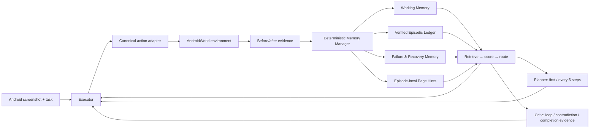

# RAVEN-M 方法与系统文档

## 1. 方法概述

RAVEN-M 是一个基于单一冻结 Qwen3-VL-32B-Instruct endpoint 的逻辑多角色
Mobile-use Agent。系统不训练新参数，也不在 Hard episode 之间共享经验。
核心问题不是扩大 memory 容量，而是让每条 episode-local 记录具备可验证来源、
明确状态、页面兼容性和确定性路由。



Planner、Executor、Memory Manager、Critic 是逻辑角色而非四套模型。这样既
满足多智能体职责拆分，也能把额外调用完整计入预算。

## 2. 每步工作流

```mermaid
sequenceDiagram
    participant Env as AndroidWorld
    participant Exec as Executor
    participant Mem as Memory Manager
    participant Plan as Planner
    participant Crit as Critic

    Env->>Exec: current screenshot
    Mem->>Exec: FACT / HYPOTHESIS / ALERT bundle
    Exec->>Exec: schema validation; at most one repair
    Exec->>Env: one canonical action
    Env-->>Mem: before/after hashes and observed outcome
    Mem->>Mem: write, contradict, invalidate, route
    opt first transition or every five steps
        Mem->>Plan: bounded state and open requirements
        Plan-->>Exec: structured plan.v1
    end
    opt loop, contradiction, or completion evidence
        Mem->>Crit: evidence bundle
        Crit-->>Exec: critic.v1 constraint
    end
```

模型在动作前产生的 `state_delta` 始终绑定到 pre-action screenshot。
`evidence=action_outcome` 指向当前决策实际收到的“上一动作结果”，不能错误
绑定到尚未执行的当前动作。只有确定性 loop detector 使用 post-action frame。

## 3. Memory item

持久化记录包含：

- `memory_id`, `episode_id`, `memory_type`;
- subject–predicate–object 和简短自然语言；
- 创建、最近确认步骤与当前 subgoal；
- observation/action/model-call IDs；
- source screenshot 路径与 SHA-256；
- `candidate / observed / verified / stale / contradicted / revoked /
  superseded / archived` 状态；
- page signature、scope、preconditions、expires-on 条件；
- contradiction/supersession/completion-support 关系；
- 每次 route 的特征、分数与使用角色。

事件以 append-only JSONL 保存。replay 要求 episode ID 一致、事件下标连续，
并重建与原状态等价的有序内容。

## 4. Reliability 与 route

对 item \(m\) 和当前 query \(q\)，可靠度为：

\[
R(m,q)=\mathrm{clip}_{[0,1]}\left(
0.25V+0.20O+0.15P+0.20C+0.10T
-0.45X-0.20S-0.15F
\right),
\]

其中 \(V\) 是 verification，\(O\) 是 observed outcome，\(P\) 是 provenance，
\(C\) 是 page/app compatibility，\(T\) 是 recency；\(X,S,F\) 分别表示
contradiction、staleness 和不安全 failure transfer。

检索分数为：

\[
Q(m,q)=0.20L+0.15G+0.15M+0.10T+0.40R-0.40X-0.20S,
\]

其中 \(L,G,M\) 分别为 lexical relevance、subgoal match 与 page match。
阈值在非 Hard development 上冻结：

- `R ≥ 0.75` 且 scope compatible：FACT；
- `R ≥ 0.45` 且 `Q ≥ 0.30`：HYPOTHESIS；
- compatible contradiction/failure：ALERT；
- inactive、跨页 failure 或低可信 item：SUPPRESS。

无论分数多高，stale、contradicted、revoked、superseded 和 archived item
都不能成为 FACT。

## 5. 四类表示

| 组件 | 表示与容量 | 作用 |
|---|---|---|
| WM | 最近 3 个 transition，FIFO | 短期动作连续性 |
| VEL | store top-8 episodic facts | 中间变量、完成证据、子目标进度 |
| FRM | top-2 failures/alerts | 避免相同页面重复无效动作 |
| PSI-lite | top-2 episode-local page hints | 页面兼容性与导航假设 |

跨 episode procedural memory、latent encoder、全局 Page Graph 和 MCTS
均不属于核心方法。

四类 store 的容量彼此独立，但每个决策最终只向角色路由全局得分最高的
2 条 item。这个全局上限在 v13 的 50 条人工检索审计失败后、Hard 冻结前
确定：审计样本的前两名中 19/20 有用，而继续加入低排名旧页面描述会显著
降低精度。直接动作后的结果先保留为 HYPOTHESIS；只有后续直接视觉观察或
独立确定性确认才能升级为 FACT。

## 6. 动作与完成约束

动作统一为 normalized `[0,1]` 坐标的 tap、long press、swipe、type text、
back/home/enter、open app 或 wait。每步只允许一个动作。JSON 首次无效时
最多进行一次格式修复，两个调用都计入预算。

`done` 不能仅由可见 Save/Done 按钮触发。M0 必须引用当前 bundle 中至少一条
FACT；若最近 Critic 拒绝完成，则继续操作。终止响应的 `state_delta=[]`，
避免在没有后续 transition 的情况下制造无法持久化的“完成事实”。

## 7. 公平比较

所有直接比较固定：

- 相同 AndroidWorld commit、Hard task class、instance seed 与生成参数；
- 相同 Qwen revision、BF16 backend、截图处理与 deterministic generation；
- 原生 `int(10 × complexity)` environment-step budget；
- 8192 total context cap 和 256 maximum new tokens；
- 同一动作 adapter、evaluator、reset、invalid-run 与泄漏规则；
- 全部 model/role calls、tokens、latency 和 peak VRAM 入账。

主要 baseline 为 B0 当前屏幕、B1 三步窗口、B2 受限全历史和 B3 简单摘要。
S0 移除 Planner/Critic 额外调用。MREL、MNO_WM、MNO_VEL、MNO_FRM、
MNO_PSI、MNO_CRITIC、B3_CTX 与 B3_CALL 分别控制 reliability、组件、
context 和 model-call 混杂因素。

## 8. 可审计性与安全边界

- evaluator 只在 episode 终止后调用，结果不进入 prompt；
- prompt 不含 package/activity、accessibility tree 或 ground-truth state；
- 每个 episode 从空 history/memory 开始；
- Hard 轨迹绝不进入另一个 scored episode；
- schema error、错误动作、loop、false done、主动 fail 和预算耗尽都保留为
  agent failure；
- 只有冻结 codebook 中的基础设施错误可用相同 payload/seed 重试两次；
- 最终 runner 在创建首个 Hard episode 前验证 preregistration 哈希、
  `protocol-v1` tag、模型 identity、协议审计和磁盘空间。

这套设计使最终结论可以是正向、零效应或负向，但不能依赖不可追溯的记忆、
选择性重跑或事后调参。
